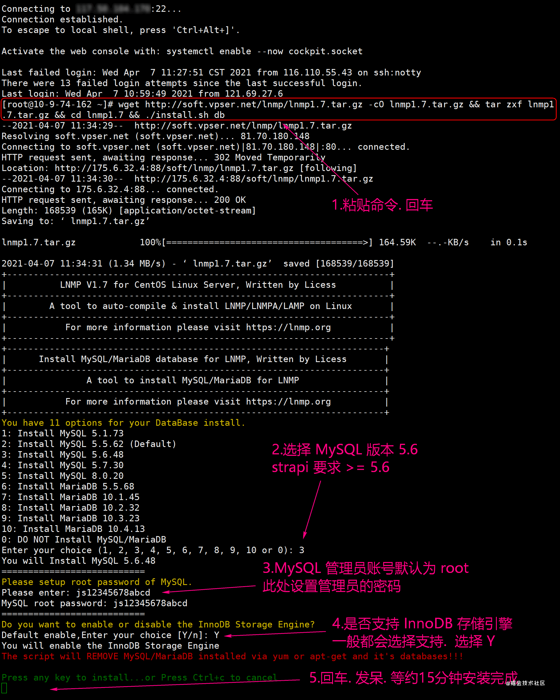
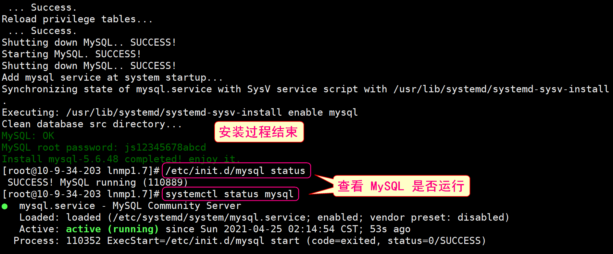
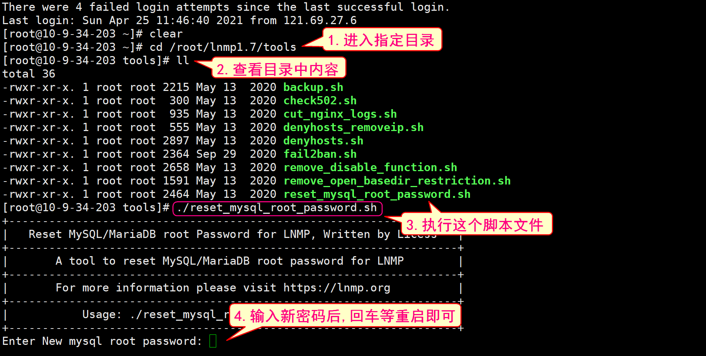
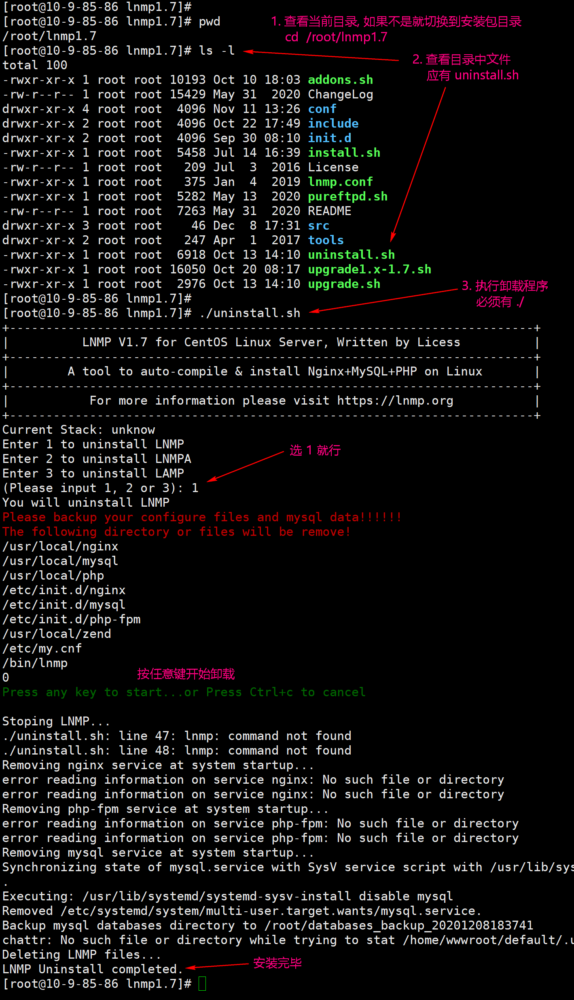

## 安装mysql
``` js
1. 登录服务器
2. 切换到家目录
  // cd 回车
3. 复制下面指令到命令行,回车
wget http://soft.vpser.net/lnmp/lnmp1.7.tar.gz -cO lnmp1.7.tar.gz && tar zxf lnmp1.7.tar.gz && cd lnmp1.7 && ./install.sh db

4. MySQL 状态管理
  `查看 MySQL 是否运行`
  /etc/init.d/mysql status
  /etc/init.d/mysql start  # MySQL安装后默认就是运行状态, 所以一般不用执行这条指令
  /etc/init.d/mysql stop      # 停止 MySQL 服务
  /etc/init.d/mysql restart   # 重启
  /etc/init.d/mysql reload    # 重新加载, 应该是比 restart 好一些
  /etc/init.d/mysql status    # 查看当前状态
5. 简单排错指令
  // 可以查看端口使用情况, 看有没有 3306
  netstat -tunpl 
  // 可以结束指定进程
  kill  -9 进程ID
  pkill -9 进程名
6. 登录、建库
  // 登录
  mysql -uroot -p密码
  // 创建数据库
  create database `mystrapi` default charset=utf8;
  // 查看管理系统中所有数据库
  show databases;
7. 重置密码
8. 卸载数据库
  cd /root/lnmp1.7  回车
  ./uninstall.sh    回车
  1 回车
  任意键回车
```




