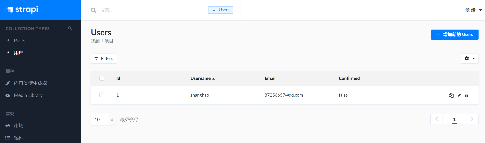
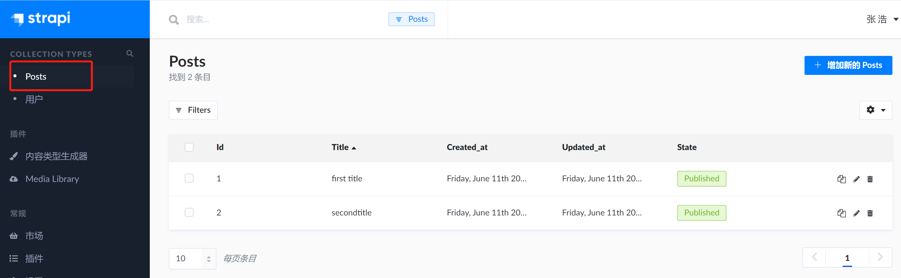
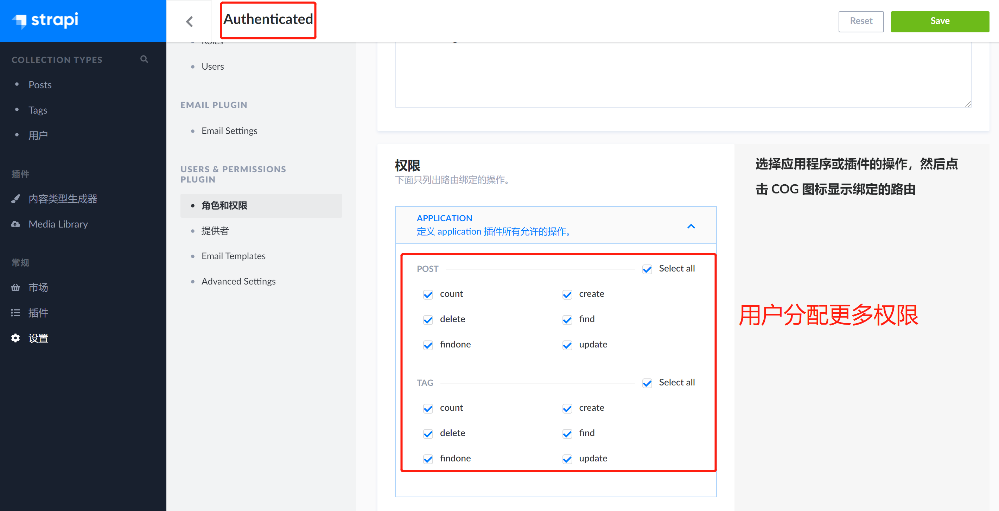
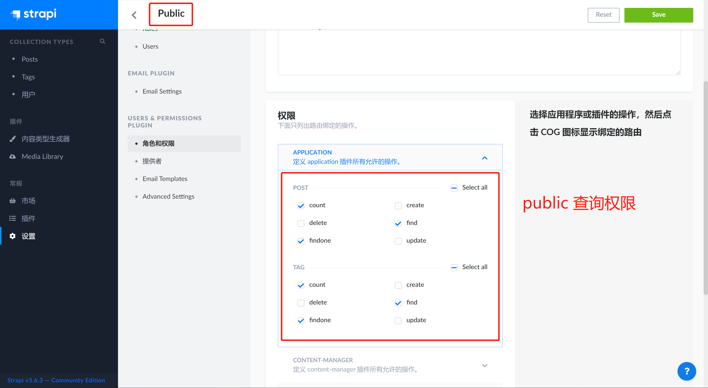
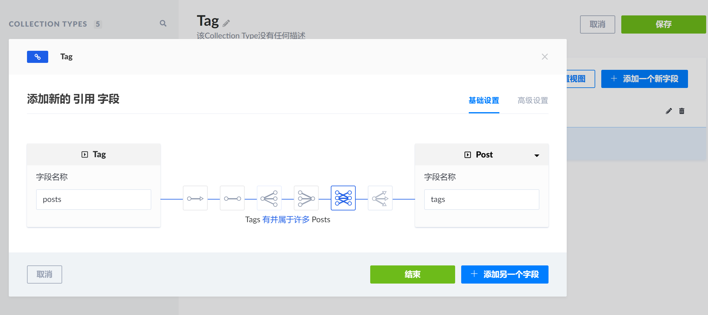
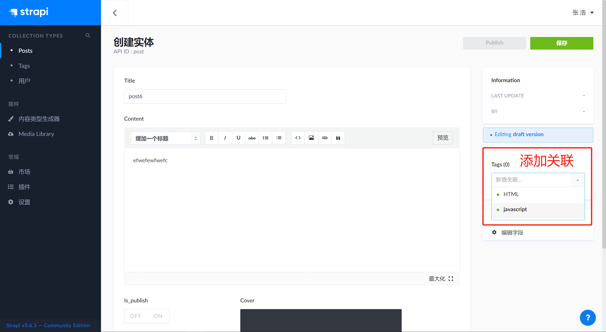
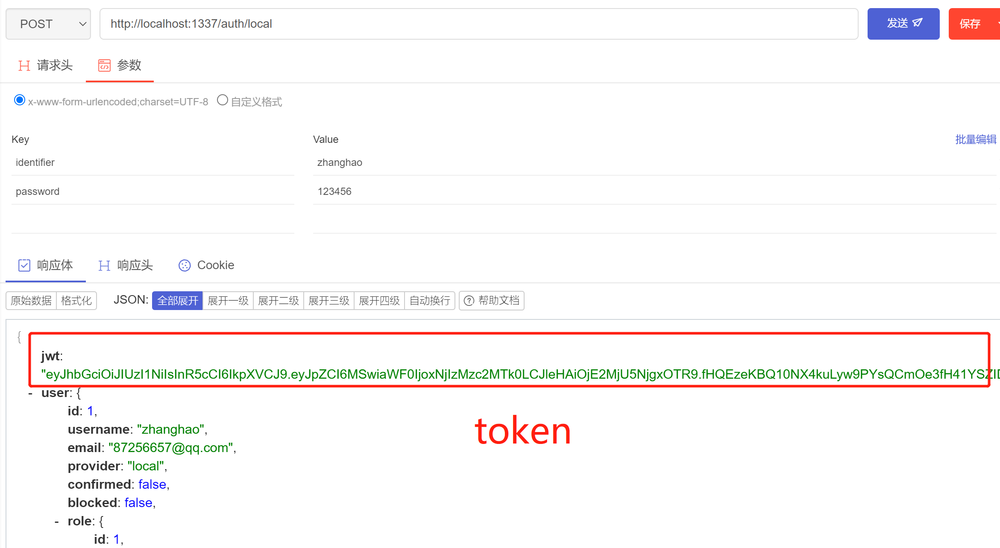
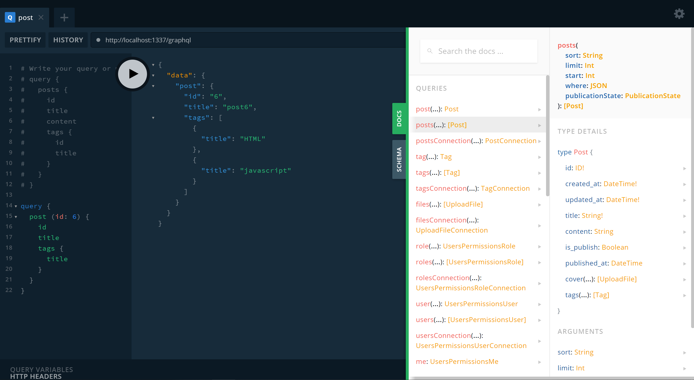

## strapi
官方链接: 
 [https://strapi.io/](https://strapi.io/)
```css
基于Nodejs的开源免费CMS框架
``` 

- [1. 创建项目](#1)
- [2. 运行并创建管理员](#2)
- [3. 内容类型生成器](#3)
- [4. 设置角色和权限](#4)
- [5. 设置关联](#5)
- [6. 请求测试](#6)
- [7. strapi graphQL](#7)

--------
><h2 id='1'>1. 创建项目</h2>
```js
// 默认sqlite
// yarn
yarn create strapi-app my-project --quickstart
// npx
npx create-strapi-app my-project --quickstart
```

><h2 id='2'>2. 运行并创建管理员</h2>
```js
npm run develop
http://localhost:1337/admin 
```
<br/>

><h2 id='3'>3. 内容类型生成器</h2>
```js
创建一个新的 `ContentType`, 如: post
1. 配置属性 如: title, content
2. 生成对应的数据
```
<br/>

><h2 id='4'>4. 设置角色和权限</h2>
```js
1. Authenticated(用户权限): 可以生成token
2. Public(公共权限): 如查询接口
```
<br/>
<br/>

><h2 id='5'>5. 设置关联</h2>
<br/>
<br/>

><h2 id='6'>6. 请求测试</h2>
```js
https://strapi.io/documentation/developer-docs/latest/development/plugins/users-permissions.html#concept
// Roles & Permissions

// 获取posts列表
axios
  .get('http://localhost:1337/posts')

// 获取token
axios
  .post('http://localhost:1337/auth/local', {
    identifier: 'user@strapi.io',
    password: 'strapiPassword',
  })
  .then(response => {
    console.log('User token', response.data.jwt);
  })

// 根据token获取数据模板
const token = 'YOUR_TOKEN_HERE';
axios
  .get('http://localhost:1337/posts', {
    headers: {
      Authorization: `Bearer ${token}`,
    },
  })
```
<br/>

><h2 id='7'>7. strapi graphQL</h2>
```js
https://strapi.io/documentation/developer-docs/latest/development/plugins/graphql.html

1. 安装
// yarn strapi install graphql
// npm run strapi install graphql

2. 启动项目, 并打开网址
  `npm run develop`
  `http://localhost:1337/graphql`

3. 项目中使用 strapi graphql
  `gridesome` 预渲染 strapi中的数据 
  安装插件: 
  // https://www.gridsome.cn/plugins/@gridsome/source-strapi
  // npm install @gridsome/source-strapi
```
<br/>


