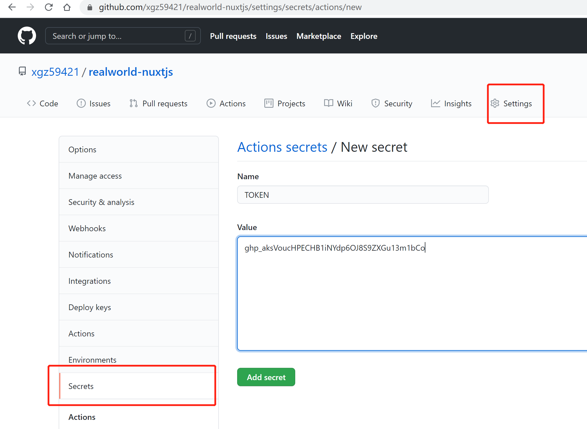
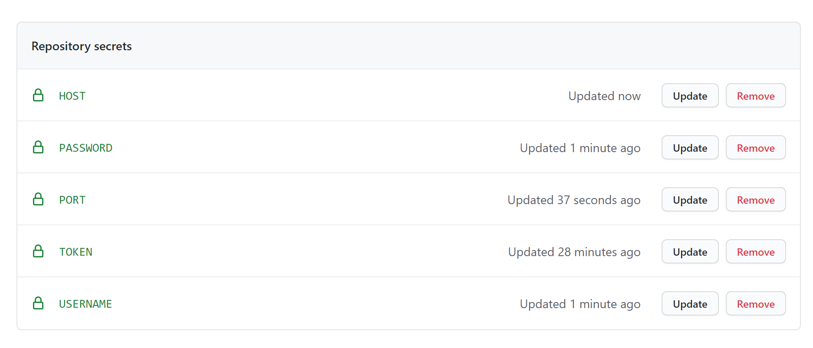
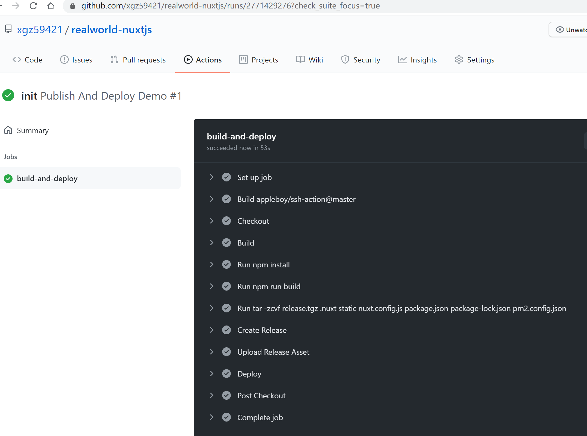

## uclound 服务器
```
  https://passport.ucloud.cn/#login
```
- [1. ucloud账户信息](#1)
- [2. 安装node](#2)
- [3. linux基操](#3)
- [4. pm2 测试server.js](#4)
- [5. 现代化的部署方式 CI/CD](#5)

--------

><h2 id='1'>1. ucloud账户信息</h2>
```js
uclound: 广州B
uname: 8725@qq.com
pwd: xgz5

ssh: 
用户名: root
密码: Xgz5
外网ip: 106.75.154.132

cmd/gitbash/xshell 登录:
ssh root@106.75.154.132(外网ip) 
pwd: Xgz5

// 表示登录成功
[root@10-13-133-240 ~]#   

// 密码输入错误
C:\Users\zh\.ssh\known_hosts 删掉 对应的ip
```

><h2 id='2'>2. 安装node</h2>
```js
nver='v14.16.1' && 
cd /root/.nvm/versions/node/$nver/bin &&  
ln -sf `readlink -f node` /usr/bin/node && 
ln -sf `readlink -f npm`  /usr/bin/npm && 
ln -sf `readlink -f npx`  /usr/bin/npx && 
ln -sf `readlink -f pm2`  /usr/bin/pm2 && cd

node --version
npm --version
pm2 --version
```

><h2 id='3'>3. linux基操</h2>
```js
// 拷贝 
// realworld-nuxtjs.zip 到服务器root/realworld-nuxt  
scp .\realworld-nuxtjs.zip root@106.75.154.132:/root/realworld-nuxt   
// 解压
unzip ./realworld-nuxtjs.zip
// 删除
rm -rf ./node_modules/
```

><h2 id='4'>4. pm2 测试server.js</h2>
```js
scp ./server.js root@106.75.154.132:/root/    
node启动:
  node server.js
// 它使您可以让应用程序永远保持活动状态，在不停机的情况下重新加载它们并促进常见的系统管理任务
pm2 启动方式: 
  pm2 start 'node server.js' --name MyServer // 启动应用
  pm2 list // 查看应用列表
  pm2 stop // 停止应用
  pm2 delete 0/name  // 删除应用
  pm2 stop // 停止应用
  pm2 reload // 重载应用
  pm2 restart // 重启应用
```

><h2 id='5'>5. 现代化的部署方式 CI/CD</h2>
```js
种类: 
  Jeckins
  Gitlab CI
  GitHub Actions
  Travis CI
  Circle CI
```
```js
以`GitHub Actions`为例
环境准备: 
  1. Linux 服务器
  2. 把代码提交到GitHub 远程仓库

配置 GitHub Access Token
1. 生成token
https://github.com/settings/tokens   (Generate new token)
2. 配置到项目的secrets中 
https://github.com/xgz59421/realworld-nuxtjs/settings/secrets/actions
```








