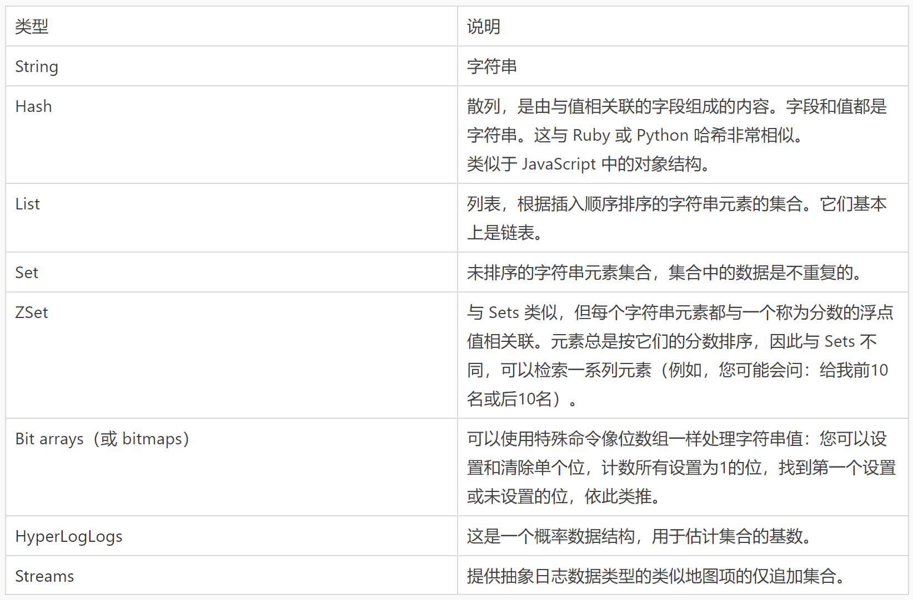
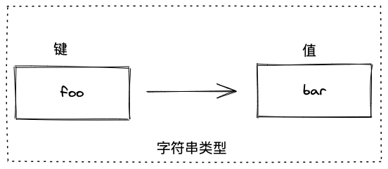
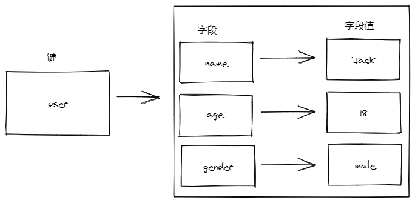
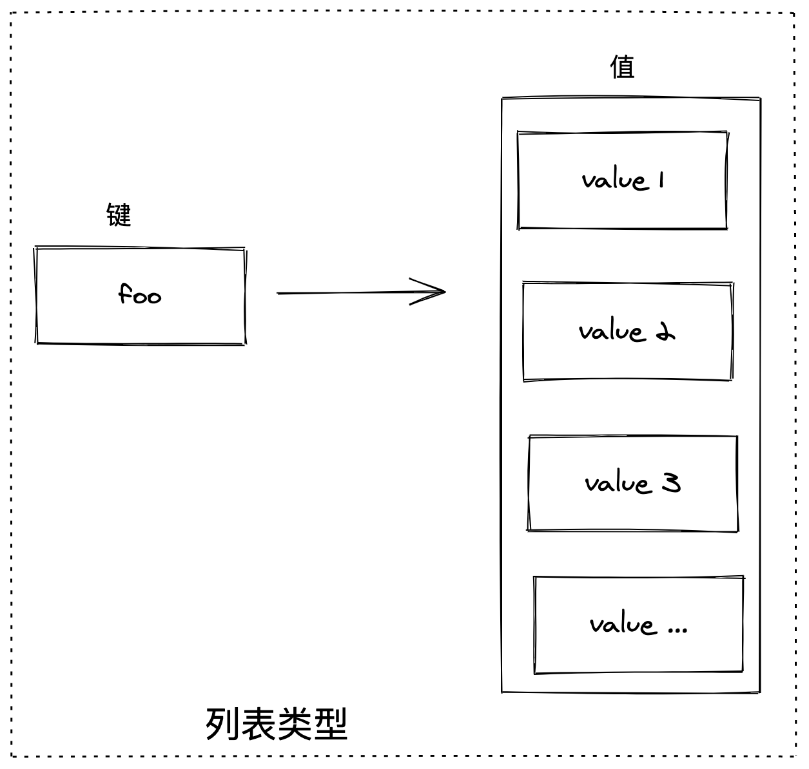
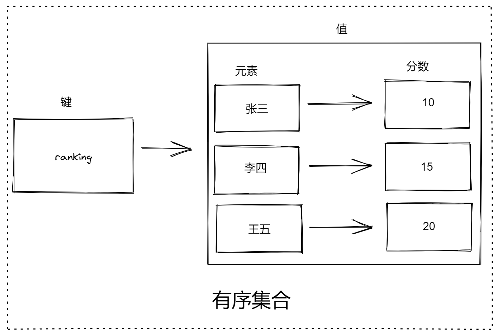
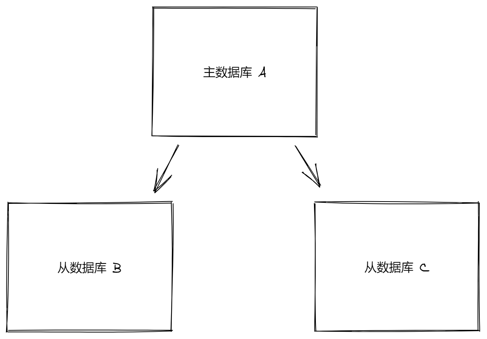

## redis
```
官网：https://redis.io/
GitHub 仓库：https://github.com/redis/redis
交互式学习 Redis：https://try.redis.io/
Redis 中文网（非官方）：http://www.redis.cn/
Redis 命令参考：http://doc.redisfans.com/
https://www.yuque.com/books/share/e04c68e0-44b2-4a74-abf7-f110ebf8c423?#（密码：gsz1） 《Redis 教程》
```
### 一. redis 简介
#### 1.什么是redis
`Redis 是一个使用 ANSI C 编写的开源、支持网络、基于内存、可选持久性的键值对存储数据库。`
```
Redis 不是简单的 Key-Value 数据库，它还支持数据结构，例如
字符串
哈希
列表
集合
带范围查询的排序集合
位图
超日志
带有半径查询和流的地理空间索引
```
#### 2.内存存储与持久化
`Redis 数据库中所有数据都存储在内存中。相对于磁盘，内存的数据读/写速度要快得多，所以我们通常用 Redis 做缓存数据库`
#### 3.Redis 应用场景
```
Redis是一个 Key-Value 存储系统，大部分情况下是因为其高性能的特性，被当做缓存使用，这里介绍下Redis经常遇到的使用场景。

一个产品的使用场景肯定是需要根据产品的特性，先列举一下 Redis 的特点：
  读写性能优异
  持久化
  数据类型丰富
  单线程
  数据自动过期
  发布订阅
  分布式
```

### 二. Redis 安装
#### 1.关于 Redis 的版本
```
Redis 借鉴了 Linux 操作系统对于版本号的命名规则：
  版本号第二位如果是奇数，则为非稳定版本（例如2.7、2.9、3.1）
  如果是偶数，则为稳定版本（例如2.6、2.8、3.0、3.2）
```
#### 2.macOS 中安装 Redis
```js
在 macOS 中有两种方式：
  方式一：编译安装
  方式二（推荐）：使用 Homebrew 安装
  1、安装 Homebrew
  /bin/bash -c "$(curl -fsSL https://raw.githubusercontent.com/Homebrew/install/master/install.sh)"
  2、通过 Homebrew 安装 Redis
  brew install redis
```
#### 3.在 Windows 中安装 Redis
```
Redis 官方不支持 Windows
尽管如此微软还是发布了一个可以在 Windows 下的 Redis 版本，但是这个项目已经不再维护。
https://github.com/microsoftarchive/redis
```
#### 4.在 Linux 中安装 Redis
```shell
下载 Redis 源码
# wget https://download.redis.io/releases/redis-6.0.9.tar.gz

解压 Redis 压缩包
# tar xzf redis-6.0.9.tar.gz

进入 Redis 源码目录
# cd redis-6.0.9

编译安装
# make
```

### 三. 运行及配置 Redis
#### 1. 添加到环境变量
```shell
现在已编译的二进制文件位于 src 目录中。使用以下命令运行 Redis：
# ./src/redis-server

要将 Redis 二进制文件安装到 /usr/local/bin 中(相当于环境变量)，只需使用：
# make install
```
#### 2. 可执行文件
```shell
编译后在 Redis 源代码目录的 src 文件夹中会有以下几个可执行文件：
redis-server        Redis 服务器
redis-cli           Redis 命令行客户端
redis-benchmark     Redis 性能测试工具
redis-check-aof     AOF 文件修复工具
redis-check-dump    RDB 文件检查工具
redis-sentinel      哨兵模式工具
```
#### 3. 启动 Redis

```shell
我们最常用是 redis-server 和 redis-cli
最简单的，直接运行 redis-server 即可启动 Redis：
# redis-server

Redis 默认使用 6379 端口，我们也可以通过 --port 参数指定启动端口：
# redis-server --port 1234
停止 Redis
# redis-cli shutdown 

如果需要在后端运行 Redis：
# redis-server --daemonize yes
```

#### 4. 查看 Redis 运行状态：
`ps -ef | grep -i redis`

#### 5. 停止 Redis
```shell
1. redis-cli shutdown
# 通过进程号停止 Redis
2. kill -9 4684
```

#### 6. 连接 Redis
```shell
# redis-cli

可以指定服务器地址和端口连接：
# redis-cli -h 127.0.0.1 -p 1234

测试与 Redis 是否连接正常：
# 127.0.0.1:6379> PING
PONG   Redis 返回 PONG，证明连接正常

如果想要断开连接：
  命令：quit
  快捷键：Ctrl + C
```
#### 7. 连接 Redis (通过配置文件)
```shell
配置项较多，通过启动参数设置这些选项并不方便，
所以 Redis 支持通过配置文件来设置这些选项。

Redis 提供了一个配置文件的模板 redis.conf，位于源代码目录的根目录中。

我们建议把该文件放到 /etc/redis 目录中（该目录需要手动创建），以端口号命令，例如 6379.conf。
# cd /etc/      进入/etc
# mkdir redis   创建redis文件夹
# cd redis      进入redis文件夹
拷贝文件到redis 以端口号命名
# cp /root/redis-6.0.9/redis.conf 6379.conf
启用配置文件：
redis-server 6379.conf

vim 拓展
vi 6379.conf
:q      退出
:wq     保存退出
:q!     不保存退出
/       查找
# 查找port   /port
n  查找下一个   
i   修改 
如果意外非正常退出报错, 删除.swp即可
# rm .6379.conf.swp

比如将 daemonize (后端运行, 默认为no) 设置为yes
# vi 6379.conf 打开文件
# /daemonize   查找daemonize
# n 查找下一个
# i 修改 no为yes
# :wq 保存退出
```
#### 8. Redis 设置远程连接
```shell
Redis 默认是不允许远程连接的，通过下面的配置可以开启远程连接。

将 redis.conf 配置文件的 bind 和 protected-mode 修改如下：
# 绑定的端口号
bind 0.0.0.0

# 关闭保护模式
protected-mode no

除此之外还需要检查服务器防火墙是否开放了 Redis 服务占用的端口号。

修改之后重启 Redis 服务即可生效。
```
#### 9. 在服务器运行时更改 Redis 配置
```shell
在 Redis 运行时通过 CONFIG SET 命令在不重新启动 Redis 的清空下动态修改部分 Redis 配置:
# CONFIG SET logLevel warning

在运行的时候也可以使用 CONFIG GET 命令获得 Redis 当前的配置情况:
# redis-cli  先连接到redis
# CONFIG GET logLevel
# CONFIG GET port
```
#### 10. Redis 中的多数据库
```shell
Redis 默认支持 16 个数据库，分别编号为 0、1、2、...14、15
  1. Redis 不支持自定义数据库名字
  2. 开发者必须要明确哪个数据库存放了哪些数据
  3. 可以通过配置参数 databases 修改支持的数据库个数
  4.Redis 建立连接后自动选择 0 号数据库
  5.使用 `SELECT` 命令来更换数据库

127.0.0.1:6379> SET a 1
OK
127.0.0.1:6379> KEYS *
1) "a"
127.0.0.1:6379> SELECT 16
(error) ERR DB index is out of range
127.0.0.1:6379> SELECT 15
OK
127.0.0.1:6379[15]> SET b 2
OK
127.0.0.1:6379[15]> KEYS *
1) "b"
127.0.0.1:6379[15]> SELECT 0
OK
127.0.0.1:6379> KEYS *
1) "a"
127.0.0.1:6379>

# 将指定 key 移动到指定数据库
move key db
```

### 四. 常用数据类型及操作命令（CRUD）
#### 0. 通用命令
```shell
# 返回所有 key
KEYS *

# 返回所有以 my 开头的 key
KEYS my*

# 获取 key 的类型
TYPE key

# 查询某个 key 是否存在
EXISTS key [key ...]

# 将 key 改名为 newkey
RENAME key newkey

# 删除指定 key
DEL key [key ...]

# 从当前数据库中随机返回(不删除)一个 key
RANDOMKEY

# 对 key 进行重命名
RENAME key newkey

# 清空当前数据库所有内容
FLUSHDB

# 清空所有数据库内容
FLUSHALL

# 将当前数据库的 key 移动到给定的数据库 db 当中
MOVE key db
```


#### 1. 字符串（String）
```shell
字符串类型是 Redis 中最基本的数据类型，也是其它数据类型的基础。
1. 它能存储任何形式的字符串，包括二进制数据。
2. 你可以用它存储用户的邮箱、JSON 化的对象，甚至是一张图片
3. value 最多可以容纳数据大小为 512 MB
```


```shell
example
# set foo bar
# get foo
# set count 1
# get count 1
# INCR count 
# INCRBY count 2 自增2
# DECR count 
# DECRBY count 2 自减2
```
##### 添加
```shell
# 设置指定 key 的值
SET key value

# 将给定 key 的值设为 value ，并返回 key 的旧值(old value)
GETSET key value

# 只有在 key 不存在时设置 key 的值
SETNX key value

# 同时设置一个或多个 key-value 对
MSET key value [key value ...]

# 同时设置一个或多个 key-value 对，当且仅当所有给定 key 都不存在
MSETNX key value [key value ...]

# 如果 key 已经存在并且是一个字符串， APPEND 命令将指定的 value 追加到该 key 原来值（value）的末尾。
APPEND key value
```
##### 查询
```shell
# 获取指定 key 的值
GET key

# 返回 key 中字符串值的子字符
GETRANGE key start end

# 获取所有(一个或多个)给定 key 的值
MGET key [key ...]

# 返回 key 所储存的字符串值的长度。
STRLEN key

# 通用命令：查询集合中是否有指定的 key
EXISTS key [key ...]

# 通用命令，查询 key 的类型
TYPE key
```
##### 修改
```shell
# 设置指定 key 的值
SET key value

# 将给定 key 的值设为 value ，并返回 key 的旧值(old value)
GETSET key value

# 如果 key 已经存在并且是一个字符串， APPEND 命令将指定的 value 追加到该 key 原来值（value）的末尾。
APPEND key value
```
##### 删除
```shell
# 通用命令：删除1个或多个指定的 key
DEL key [key ...]
```
##### 数字值
```shell
# 将 key 中储存的数字值增一
INCR key

# 将 key 所储存的值加上给定的增量值（increment） 
INCRBY key increment

# 将 key 中储存的数字值减一
DECR key

# key 所储存的值减去给定的减量值（decrement）
DECRBY key decrement
```

#### 2. 哈希（Hash）
```shell
哈希（也叫散列）类型也是一种字典结构，其存储了字段和字段值的映射，但字符值只能是字符串，不能其它数据类型
```


```shell
example
# hset myhash a 1 b 2
# hkeys myhash    获取myhashkeys
# HMGET myhash a b 获取所有字段的value
# hget myhash a   获取myhash.a
# hlen myhash     获取长度
# hgetall myhas   获取 myhash 所有 key value
```
##### 添加
```shell
# 将哈希表 key 中的字段 field 的值设为 value
HSET key field value [field value ...]

# 同时将多个 field-value (域-值)对设置到哈希表 key 中
HMSET key field value [field value ...]

# 只有在字段 field 不存在时，设置哈希表字段的值
HSETNX key field value
```
##### 查询
```shell
# 获取所有哈希表中的字段
HKEYS key

# 获取哈希表中字段的数量
HLEN key

# 获取所有给定字段的值
HMGET key field1 [field2]

# 获取存储在哈希表中指定字段的值
HGET key field

# 获取在哈希表中指定 key 的所有字段和值
HGETALL key

# 查看哈希表 key 中，指定的字段是否存在
HEXISTS key field

# 获取哈希表中所有值
HVALS key

# 迭代哈希表中的键值对
HSCAN key cursor [MATCH pattern] [COUNT count]
```
##### 修改
```shell
# 将哈希表 key 中的字段 field 的值设为 value
HSET key field value [field value ...]

# 为哈希表 key 中的指定字段的整数值加上增量 increment
HINCRBY key field increment
```
##### 删除
```shell
# 删除一个或多个哈希表字段
HDEL key field1 [field2]

# 删除整个数据字段
DEL key [key ...]
```

#### 3. 列表（List）
```shell
列表类型内部使用双向链表实现的，可以存储一个有序的字符串列表，常用的操作就是向列表两端添加元素，或者获得列表的某一个片段

```


```shell
example
# lpush mylist a
# lpush mylist b
# lpush mylist 1
# rpush mylist 3
# lrange mylist 0 -1 查看l列表所有数据
```
##### 添加
```shell
# 将一个或多个值插入到列表头部
LPUSH key element [element ...]

# 在列表的元素前或者后插入元素
LINSERT key BEFORE|AFTER pivot value

# 将一个值插入到已存在的列表头部
LPUSHX key value

# 通过索引设置列表元素的值
LSET key index value

# 在列表中添加一个或多个值
RPUSH key value1 [value2]

# 为已存在的列表添加值
RPUSHX key value
```
##### 查询
```shell
# 通过索引获取列表中的元素
LINDEX key index

# 获取列表长度
LLEN key

# 获取列表指定范围内的元素
LRANGE key start stop
```
##### 删除
```shell
# 移出并获取列表的第一个元素
LPOP key

# 移出并获取列表的第一个元素， 如果列表没有元素会阻塞列表直到等待超时或发现可弹出元素为止
BLPOP key1 [key2 ] timeout

# 移出并获取列表的最后一个元素， 如果列表没有元素会阻塞列表直到等待超时或发现可弹出元素为止
BRPOP key1 [key2 ] timeout

# 从列表中弹出一个值，将弹出的元素插入到另外一个列表中并返回它； 如果列表没有元素会阻塞列表直到等待超时或发现可弹出元素为止
BRPOPLPUSH source destination timeout

# 移除列表元素
# 如果 count > 0，则从头向尾遍历删除元素
# 如果 count < 0，则从后面向前面删除元素
# 如果 count = 0，则删除所有匹配的元素
LREM key count value

# 对一个列表进行修剪(trim)，就是说，让列表只保留指定区间内的元素，不在指定区间之内的元素都将被删除
LTRIM key start stop

# 移除列表的最后一个元素，返回值为移除的元素
RPOP key

# 移除列表的最后一个元素，并将该元素添加到另一个列表并返回
RPOPLPUSH source destination
```

#### 4. 集合（Set）
```shell
集合类型和列表类型有相似之处，它们的主要区别是：
1. 列表是有序的，集合是无序的
2. 列表数据可以重复，集合中没有重复数据
```

```shell
example
添加
# SADD myset a b c d 1 2 3
查询
# SMEMBERS myset
随机查询一个/多个
# SRANDMEMBER myset count(默认0)
```

##### 添加
```shell
# 向集合添加一个或多个成员
SADD key member1 [member2]
```
##### 查询
```shell
# 返回集合中的所有成员
SMEMBERS key

# 获取集合的成员数
SCARD key

# 判断 member 元素是否是集合 key 的成员
SISMEMBER key member

# 返回集合中一个或多个随机数
SRANDMEMBER key [count]
```
##### 删除
```shell
# 移除集合中一个或多个成员
SREM key member1 [member2]

# 移除并返回集合中的一个随机元素
SPOP key

# 将 member 元素从 source 集合移动到 destination 集合
SMOVE source destination member
```
##### 集合间聚合运算
```shell
# 返回第一个集合与其他集合之间的差异。
SDIFF key1 [key2]

# 返回给定所有集合的交集
SINTER key1 [key2]

# 返回所有给定集合的并集
SUNION key1 [key2]

# 返回给定所有集合的差集并存储在 destination 中
SDIFFSTORE destination key1 [key2]

# 返回给定所有集合的交集并存储在 destination 中
SINTERSTORE destination key1 [key2]

# 所有给定集合的并集存储在 destination 集合中
SUNIONSTORE destination key1 [key2]
```

#### 5. 有序集合（Sorted Set）
```shell
有序集合是一种类似于集合和哈希之间的混合数据类型。
1. 与集合一样，排序集合由唯一的非重复字符串元素组成
2. 有序集合中的元素不排序，但有序集合中的每个元素都关联了一个分数
3. 虽然集合中每个元素都是不同的，但是它们的分数确可以相同

有序集合的典型应用场景：
（1）排行榜
（2）微博热搜
```


##### 添加
```shell
# 向有序集合添加一个或多个成员，或者更新已存在成员的分数
ZADD key score member [score member ...]
```
##### 查询
```shell
# 通过索引区间返回有序集合指定区间内的成员，分数从低到高排序
ZRANGE key start stop [WITHSCORES]

# 通过索引区间返回有序集合指定区间内的成员，分数从高到低排序
ZREVRANGE key start stop [WITHSCORES]

# 返回有序集中指定分数区间内的成员，分数从低到高排序
ZRANGEBYSCORE key min max [WITHSCORES] [LIMIT offset count]

# 返回有序集中指定分数区间内的成员，分数从高到低排序
ZREVRANGEBYSCORE key max min [WITHSCORES] [LIMIT offset count]

# 返回有序集合中指定成员的排名，有序集成员按分数值（从小到大）排序
ZRANK key member

# 返回有序集合中指定成员的排名，有序集成员按分数值（从大到小）排序
ZREVRANK key member

# 获取有序集合的成员数
ZCARD key

# 返回有序集中，成员的分数值
ZSCORE key member

# 计算在有序集合中指定区间分数的成员数
ZCOUNT key min max
```
##### 修改
```shell
# 向有序集合添加一个或多个成员，或者更新已存在成员的分数
ZADD key score member [score member ...]

# 有序集合中对指定成员的分数加上增量 increment
ZINCRBY key increment member
```
##### 删除
```shell
# 移除有序集合中的一个或多个成员
ZREM key member [member ...]

# 移除有序集合中给定的排名区间的所有成员
ZREMRANGEBYRANK key start stop

# 移除有序集合中给定的分数区间的所有成员
ZREMRANGEBYSCORE key min max
```

### 五. Redis 过期时间
```shell
在实际开发中经常会遇到一些有时效的数据，比如限时优惠活动、缓存或验证码等，过了一定时间就需要删除这些数据。在关系数据库中一般需要额外的一个字段记录到期时间，然后定期检测删除过期数据。而在 Redis 中可以设置一个键的过期时间，到时间后 Redis 会自动删除它。

注意：
使用 SET 或 GETSET 命令为键赋值也会同时清除键的过期时间。
其它只对键值进行操作的命令（如 INCR、LPUSH、HSET、ZREM）不会影响键的过期时间。
```
#### 1. 设置键的过期时间
```shell
# 为给定 key 设置生存时间，当 key 过期时(生存时间为 0 )，它会被自动删除。
EXPIRE key seconds

# 和 EXPIRE 一样，但是它以毫秒为单位
PEXPIRE key milliseconds

# EXPIREAT 的作用和 EXPIRE 类似，都用于为 key 设置生存时间。
# 不同在于 EXPIREAT 命令接受的时间参数是 UNIX 时间戳(unix timestamp)。
EXPIREAT key timestamp

# 这个命令和 EXPIREAT 命令类似，但它以毫秒为单位设置 key 的过期 unix 时间戳，而不是像 EXPIREAT 那样，以秒为单位。
PEXPIREAT key milliseconds-timestamp
```
#### 2. 获取键的过期时间
```shell
# 以秒为单位，返回给定 key 的剩余生存时间(TTL, time to live)。
TTL key

# 类似于 TTL，但它以毫秒为单位返回 key 的剩余生存时间。
PTTL key

-2	过期且已删除
-1	没有过期时间设置，即永不过期
>0	表示距离过期还有多少秒或者毫秒
```
#### 3. 清除键的过期时间
```shell
# 移除给定 key 的生存时间，将这个 key 从『易失的』(带生存时间 key )转换成『持久的』(一个不带生存时间、永不过期的 key )。
PERSIST key
```

### 六. Redis 事务
#### 1. 事务的基础概念
```shell
1. 原子性（Atomicity）: 事务要么全部完成，要么全部取消。 如果事务崩溃，状态回到事务之前（事务回滚）。
确保不管交易过程中发生了什么意外状况（服务器崩溃、网络中断等），不能出现A账户少了一个亿，但B账户没到帐，或者A账户没变，但B账户却凭空收到一个亿（数据不一致）。A和B账户的金额变动要么同时成功，要么同时失败(保持原状)。

2. 隔离性（Isolation）: 如果2个事务 T1 和 T2 同时运行，事务 T1 和 T2 最终的结果是相同的，不管 T1和T2谁先结束。
如果A在转账1亿给B（T1），同时C又在转账3亿给A（T2），不管T1和T2谁先执行完毕，最终结果必须是A账户增加2亿，而不是3亿，B增加1亿，C减少3亿。

3. 持久性（Durability）: 一旦事务提交，不管发生什么（崩溃或者出错），数据要保存在数据库中。
确保如果 T1 刚刚提交，数据库就发生崩溃，T1执行的结果依然会保持在数据库中。

4. 一致性（Consistency）: 只有合法的数据（依照关系约束和函数约束）才能写入数据库。
确保钱不会在系统内凭空产生或消失， 依赖原子性和隔离性。
```
#### 2. Redis 中的事务
Redis 中提供了以下三个命令来处理事务：
```shell
# 标记一个事务块的开始
# 事务块内的多条命令会按照先后顺序被放进一个队列当中，最后由 EXEC 命令原子性(atomic)地执行
MULTI

# 执行所有事务块内的命令。
EXEC

# 取消事务，放弃执行事务块内的所有命令。
DISCARD
```

示例：
```shell
SET Jack 10
SET Rose 20

# Jack 给 Rose 转账 5 块钱

# 开启事务
MULTI     # 开始事务
DECRBY Jack 5 # 命令入队
INCRBY ROSE 5 # 命令入队
EXEC # 执行事务
# 如果想要取消事务,则执行 DISCARD 命令。
```

#### 3. 事务中的错误处理
```
1. 语法错误。语法错误指命令不存在或命令参数的个数不对
2. 运行错误
```
#### 4. 事务中的 WATCH 命令
```shell
如果在执行 WATCH 命令之后， EXEC 命令或 DISCARD 命令被执行了的话，那么会自动取消 WATCH。

如果需要手动停止 WATCH 则可以可以使用 UNWATCH 命令，UNWATCH 命令会取消 WATCH 命令对所有 key 的监视。
```
WATCH 相关命令如下：
```shell
# 监视一个(或多个) key ，如果在事务执行之前这个(或这些) key 被其他命令所改动，那么事务将被打断。
WATCH key [key ...]

# 取消 WATCH 命令对所有 key 的监视。
# 如果在执行 WATCH 命令之后， EXEC 命令或 DISCARD 命令先被执行了的话，那么就不需要再执行 UNWATCH 了。
UNWATCH
```
使用示例: 
```shell
# SET balance 100
# WATCH balance
# DECRBY balance 30
# MULTI
# DECRBY balance 10
# EXEC
# GET balance # 70
```

#### 参考链接
https://zhuanlan.zhihu.com/p/43493165
https://xie.infoq.cn/article/84baa7fa9c2c3d3698a601def

### 七. Redis 持久化
```shell
Redis 提供了两种持久化方案：
1. RDB 持久化，根据指定的规则“定时”将内存中的数据存储在硬盘上，在重启之后读取硬盘上的 .rdb 快照文件将数据恢复到内存中。
2. AOF 持久化：AOF 持久化记录服务器执行的所有写操作命令形成 .aof 日志文件保存到硬盘中，并在服务器启动时，通过重新执行这些命令来还原数据集。
```
#### 1. RDB 持久化
RDB 持久化相关配置规则如下：
```shell
save 900 1 # 每 900 秒至少有 1 个 key 变化了，则写入快照
save 300 10 # 每 300 秒至少有 10 个 key 变化了，则写入快照
save 60 10000 # 每 60 秒至少有 10000 个 key 变化了，则写入快照

dbfilename dump.rdb # 快照保存的文件名称

dir ./ # 快照文件保存路径
```
#### 2. AOF 持久化
```shell
默认情况下，Redis 没有开启 AOF 方式的持久化，可以通过 appendonly 参数启用：
# appendonly yes

# 同步的文件名称
appendfilename "appendonly.aof" (可以修改)
```
AOF 有三种同步策略：
```shell
一般情况下使用默认值 everysec 就足够了，既兼顾了性能又保证了安全。

# 每修改同步，每一次发送数据变化都会被立即同步到磁盘中，效率比较低，但是数据最安全
appendfsync always

# 默认值，每秒同步，异步完成，同步效率非常高，缺点是一旦系统出现宕机，这1秒之内操作的数据就会丢失
appendfsync everysec

# 不同步
appendfsync no
```
#### 3. RDB vs AOF
参考阅读：http://doc.redisfans.com/topic/persistence.html。

| 持久化方式 | 优点 | 缺点 |
| :-----| :----- | :----- |
| RDB | 文件小 异步备份性能好, 恢复大数据集速度比 AOF 快 | 数据安全性低容易丢失数据, 数据量比较大时备份速度慢 |
| AOF | 数据安全性高, 有利于开发分析 | 单元格 |

#### 参考链接
http://doc.redisfans.com/topic/persistence.html

### 八. 使用编程语言客户端操作 Redis
```shell
在此之前我们进行的操作都是通过 Redis 的命令行客户端 redis-cli 进行的，并没与介绍实际编程时如何操作 Redis。接下来主要会讲解如何通过具体的编程语言来操作 Redis。
```
#### 1. Redis 支持的程序客户端
参考官方支持列表：https://redis.io/clients。

#### 2. 在 Node.js 中操作 Redis
Node.js 中可以操作 Redis 的软件包推荐列表：https://redis.io/clients#nodejs。
```shell
推荐下面两个：
https://github.com/NodeRedis/node-redis
https://github.com/luin/ioredis  支持ES6类型
```
##### Pipelining
```js
// npm install ioredis

如果要发送一批命令（例如> 5），则可以使用流水线将命令在内存中排队，然后将它们一次全部发送到 Redis。
这样，性能提高了50％〜300％
const pipeline = redis.pipeline();
pipeline.set("foo", "bar");
pipeline.del("cc");
pipeline.exec((err, results) => {

});

// You can even chain the commands:
redis
  .pipeline()
  .set("foo", "bar")
  .del("cc")
  .exec((err, results) => {});

// `exec` also returns a Promise:
const promise = redis.pipeline().set("foo", "bar").get("foo").exec();
promise.then((result) => {
  // result === [[null, 'OK'], [null, 'bar']]
});
```
##### 事务
```js
大多数时候，事务命令 multi＆exec 与管道一起使用。因此，在调用 multi 时，默认情况下会自动创建 Pipeline 实例，因此您可以像使用管道一样使用 multi：
redis
  .multi()
  .set("foo", "bar")
  .get("foo")
  .exec((err, results) => {
    // results === [[null, 'OK'], [null, 'bar']]
  });

-------------
redis
  .pipeline()
  .get("foo")
  .multi()
  .set("foo", "bar")
  .get("foo")
  .exec()
  .get("foo")
  .exec();
```
##### 错误处理
```js
const Redis = require("ioredis");
const redis = new Redis({
  // 优化错误堆栈会大大降低性能
  showFriendlyErrorStack: true // 生产环境关闭
});
redis.set("foo");
```

### 九. Redis 集群
```
对于一个小型项目来说，使用一台 Redis 服务器已经非常足够了，然后现实中的项目通常需要若干台 Redis 服务器的支持：
1. 从结构上，单个 Redis 服务器会发生单点故障，同时一台服务器需要承受所有的请求负载。这就需要为数据生成多个副本并分配在不同的服务器上；
2. 从容量上，单个 Redis 服务器的内存非常容易成为存储瓶颈，所有需要进行数据分片

同时拥有多个 Redis 服务器后就会面临如何管理集群的问题，包括如何增加节点、故障恢复等。

为此，我们将依次介绍 Redis 中的复制、哨兵（sentinel）和集群的使用和原理。
```
#### 1. 复制 
```
通过持久化功能，Redis 保证了即使在服务器重启的情况下也不会损失（或少量损失）数据。但是由于数据是存储在一台服务器上的，如果这台服务器出现硬盘故障等问题，也会导致数据丢失。为了避免单点故障，通常的做法是将数据库复制多个副本以部署在不同的服务器上，这样即使有一台服务器出现故障，其它服务器依然可以继续提供服务。为此，Redis 提供了复制功能，可以实现当一台数据库中的数据更新后，自动将更新的数据同步到其它数据库上。
```
##### 配置 
```
在复制的概念中，数据库分为两类，一类是主数据库（master），另一类是从数据库（slave）。
1. 主数据库可以进行读写操作
2. 当写操作导致数据变化时会自动将数据同步给从数据库
3. 而从数据库一般是只读的，并接受主数据库同步过来的数据
4. 一个主数据库可以拥有多个从数据库，而一个从数据库只能拥有一个主数据库
```


```shell
在 Redis 中使用复制功能非常容易，只需要在从数据库的配置文件中加入下面的配置即可，主数据库无需进行任何配置。

# slaveof 主数据库地址 主数据库端口
1. 开启两个 Redis 服务进程
为了能够更直观的展示复制的流程，下面将实现一个最简化的复制系统。我们要在一台服务器上启动两个 Redis 实例，监听不同端口，其中一个作为主数据库，另一个作为从数据库。首先我们不加任何参数来启动一个 Redis 实例作为主数据库：
# redis-server
该实例默认监听 6379 端口。然后加上 slaveof 参数启动另一个 Redis 实例作为从数据库，并让其监听 6380 端口；
# redis-server --port 6380 --slaveof 127.0.0.1 6379
此时在主数据库中的任何数据变化都会自动地同步到从数据库中。

2. 查看复制信息
# INFO replication

3. 测试数据同步效果
测试数据同步效果

4. 从数据库中的数据是只读的
默认情况下，从数据库是只读的，如果直接修改从数据库的数据会出现错误：

可以通过设置从数据库的配置文件中的 slave-read-only 为 no 以使从数据库可写，但是因为对从数据库的任何更改都不会同步给任何其它数据库，并且一旦主数据库中更新了对应的数据就会覆盖从数据库中的改动，所有通常的场景下不应该设置从数据库可写，以免导致被忽略的潜在应用逻辑错误。

配置多台从数据库的方法也一样，在所有的从数据库的配置文件中都加上 slaveof 参数指向同一个主数据库即可。

除了通过配置文件或命令行参数设置 slaveof 参数，还可以在运行时使用 SLAVEOF 命令修改。
```
##### 参考链接
http://doc.redisfans.com/topic/cluster-tutorial.html

### 十. Redis 图形管理软件
Redis 的图形化管理软件有很多，这里我主要推荐RDM：https://rdm.dev/。


