## ucload
##### 链接
```
1. 购买链接
https://www.ucloud.cn/site/active/lagou.html

2. 登录地址
https://passport.ucloud.cn/#login
```
##### 账户信息
```js
ucload账号: (华北（北京）E)
登录邮箱: 87256657@qq.com
登录密码: xgz5

ssh: 
用户名: root
密码: xgz5
外网ip: 117.50.15.6

xshell 登录
ssh root@117.50.15.6(外网ip) 
pwd: xgz5
// 密码输入错误
C:\Users\zh\.ssh\known_hosts 删掉 对应的ip
```

##### 端口 port
```
不同的程序使用不同的端口

22 / 80 / 443 / 1337 / 3000 / 3306 / 8080 /

0 ~ 1024 系统保留 计算机共有65535个端口

6666 谷歌浏览器中默认不可用
```
##### 内部防火墙 - 关闭
```shell
默认就是关闭的

# 关闭内部防火墙
systemctl stop firewalld      # 临时关
systemctl disable firewalld   # 永久关. 重启以后也是关着的

# 开启内部防火墙
#systemctl start firewalld

# 添加开放端口规则
#firewall-cmd --zone=public --add-port=22/tcp   --permanent
#firewall-cmd --zone=public --add-port=80/tcp   --permanent
#firewall-cmd --zone=public --add-port=443/tcp  --permanent
#firewall-cmd --zone=public --add-port=1337/tcp --permanent
#firewall-cmd --zone=public --add-port=3000/tcp --permanent
#firewall-cmd --zone=public --add-port=3306/tcp --permanent
#firewall-cmd --zone=public --add-port=8080/tcp --permanent

# 重新加载规则. 使之立刻生效.
#firewall-cmd --reload
```
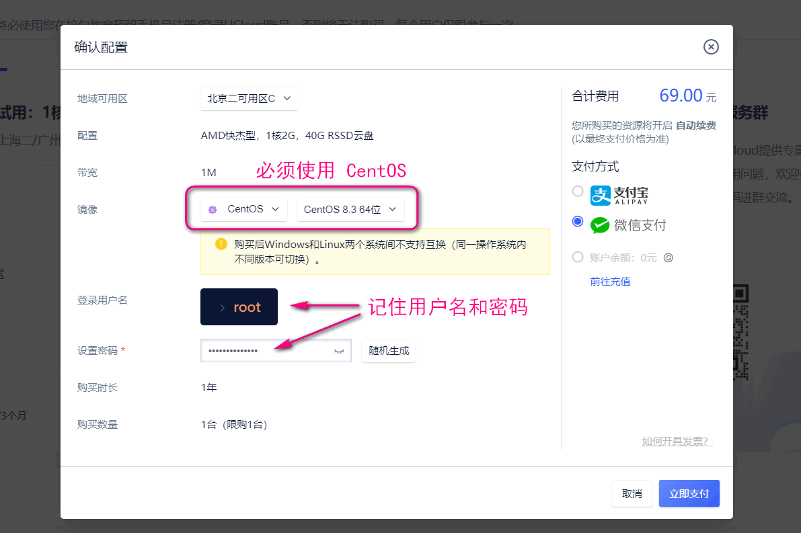
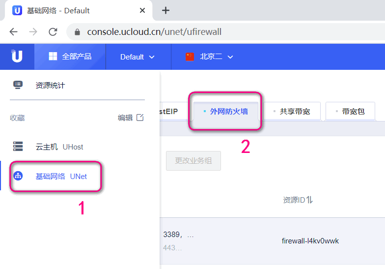
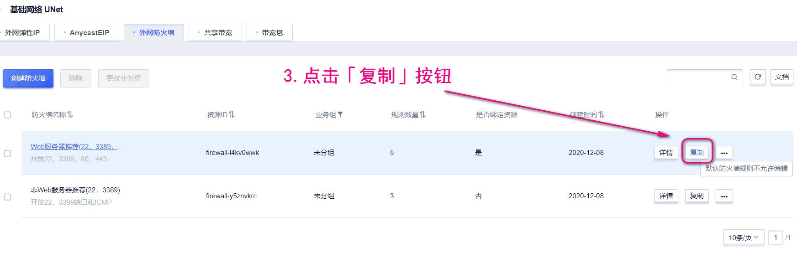
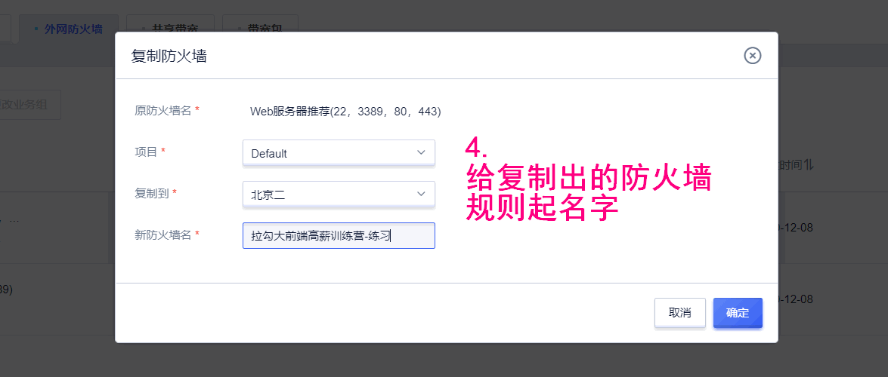
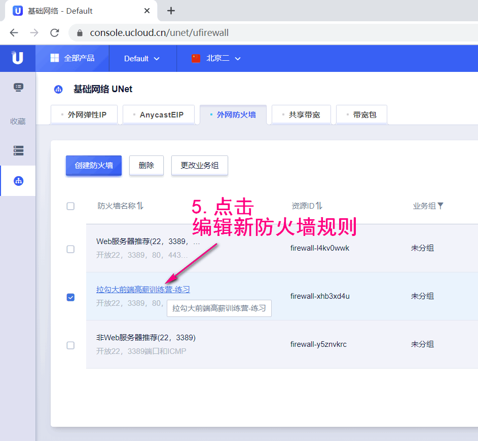
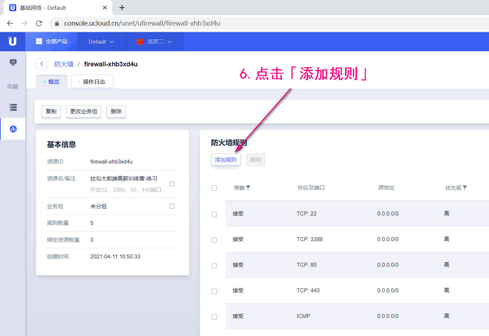
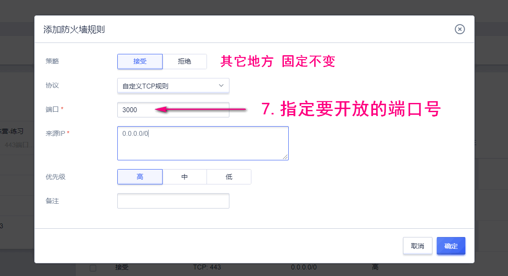
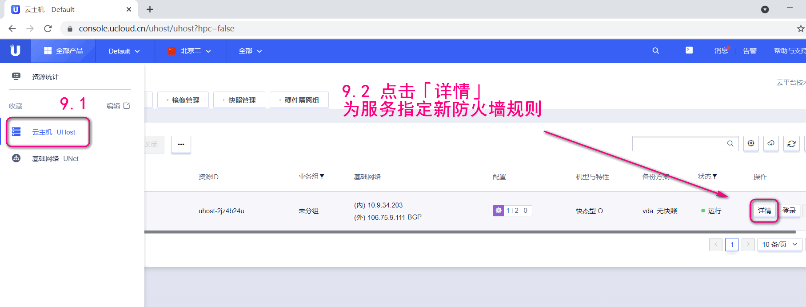
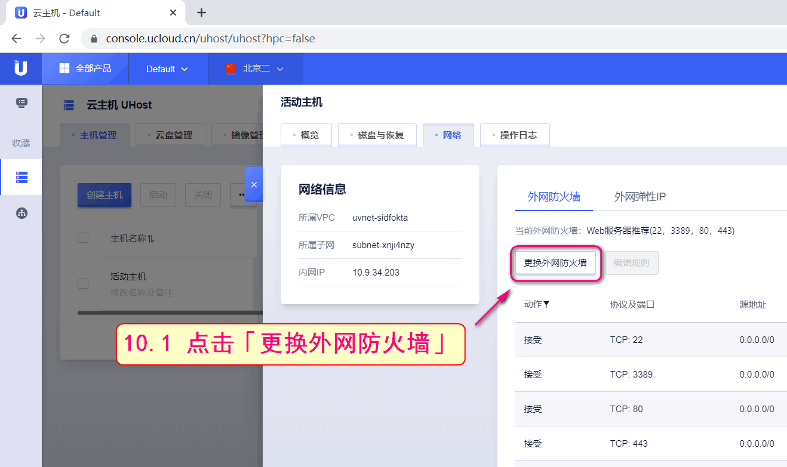
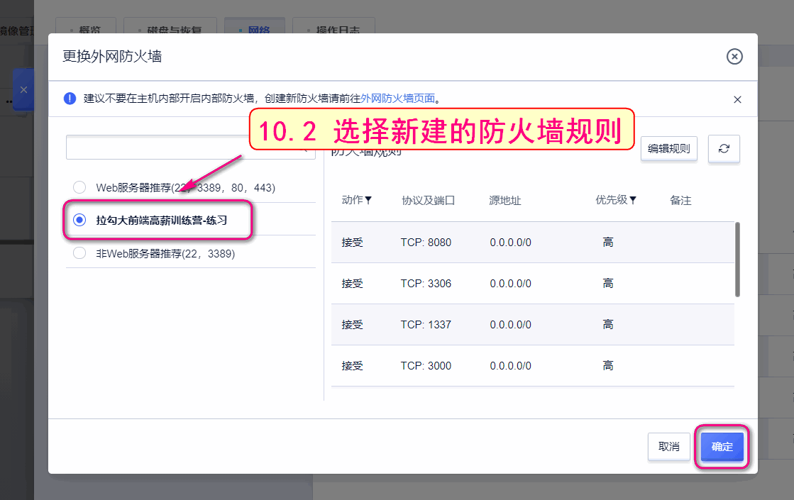
ssh登录
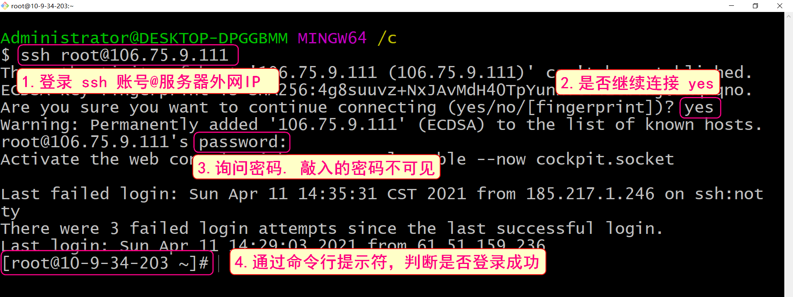
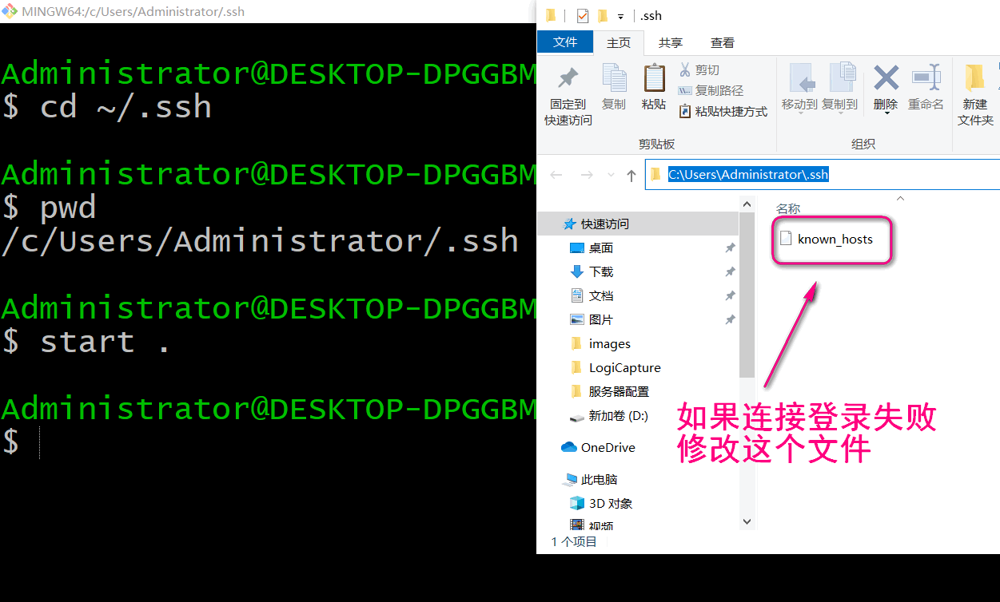
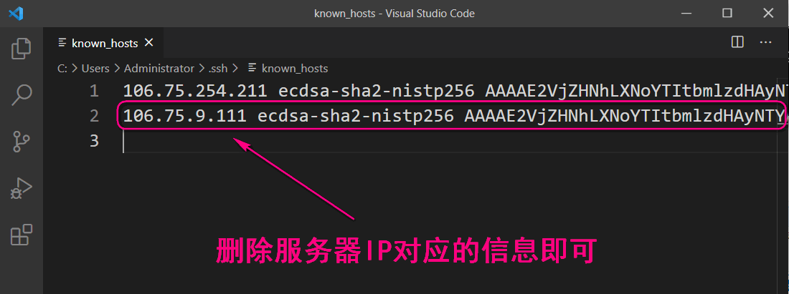
xshell登录


