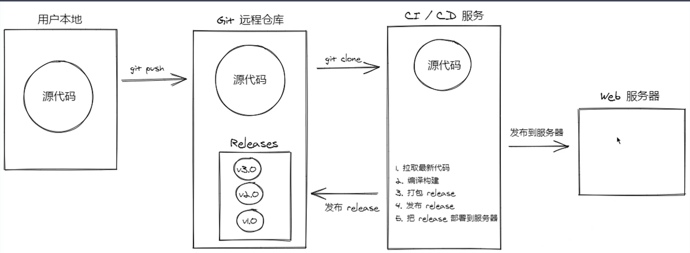
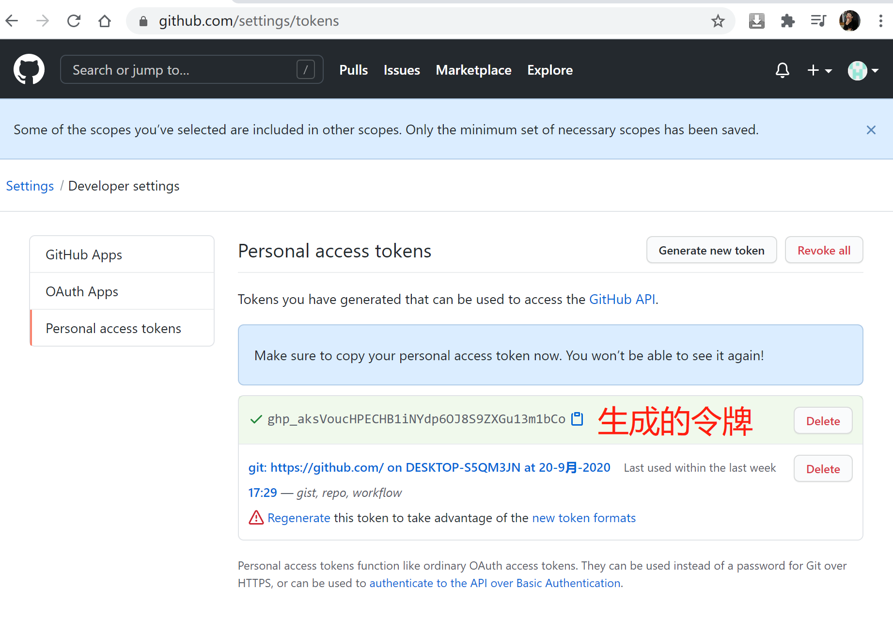
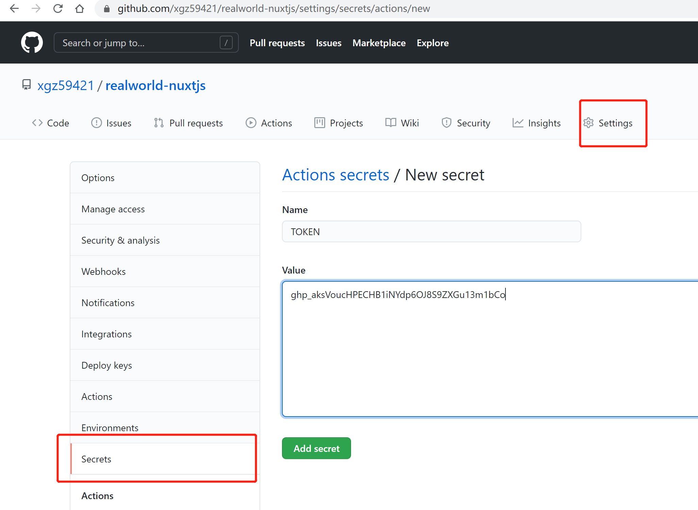
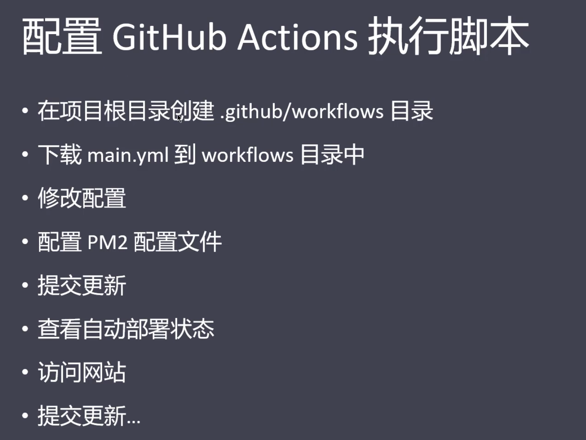
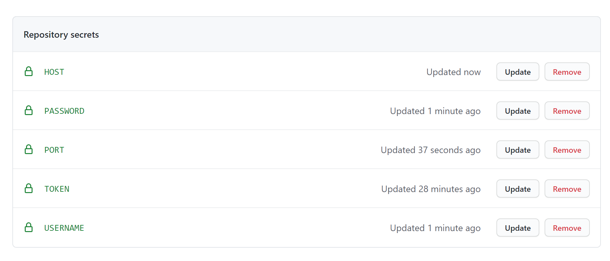
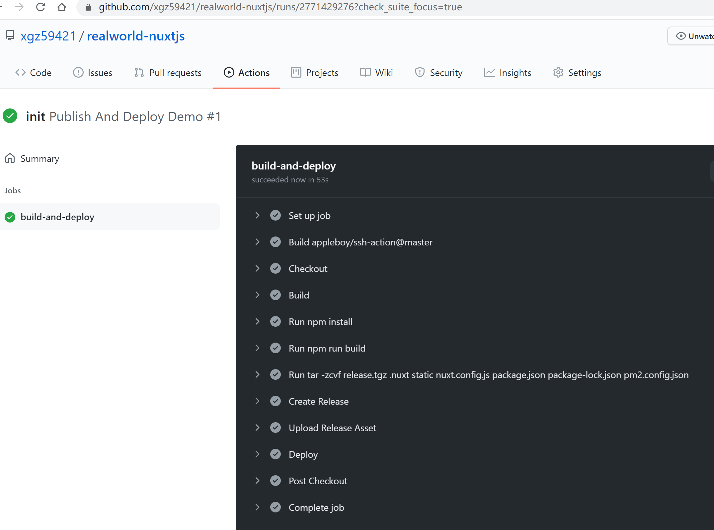
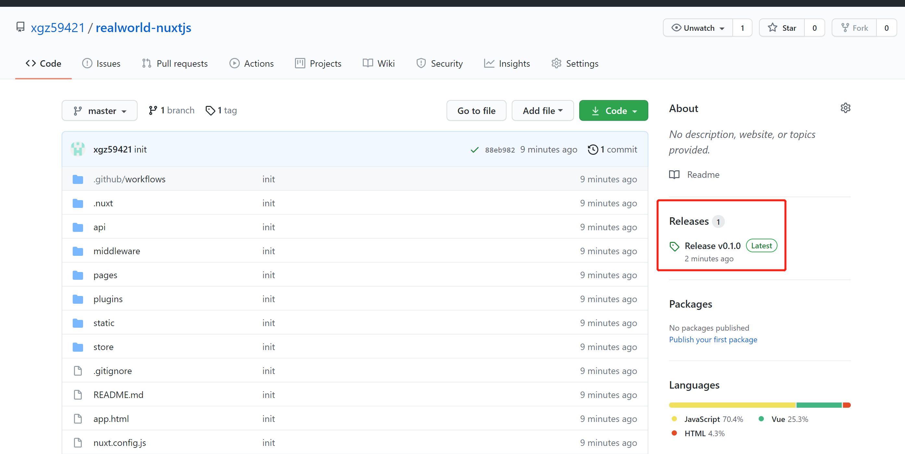
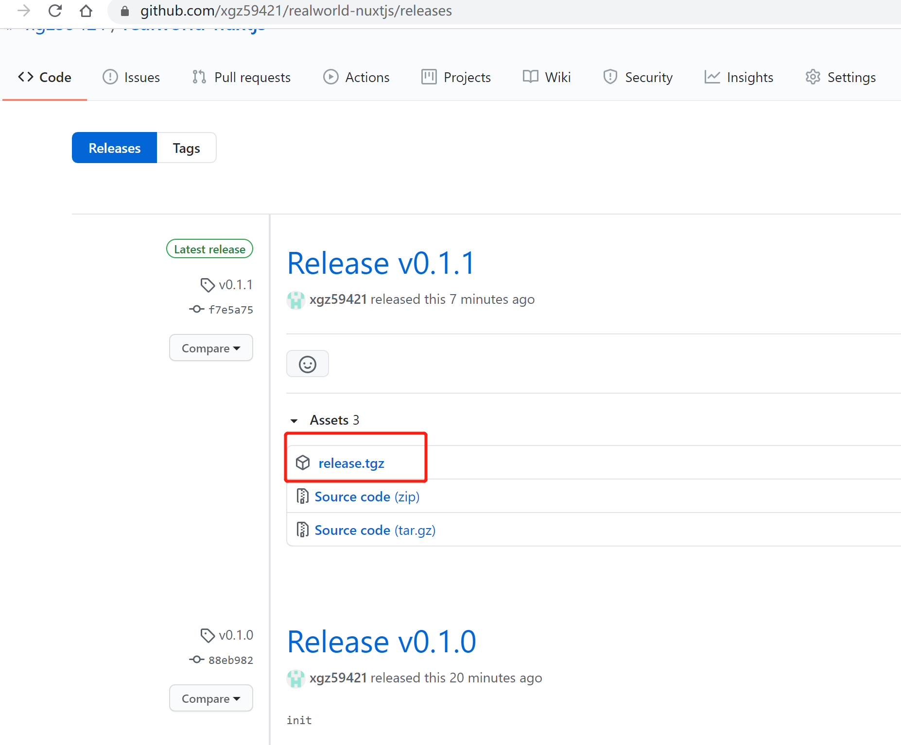

#### 自动部署 CI/CD
##### 种类:
```js
  Jeckins
  Gitlab CI
  GitHub Actions
  Travis CI
  Circle CI
```


##### GitHub Actions
```js
环境准备: 
  1. Linux 服务器
  2. 把代码提交到GitHub 远程仓库

配置 GitHub Access Token
1. 生成token
https://github.com/settings/tokens   (Generate new token)
2. 配置到项目的secrets中 
https://github.com/xgz59421/realworld-nuxtjs/settings/secrets/actions
```








