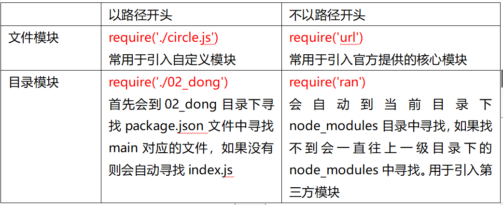

## jquery
- [1. nodejs概述](#1)
- [2. 全局对象](#2)
- [3. 模块系统](#3)
- [4. 定时器](#4)
--------
>#
><h2 id='1'>1. nodejs概述</h2>
- 基于谷歌V8引擎，运行在服务器端的环境
- nodejs执行方式  
  脚本模式   node  c:/xampp/.../01.js   回车  
  交互模式   node  回车  进入交互模式  
- `nodejs API`  
  www.nodejs.org  官网   
  www.nodejs.cn 中文镜像
- 查看版本  node  -v
- 适用场景  
   基于社交网络的大规模web应用(属于I/O密集型)

>#
><h2 id='2'>2. 全局对象</h2>
1. `global`对象  
    ```bash
    # 在交互模式下
      声明的变量和创建函数都属于全局对象下的
      可以使用global来访问  global.a   global.fn
    # 在脚本模式
      声明的变量和创建函数都不属于全局对象下的，不能使用global来访问
    # js：window
    ```
2. `console`对象
    ```javascript
    console.log(1)   //打印日志
    console.info(2)  //打印消息
    console.warn(3)  //打印警告
    console.error(4)  //打印错误
    console.time( )  //开始计时
    console.timeEnd()  //结束计时
    example:
      console.time("for");//for为自定义标签
      for (var i = 0; i < 10000; i++) 
      console.timeEnd("for");
    ```
3. process对象
    ```css
    进程: 执行程序的时候，操作系统分配内存空间
    process.arch  查看当前CPU架构
    process.platform   查看当前的操作系统
    process.env   查看当前的环境变量有哪些
    process.version  查看当前NodeJS版本号
    process.pid  查看当前进程的编号
    process.kill()  结束某个编号的进程
    ```
4. Buffer对象
- Buffer：缓冲区，缓冲器
- buffer数据，是内存中一块存储的临时数据，常用于存储网络传输时的资源。
  ```javascript
  //创建buffer为5个字节，并存储数据
    let buf=Buffer.alloc(5, 'abcde'); 
  //转为字符串
    buf.toString()  /  String(buf)   
  ```

>#
><h2 id='1'>3. 模块系统</h2>
- 每个模块都是一个独立的功能体
- nodejs模块分为`自定义模块、第三方模块、核心模块`
- `每个文件就是一个模块`，创建一个文件就是创建一个模块
  ```bash
  nodejs自动为每个文件添加了构造函数，所有的代码被构造函数所包含
    (function(exports,require,module,__filename,__dirname){
      程序员自己写的代码
    })
    __dirname: 当前模块的绝对目录  directory
    __filename: 当前模块的绝对目录和模块名称
  ```
- `每个文件都是一个模块作用域，里边的变量和函数外部都是无法访问`
  ```javascript
  require(): 用于引入其它的模块，得到的是对方导出的对象
  module: 当前模块的对象
  module.exports:  当前模块导出的内容，默认是一个对象，导出的内容都往这个对象下添加
  ```
- 模块分类  
  
  ```css
  执行require('mysql')，是如何引入模块的。
  会到当前目录下的node_modules中寻找mysql目录, 如果找不到, 会一直往上一级目录下的node_modules中寻找mysql目录; 找到后, 接着到mysql目录下去寻找package.json中main对应的文件, 如果找不到会自动去寻找index.js
  ```

- `querystring模块`
  ```javascript
  查询字符串：浏览器向服务器发请求，传递数据的一种方式
    parse()  将查询字符串解析为对象
    stringify()  将对象格式化为查询字符串

  const querystring = require("querystring");
  console.log(querystring)
  let str = "kw=dell&price=4999.00";
  //解析查询字符串为对象
  var obj = querystring.parse(str);
  //将对象格式化为 查询字符串
  let obj2 = {lid:18,title:"dell"}
  var str2 = querystring.stringify(obj2);
  ```
- `url模块`:   
  ```javascript
  URL模块用于操作URL
    parse()  将URL解析为对象, 查询字符串部分(query) 
  const url = require("url");
  let str = "http://www.codey.com:80/products.html?kw=dell#three";
  //解析URL为对象
  var obj = url.parse(str);
  console.log(obj.query)

  //将对象转为URL
  var obj2 = {
      protocol: 'http:',hostname: 'www.codey.com',
      search: '?kw=dell', hash: '#three',
  }
  var strurl = url.format(obj2);
  ```
>#
><h2 id='4'>4. 定时器</h2>
1. 一次定时器
    ```javascript
    当间隔时间到了，执行一次回调函数，间隔时间单位是毫秒
    // let timer=setTimeout(回调函数, 间隔时间);
    清除
    // clearTimeout(timer)
    ```
2. 周期性定时器
    ```javascript
    每隔一段时间，调用一次回调函数
    // let timer=setInterval( 回调函数,间隔时间 )
    清除
    // clearInterval(timer)
    ```
3. 立即执行的定时器
    ```javascript
    1.在事件队列的开头执行
      let timer=setImmediate(回调函数)
      清除
      clearImmediate(timer)
    2. 在主程序的后边执行
      process.nextTick(回调函数)
      没有清除

    立即执行的定时器会将回调函数放入到事件队列中。
    事件队列：由一组回调函数组成的队列，当主程序执行完才会执行
    ```
