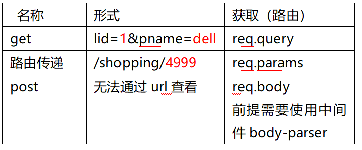

# express框架
- [1. 安装](#1)
- [2. 创建web服务器](#2)
- [3. 路由](#3)
- [4. 路由器](#4)
- [5. 中间件](#5)
--------
><h2 id='1'>1. 安装</h2>
- npm install express 
><h2 id='2'>2. 创建web服务器</h2>
  ```javascript
  //引入express模块
  const express=require('express');
  //创建web服务器
  var app=express(); 
  //监听端口
  app.listen(8080); 
  ```
><h2 id='3'>3. 路由</h2>
- 浏览器向web服务器发请求，web服务器根据请求的url和请求的方法来作出响应。
- 三要素：`请求的url`,`请求的方法`,`响应(回调函数)`
  ```css
  res 响应的对象
    send()  设置并发送响应的内容,路由中只能使用一次
    sendFile()  响应文件,要求使用绝对路径,__dirname
    redirect()  响应的重定向,跳转到另一个url
  req 请求的对象
    method  请求的方法
    url   请求的url  
    headers   请求的头信息
    query   获取请求的查询字符串形式的数据，格式为对象
    params  获取路由传递的数据
  ```
  ```javascript
  设置路由中接收数据的名称
  app.get('/shopping/:price', function(req,res){
    req.params  //获取传递的数据，格式为对象
  });
  浏览器传递数据
  http://127.0.0.1:8080/shopping/4999
  ```
><h2 id='4'>4. 路由器</h2>
-  路由在使用的过程中，不同模块下的路由可能出现相同的url; 把同一个模块下的路由放到特定的路由器。
```javascript
  1. 创建路由器
    //1.路由器是express下的一个功能
      const express=require('express');
    //2.创建路由器对象
    var router=express.Router();
    //3.往路由器中添加路由
    router.get('/list',function(req,res){
      res.send('这是用户列表');
    });
    //4.导出路由器对象
    module.exports=router;
  2. 引入路由
    //引入路由器模块
    const userRouter=require('./user.js');
    //挂载路由器到web服务器下，添加前缀
    //参数1：
      //添加的前缀 /user, 访问形式 /user/list
    //参数2：要挂载的路由器
    app.use('/user',userRouter);
```

><h2 id='5'>5. 中间件</h2>
 - 为主要的业务逻辑服务; 接收到请求，以及做出响应
 - 应用级中间件、路由级中间件、内置中间件、第三方中间件、错误处理中间件
1. 路由级中间件  
    ```bash
    路由级中间件使用  
    # app.use( '/product', productRouter )
    ```
2. 应用级中间件
- 也称为自定义中间件
  ```bash
  app.use( url, (req,res,next)=>{
    # url 表示要拦截的URL,对应路由中的URL,一旦拦截会自动执行回调函数
    # next 是一个函数，表示往后执行下一个中间件或者路由
  })
  ```
3. 内置中间件
- 托管静态资源（html, css, js, 图像...）
- 当浏览器端请求文件, 不需要通过路由去寻找文件, 而是让浏览器自动到指定的目录下去寻找  
  ```css
  app.use( express.static('目录路径') )
  ```
4. 第三方中间件
- 属于第三方模块, 需要提前下载安装
  ```javascript
  使用body-parser将post请求数据解析为对象
    //1.引入body-parser模块
      const bodyParser=require('body-parser');
    //2.使用body-parser中间件，会将所有post请求数据解析为对象
      app.use( bodyParser.urlencoded({
        //是否使用扩展的querystring模块 
          //true表示使用, false表示不使用
        extended: false
      }) );
    //3.在路由中获取对象格式数据
      req.body
  ```
  
5. mysql
  ```sql
  连接数据库
    mysql  -uroot
    mysql.exe  -h127.0.0.1   -P3306  -uroot   -p
  增删改查
    select * from emp where eid=1;
    insert  into  emp  values(...);
    update  emp  set  sex=1,salary=8000 where eid=3;
    delete from emp where eid=2;
  ```
- 安装: npm  install  mysql
- mysql使用
  ```javascript
  1. 创建普通连接
    const mysql = require("mysql");
    //创建连接对象
    let connection = mysql.createConnection({
        host:"127.0.0.1",
        port:"3306",
        user:"root",
        password:"",
        database:"tedu"
    });
    //执行连接
    connection.connect();

    //执行SQL语句
    var sql = 'SELECT * FROM emp WHERE eid = ?';
    connection.query(sql,[5], function (err, result) {
        if (err)throw err;
        console.log(result);
    });
  2. 创建连接池
    连接池中保存若干个mysql的连接，如果要操作数据库，只需要从中取出一个连接，当使用完会自动归还到连接池。
    const mysql = require("mysql");
    //创建连接池对象
    let pool = mysql.createPool({
        host:"127.0.0.1",
        port:"3306",
        user:"root",
        password:"",
        database:"tedu",
        connectionLimit:15      //连接池的大小
    });

    //执行sql命令
    var sql = 'SELECT * FROM emp WHERE eid = ?';
    pool.query(sql , [5], function (err, result) {
        if (err) throw err;
        console.log(result);
    });
  ```
