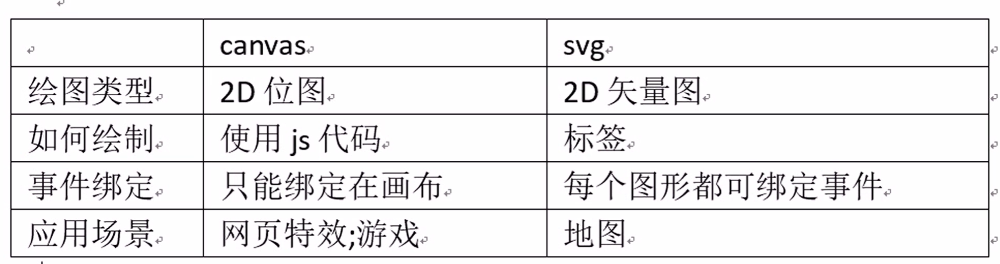
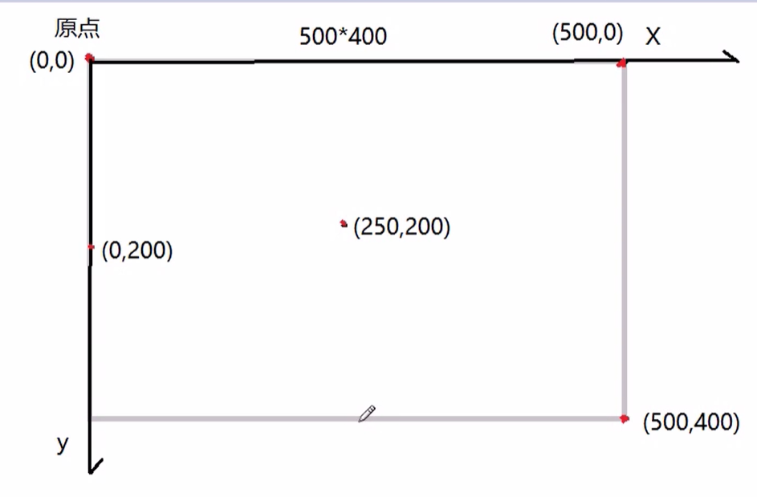

# canvas


--------

>1.canvas 创建画布
```html
1. 通过标签创建画布
  <canvas id="c3" width="500" height="400"></canvas>
  注意事项:画布宽度和高度一定用js或者属性添加 ,不能css样式来赋值 (变形)
2. 通过js获取画布
  var c3 = document.getElementById("c3");
3. 通过画布获取(画笔对象-上下文对象)
  var ctx = c3.getContext("2d");
```

>2.绘制矩形 fillRect/strokeRect
```css
1. 绘制空心矩形(描边矩形)
ctx.strokeRect(x,y,w,h);
x,y 空心矩形左上角位置
w,h 空心矩形宽度和高度
2. 设置空心样式(样式要放在绘制图形前)
ctx.strokeStyle = "#00f";
3. 绘制实心矩形(填充矩形)
ctx.fillRect(x,y,w,h);
4. 设置实心样式
ctx.fillStyle = "#f00";
ctx.fillRect(0,0,100,80); 生效 ctx.strokeRect(0,0,100,80); 不生效
5. 清空矩形范围内所有元素
ctx.clearRect(x,y,w,h);
* 清空画布中所有元素 ctx.clearRect(0,0,500,400)

* 背景颜色谨慎使用,修改方案:
1. 给柱添加透明度,使颜色柔和颜色
ctx.globalAlpha = 0.3; //透明度
2. 现成颜色组使用 echarts
['#c23531','#2f4554', '#61a0a8', '#d48265', '#91c7ae','#749f83', '#ca8622', '#bda29a','#6e7074', '#546570', '#c4ccd3']
```

>3.文本 fillText/strokeText
```
常用方法与属性:
ctx.strokeText(str,x,y); 绘制描边文字(空心)
ctx.fillText(str,x,y); 绘制填充文字(实心)
  str:绘制文本
  x,y:字符串左上角位置(以文本基线为准)
ctx.font="19px SimHei"; 前面文本大小/字体
ctx.textBaseline = "top"; 调整文本基线
  [top/alphabetic/bottom]
ctx.lineWidth = 15; 线的粗细
```
>4.canvas绘图-路径
```js
路径:绘制不规则图形 (复杂)
path:由多个坐标点组件任意图形,图形本身不可见,可以描边或者填充
ctx.beginPath(); 开始一条新路径(上一条路径结束)
ctx.moveTo(x,y); 移动到指定点(x,y)
ctx.lineTo(x,y); 从当前点到指定点绘制一条直线(x,y)
ctx.stroke(); 描边
ctx.fill(); 填充
ctx.closePath(); 闭合一条路径(结束点到开始点画一条直线)
ctx.arc(cx,cy,r,start,end); 绘制一条圆拱形
  cx,cy 圆心位置(x,y)
  r 半径
  start 开始角度
  end 结束角度
  注意:参数start,end 不使用常用角度完成设置，使用弧度设置
  角度 0~360 弧度0~2PI
  采用角度转换弧度 `角度*Math.PI/180=弧度`
```

>5.图像 drawImage
```
图片可以使用img标准显示网页为什么用canvas[复杂]
图片位置:一个软件项目所有图片保存服务器
  (1)图片版权
  (2)图片数量巨大
操作过程将图片绘制canvas画布上
  (1)创建图像对象 p3 = new Image();
  (2)下载图像 p3.src = "p3.png"; //2ms
  (3)为图片绑定事件下载成功 p3.onload = function(){...}
  (4)绘制图片 ctx.drawImage(p3,x,y)
  (4)绘制图片 ctx.drawImage(p3,x,y,w,h)
    p3 图片对象
    x,y 图片或者文本或者图片左上角位置(原始大小图片)
    w,h 图片宽度和高度(拉伸)
```
>6.canvas绘图-变形
```
canvas绘制时对图片进行旋转操作
rotate(deg) 旋转
  (1)旋转画笔对象
  (2)旋转轴心在画布原点
  (3)旋转角度会有累加操作
  (4)deg不同角度弧度
translate(x,y) 移动原点(移动轴心)到指定位置
原则: 什么时候使用如下两个方法
  当画布上绘制一个以上元素时必须使用下面方法
save() 保存画笔状态(原点;角度;颜色;...)
restore() 恢复到画笔保存时状态(原点;角度;颜色;..)
  画图时:如果画布中有多个(一个以上)元素,画之前先保存状态
  画之后恢复状态(元素之间不会受到影响)
```

