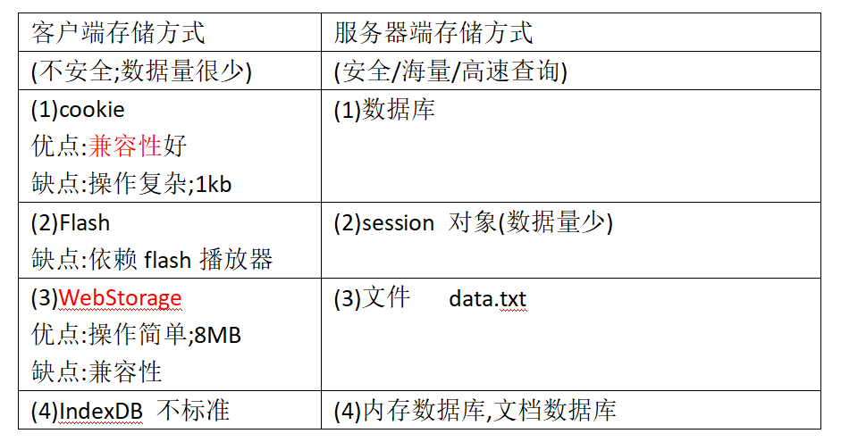

# WebStorage

------
WebStorage 存储数据依赖二个对象

>1.sessionStorage
```
sessionStorage对象存储范围在当前会话中.
当前会话中所有网页 都可以使用sessionStorage 保存
但是如果会话结束数据丢失!
注意事项:会话结束(关闭浏览器-关闭标签),退出浏览器生效
```

>2.localStorage
```
此对象保存数据永久保存
```
>3.WebStorage 操作数据方法与属性以上两个对象通用
```
1. 保存数据 
  sessionStorage.setItem(key,value); 
  localStorage.setItem(key,value); 
2. 获取数据 
  var value = sessionStorage.getItem(key);
3. 删除指定数据 
  sessionStorage.removeItem(key);
4. 清空所有数据 
  sessionStorage.clear()
5. 数据长度 
  sessionStorage.length
```
