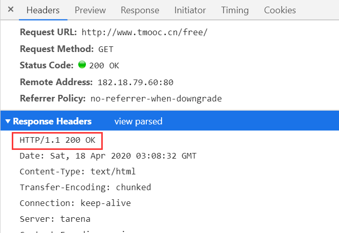

## HTTP
--------
>### 1. URL  
1. http://101.96.128.94:9999/product_details.html?lid=1  
2. url的结构：协议+主机名称+文件目录+文件名称  
3. URL完整的结构  
   `<scheme>://<user>:<upwd>@<host>:<port>/<path><params>?<query>#<flag>`  
- `<scheme>` 方案，协议。以哪种方式获取服务器资源。不区分大小写。  
-   
- `<user>:<upwd>` 早期，服务器管理员，填写用户名和密码
- `<host>`主机名称  
   域名---标志性建筑，好记好背   
   ip-----具体的门牌号码  
- `<port>` 端口号
- `<path>` 路径，资源在服务器上具体的存放位置
- `<params>` 跟踪状态参数，cookie/session
- `<query>` 查询字符串
- `<flag>` 锚点

>### 2. HTTP协议  
- HyperText Transfer Protocol 超文本传输协议  
- 规范了数据是如何打包和传递的  
- 现在我们用的http/1.1版本       
-    

>### 3. web请求原理的详解  
- 

>### 4. 消息/报文message
- http要求，消息必须符合特定的格式才能被彼此理解
* Request message  客户端发送给服务器的数据块
* Response message  服务器发送给客户端的数据块	

>### 5. Request message
- 客户端发送给服务器的数据块
- 由三部分组成:  
1. 请求起始行  (Request Headers 点view source)    
   (1)请求方法   
   |method| HTTP原生 | Restful | 
   |:----:|  :----:  |  :----:  |
   |get|没有请求主体，使用查询字符串,req.query | 所有查询使用get, 没有请求主体, req.params接收 |
   |post| 有请求主体,req.body接收 |新增操作,有请求主体,req.body接收 |
   |put|往服务器传输文件时使用|修改操作,有请求主体,req.body接收 |
   |delete|从服务器上删除资源的时候使用|删除操作,没有请求主体,req.params接收|
   |option| 预请求|无|
   (2)协议版本号  
   (3)请求的主机的url  
     
2. 请求头 (Request Headers 点view parsed)  
   - Host: www.tmooc.cn
      浏览器告诉服务器，本浏览器要访问的服务器主机地址
   - Connection: keep-alive
      告诉服务器，请开启持久连接
   - User-Agent: Mozilla/5.0 (Windows NT 10.0; WOW64) AppleWebKit/537.36 (KHTML, like Gecko) Chrome/83.0.4103.61 Safari/537.36
   告诉服务器，我当前浏览器以及客户端电脑的信息
   - Accept-Encoding: gzip, deflate
   告诉服务器，我这个浏览器可以接收的压缩文件的类型
   - Accept-Language: zh-CN
   告诉服务器，我能够接收的自然语言
   - Referer: http://www.tmooc.cn/
   告诉服务器，我这个请求来源于哪个页面
3. 请求主体 formdata

>### 6. Response message
- 服务器发送给客户端的数据块
- 响应消息,是服务器发送给客户端的数据块
- 由三部分组成:
1. 响应起始行
   - 协议版本号, http/1.1   
   - 响应状态码, 告诉浏览器响应状态码是什么    
      1xx: 正在请求,提示信息  
      200: 响应成功  
      3xx: 重定向  
       301: 永久重定向  
       302: 临时重定向  
       304; 命中缓存  
      4xx:  
       404 请求资源不存在  
       403 权限不够  
       405 请求不被允许    
      500 服务器代码错误  
   - 原因短句,对响应状态码的简短解释  
   
2. 响应头  
   - Date: Wed, 01 Jul 2020 06:53:40 GMT 服务器告诉浏览器，服务器的响应时间
   - Connection: keep-alive 告诉浏览器，持久连接已经开启
   - Content-Type: text/html 告诉浏览器，响应内容的类型    
     text/html html文本  
     text/css css文件  
     text/plain 普通文本  
     application/javascript js文件  
     application/xml xml字符串  
     application/json json字符串  
     img/jpg gif png 图片  
      
3. 请求主体 formdata  
- http原生: get没有, post有  
- Resetful: get/delete没有, post/put有

	
>### 7. 缓存
* 客户端将服务器响应回来的数据进行自动的保存  
* 当再次访问的时候,直接使用保存的数据  
* 优点:  
   减少冗余的数据传输,节省客户端浏览器  
   节省服务器带宽  
   降低了对服务器资源的消耗和运行的要求  
   降低了由于远距离传输造成的加载延迟  
    
* 缓存能否命中的原理  
	   
* 与缓存相关的消息头:  
	Cache-Control: no-cache /  max-age=3600(秒) 缓存1小时  
	meta http-equiv="消息头的属性名称" content="值"  
	meta http-equiv="Cache-Control" content="max-age = 3600"  

>### 8.http 连接性能优化
1. 减少连接创建次数 (开启持久连接)
2. 减少请求次数 (缓存)
3. 提高 服务器端运行速度
4. 尽可能减少响应数据的长度

>### 9.https 安全的http协议
- ssl 为数据通信提供安全支持
- HTTPS , 安全版本的http协议 
1. 客户端发送请求-->ssl层加密-->服务器收到加密文件,在ssl层解密,得到请求明文
2. 服务器发送响应-->ssl层加密-->客户端得到加密文件,在ssl层解密,得到响应明文  
 
	

