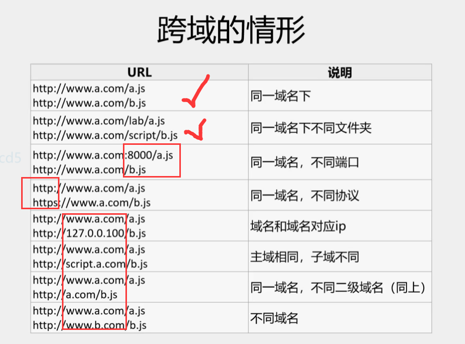
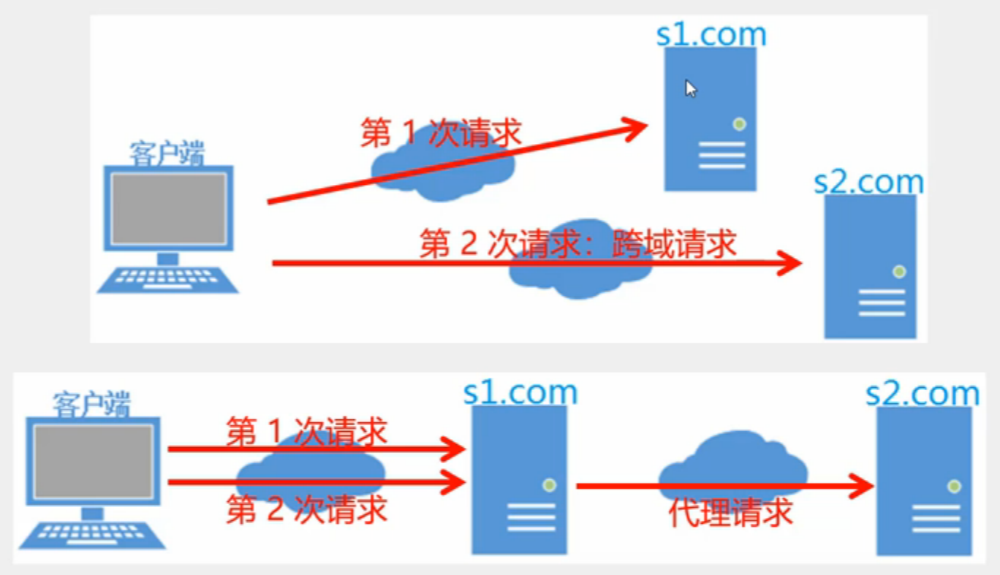
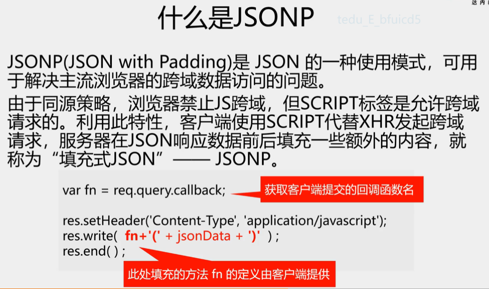

## jquery ajax 
- [1. load](#1)
- [2. get](#2)
- [3. post](#3)
- [4. getScript](#4)
- [5. getJSON](#5)
- [6. ajax ***](#6)
- [7. 跨域 ***](#7)
>#
><h2 id='1'>1. load</h2> 
* 作用:将服务器返回的数据添加到符合要求的字节上
* 用法:
  ```bash
  $obj.load(请求地址, 请求参数(略), 回调函数(略))
    参数: 
      写法1: "uname = tom & age =22"
      写法2: {uname: "tom", age: 22}
  ```
* 有参数时, `load为post请求`, 否则为get请求
  ```html
  example:
    <header id='header'></header> 获取服务器 header.html资源
    $("#header").load(url, function (){
      //回调中再添加一个css 文件
      $(`<link rel="stylesheet" href="css/header.css">`).appendTo("head");
    })
  ```
>#
><h2 id='2'>2. get()</h2> 
* 作用:`发送GET请求`
* 用法:
  ```javascript
  $.get(请求地址, 参数(略), 回调函数, 服务器返回数据类型(略))
  说明:
    回调函数添加的参数时服务器返回的数据.
    服务器返回的数据类型:
    html html文本
    text 文本
    json js对象
    xml xml文档
    script js脚本
  example:
    $.get(url, function (result) {}, "json");   
    //如果写"json",则会自动调用JSON.parse将服务器数据转换为数组或对象
  ```
>#
><h2 id='3'>3. post()</h2> 
* 作用:发送POST请求
* 用法:
  ```bash
  $.post(url, "k1=v1&k2=v2"或{k1:v1,k2:v2}, fn, 结果类型)
  说明:
    jQuery会自动设置Content-Type请求头
      # application/x-www-form-urlencoded .
    jQuery提供了一个表单序列化函数
      # $("#form1").serialize()
  example:
    # $.post(url, params, (result)=> {}, "json");
  ```
>#
><h2 id='4'>4. getScript() 发送的是script请求</h2> 
* 作用:`通过HTTP GET请求载入并执行js文件`
* 用法:
  ```bash
  # $.getScript(url, success(response, status) )
      success(略):(response, status) 
      response:包含来自请求的结果数据
      status:包含请求状态
        success
        error
        timeout
        notmodified
  ```

>#
><h2 id='5'>5. getJSON()</h2> 
* `$.getJSON()`允许通过使用JSONP形式的回调函数来加载其他网域的JSON数据
* 使用$getJSON()方法实现跨域请求, 需要在请求路径url后增加"callback=?" jQuery将自动转换 "?" 为正确的函数名, 以执行回调函数
* 用法:`$.getJSON("myurl?callback=?", function(data){})`

># 
><h2 id='6' class=''>6. ajax()</h2> 
* 用法:
  ```bash
  # $.ajax({})  可以代替上面所有函数!
    {}内可以设置选项参数
      url: 请求地址
      type: 请求方式
      data: 请求参数
      dataType: 服务器返回的数据类型
      success: 服务器处理正常的回调函数
      error: 服务器出错的回调函数
      "async:true" (缺省,异步), 值false时发送同步请求
  ```
  ```javascript
  //get: 
    $.ajax({
      url: url,
      type: "get",
      data: {lid: 1},  
      dataType: "json",
      success: function (result) {},
      error: function (err) {}
    }); 
  //post:
    $.ajax({
      url: url,
      type: "post",
      data: {
        uname: $(":text").val(),
        upwd: $(":password").val()
      },
      dataType: "json",
      success: function (result) {},
      error: function (err) {}
    });
  ```
># 
><h2 id='7' class=''>7. 跨域</h2> 
- 源(Origin): 
  ```bash
  指页面中数据的来源,由三部分指定:
    协议名
    域名或IP地址
    端口号
  同源策略(Same Origin Policy) 是浏览器的一个安全功能
  不同源(协议名, 域名, 端口)任一项不同的客户端js脚本在没有授权的情况下, 不能读取对方资源----称为"禁止js的跨域请求". 
  # 跨域问题是针对js和ajax的, html本身没有跨域问题
  ```
  
- 解决跨域问题方案
  ```javascript
  1. 代理请求
  2. JSONP
    server:
      res.write(fn+(${JSON.stringify(result)))
    client:
      方法1:
        $.getJSON(
          "http:xxx?callback=?", 
          function(result){}
        )
      方法2: $ajax(type:"jsonp")
  3. CORS
    npm i cors
    app.use(cors(){origin:["http:8080","http:5500"]})
  ```
  
  


