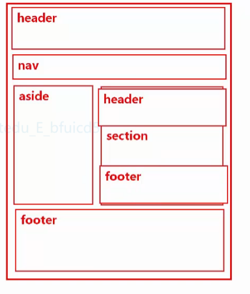

# html
HyperText Markup Language 超文本标记语言

### 1.HTML的基本语法
1. 双标记 (封闭类型标记，有开有关)
   `<form></form>`
2. 单标记 (非封闭类型，有开没有关)
   `<input>, `
3. 注释 `<!-- 这里是注释 -->`
4. 嵌套
### 2.HTML文档结构
1. 文档类型的声明   
   `<!DOCTYPE html>`告诉浏览器，当前html页面使用h5的规则编写，请用h5的规则解析
2. `<head></head>`  
   `<title></title>` 定义页面标题  
   `<meta/>` 定义网页的元数据  
   `<style></style>` 定义内部样式   
   `<script></script>` js定义或使用   
   `<link/>` 引用外部css文件  
3. `<body></body>`定义网页的主体
### 3.结构标记 
````
 h5新出了带结构语义的标签, 来取代div让代码增加可读性  
 带语义的标签,可以让网络爬虫,更快的找到
````
>常用的语义标签
1. 定义网页的头部,或者某个区域的顶部
   `<header></header>`
2. 定义网页的底部,或者某个区域的底部
   `<footer></footer>`
3. 定义网页的导航链接
   `<nav></nav>`
4. 定义网页的主体
   `<section></section>`
5. 定义网页的侧边栏
   `<aside></aside>`
6. 定义与文字相关的内容,比如论坛/回帖
   `<article></article>`
   ```html
   <nav>
      <a href="">秒杀</a>
      <a href="">闪购</a>
      <a href="">限时抢购</a>
   </nav>
   <aside>
      <a href="">母婴</a><br>
      <a href="">汽车</a><br>
      <a href="">电子</a><br>
   </aside>
   ```
   


