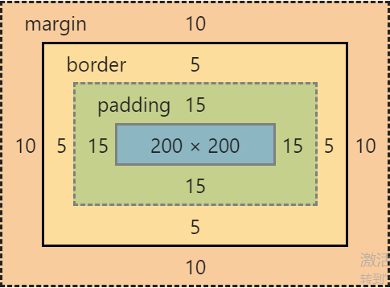

## 盒子模型
- [1. 盒子模型(框模型)](#1)
- [2. margin,外边距溢出/合并](#2)
- [3. padding](#3)
- [4. 改变盒子模型的计算方式box-sizing](#4)
--------
><h2 id='1'>1. 盒子模型(框模型)</h2> 
- 所有元素皆为框
- 每个元素在页面上都有自己的空间，空间不能被其他元素占用
- 盒子模型--框模型：元素在页面上`实际占地空间的计算方式 `
   ```
   元素的实际占地宽度=左外边距+左边框+左内边距+内容区域宽度+右内边距+右边框+右外边距
   元素的实际占地高度=上外边距+上边框+上内边距+内容区域高度+下内边距+下边框+下外边距
   ```
   
- 外边距 margin，边框以外的距离
- 内边距 padding，边框到内容区域之间的距离

><h2 id='2'>2. 外边距margin</h2> 
- 透明
- 使用场合  
   ```
   1. 元素位置的微调  
   2. 元素之间的间隙，可以使用外边距  
   3. 改变元素外边距，元素有位移效果  
   ```
1. margin语法  
- margin: 边距px; 同时设置4个方向的外边距  
- margin-top/right/bottom/left  
- 取值:  
   - 以px为单位的数字  
   - %都是按照父元素的宽度的%  
   - auto  
      ```
      1. auto对上下外边距无效
      2. auto让块级元素水平居中显示（块级元素设置了宽度）
      ```
2. margin 简写方式
- `margin: v1;` 同时设置4个方向的外边距  
- `margin: v1 v2;`  v1:上下, v2:左右
   ``` css 
   margin: 0 auto;  上下为0, 左右后居中.  
   ```
- `margin: v1 v2 v3;`  v1:上 v2:左右 v3:下  
   ```css
   margin: 10px auto 20px;  上10下20左右居中 
   ```
- margin: v1 v2 v3 v4;  v1:上 v2:右 v3:下 v4:左  
3. margin 外边距的合并
- 当两个垂直的外边距相遇, 他们将合并为一个外边距,值以大的为准.
- 解决:设计时候规避, 只写一个垂直的外边距
4. 自带外边距元素  
body h1~h6 p ol ul 等等...  
由于不同浏览器对外边距和内边距的默认初始值不同,
导致同一代码,在不同浏览器运行,会产生不同效果.  
解决:  
在写代码之前 会把浏览器默认的样式清空,或重置.  
这个行为 css reset  
`*{margin: 0;padding: 0;}`
`h3,h4,h5,h6,hr,input,legend,li,ol,p,pre,td,textarea,th,ul{margin:0;padding:0}`
5. `外边距的溢出`  
- 在特殊的情况下,为子元素添加上外边距,会作用到父元素上
- 父元素没有上边框  
- 子元素的内容区域的上沿,与父元素内容区域的上沿重合
- 解决方案:
   1. 给父元素上沿加上边框, 弊端:增加了父元素实际的占地高度
   2. 给父元素增加了上内边距, 弊端:增加了父元素实际的占地高度
   3. 给父元素设置overflow:hidden/auto,弊端:不能溢出显示了
   4. `给父元素添加一个 大儿子, 空的table`
      ```html
      <div id="d4">
         <table></table>
         <div id="d5"></div>
      </div>
      ```

><h2 id='3'>3. 内边距padding</h2> 
1. padding 内边距
- 改变内边距,元素内容区域没有变,变化的是边框到内容区域的距离
- 内边距颜色 和 内容背景色一致
- 语法:  
  padding: v1; 设置4个方向内边距  
  padding-top/bottom/left/right  
  padding取值:  
   - 以px为单位的数字  
   - % 都是父元素宽度的%  
   - padding没有auto    
2. 简写方式  
  padding: v1;  设置4个方向  
  padding: v1 v2;  v1设置上下,v2 设置左右  
  padding: v1 v2 v3;  v1设置上,v2 设置左右 v3下
  padding: v1 v2 v3 v4;   上右下左

><h2 id='4'>4. 改变盒子模型的计算方式box-sizing</h2> 
1. 默认盒子模型计算方式  
- box-sizing:content-box; 
- 设置的width为内容区域
   `计算公式：左右外边距，左右边框，左右内边，width`
2. 改变盒子模型计算方式
- box-sizing: border-box; 
- 设置的width为：左右边框+左右内边距+内容区域
   `计算公式：左右外边距+width`
   ```
   高度同理，一样会改变！！！
   当元素尺寸设置为百分比的，通常使用border-box
   ```


