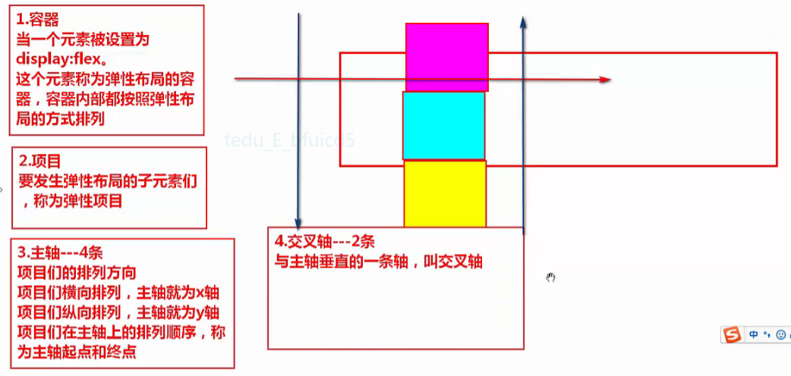

><h2 id='1'>弹性布局 flex</h2> 
- 一种布局方式，一堆子元素在一个父元素内，横向/纵向的对齐方式都可以灵活控制 
  
- 语法  
  `display:flex;`把块级元素变为弹性容器  
  `display:inline-flex;` 把行内元素变为弹性容器
- 将元素变为弹性容器, 他所有的子元素都将变为弹性项目
- 注意:
  ```
  1.元素设置为容器后
    元素的 text-align, vertical-align失效
    只能使用主轴和交叉轴的属性来设置子元素对齐方式
  2.弹性项目, 浮动, 清除浮动失效
  ```
`1. 容器的属性`（设置所有项目）  
  1. 主轴方向（4条）  
  `flex-direction: row;` x轴,起点在左侧,默认值  
  `row-reverse;` x轴，起点在右侧  
  `column;` y轴，起点在顶端    
  `column-reverse;` y  起点在底部       
  2. 设置项目换行  
  `flex-wrap: nowrap;`  默认值,项目不换行  
  `flex-wrap: wrap;`  项目换行       
  3. 主轴方向，项目换行的简写方式  
  `flex-flow:direction wrap;`
  4. 项目在主轴上排列方式  
  `justify-content: flex-start;` 主轴起点对齐，默认值      
  `center;` 主轴中间对齐    
  `flex-end;` 主轴终点对齐  
  `space-around;` 每个项目左右间距相同  
  `space-between;`
  5. 所有项目在交叉轴上的对齐方式  
  `align-items: flex-start;` 默认值,交叉轴起点对齐
  `center;` 交叉轴中间对齐
  `flex-end;` 交叉轴终点对齐
  `baseline;` 所有项目的基线对齐
  `stretch;` 所有项目在交叉的方向上不设置尺寸,充满交叉轴

`2. 项目的属性`(设置某一个项目)  
  1. `order:`
  - 定义项目的排列顺序, 值越小,越靠近主轴起点
  - 取值:无单位的整数, 默认值:0  
  2. `align-self:`  
  - 单独某个项目在交叉轴上的对齐方式  
  `align-self: flex-start;`  默认值，交叉轴起点对齐  
  `center;`  交叉轴中间对齐  
  `flex-end;`  交叉轴终点对齐  
  `baseline;`  所有项目的基线对齐  
  `stretch;` 所有项目在交叉的方向上不充满交叉轴  
  `auto;`  遵循 align-items的值 
  3. `flex-shrink:` 无单位数字;  
      - 默认值为1,  
      - 0为不压缩  
  - 如果主轴方向空间不足，项目也设置了不换行
  - 每个项目如何压缩  
  - 主轴不足的空间，按照分配的份数进行压缩
  - 项目压缩后的宽度=项目原始宽度-不足空间*比例 
  4. `flex-grow:` 无单位数组  
      - 0 默认值，不增长
  - 如果主轴方向的空间有剩余，项目们该如何变大
  - 项目增长后的宽度=项目原始宽度+多余空间*比例
  5. `flex-basis：%`
      - px为单位的数字
  - 设置每个项目在主轴空间上占据的比例
  - flex-basis优先级大于设置的尺寸
  - 不要在img上使用
  6. shrink,grow,basis属性的简写方式   
  flex:grow shrink basis;  
  `flex:0 0 50%;`
