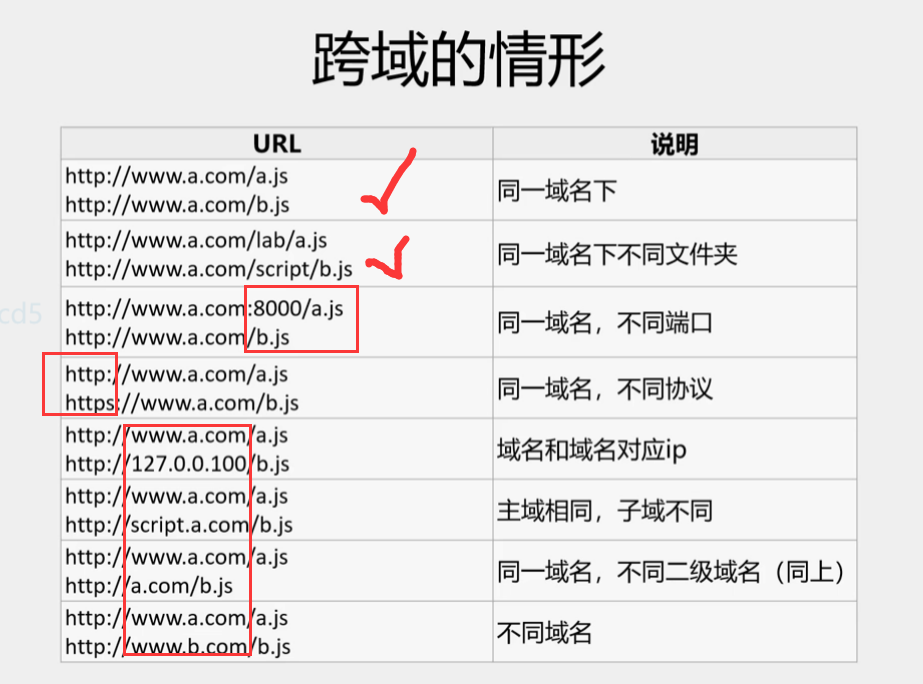
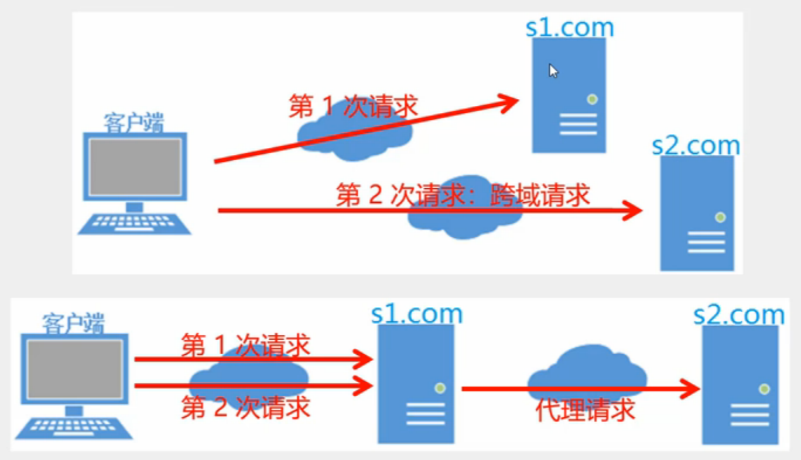
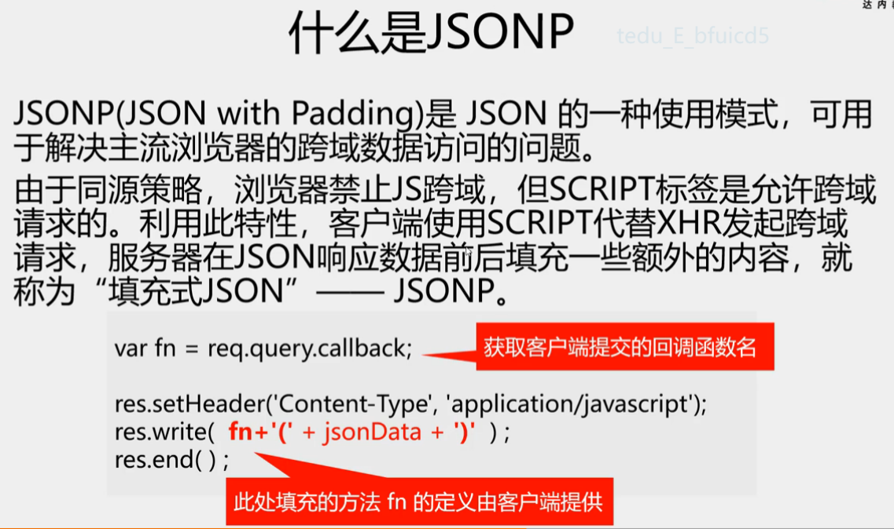

><h2 id='7' class=''>跨域</h2> 
- 源(Origin): 
  ```bash
  指页面中数据的来源,由三部分指定:
    协议名
    域名或IP地址
    端口号
  同源策略(Same Origin Policy) 是浏览器的一个安全功能
  不同源(协议名, 域名, 端口)任一项不同的客户端js脚本在没有授权的情况下, 不能读取对方资源----称为"禁止js的跨域请求". 
  # 跨域问题是针对js和ajax的, html本身没有跨域问题
  ```
  
- 解决跨域问题方案
  ```javascript
  1. 代理请求
  2. JSONP
    server:
      res.write(fn+(${JSON.stringify(result)))
    client:
      方法1:
        $.getJSON(
          "http:xxx?callback=?", 
          function(result){}
        )
      方法2: $ajax(type:"jsonp")
  3. CORS
    npm i cors
    app.use(cors(){origin:["http:8080","http:5500"]})
  ```
  
  