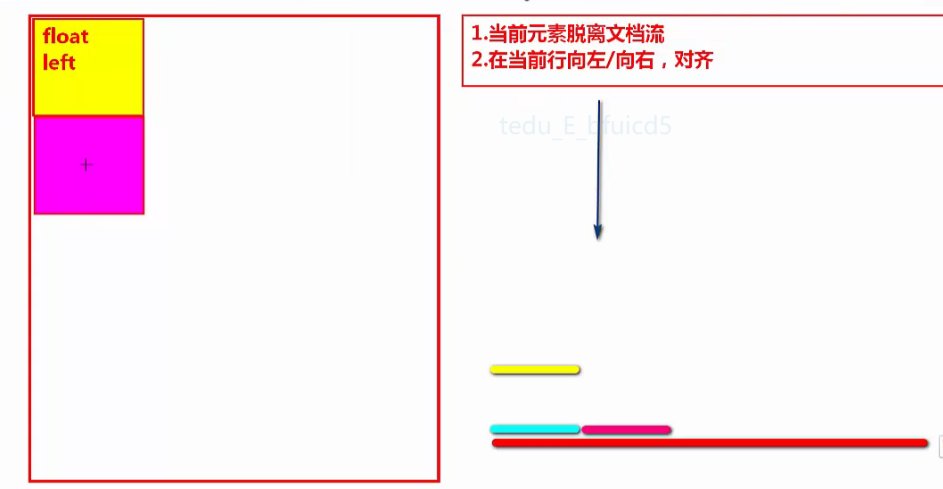
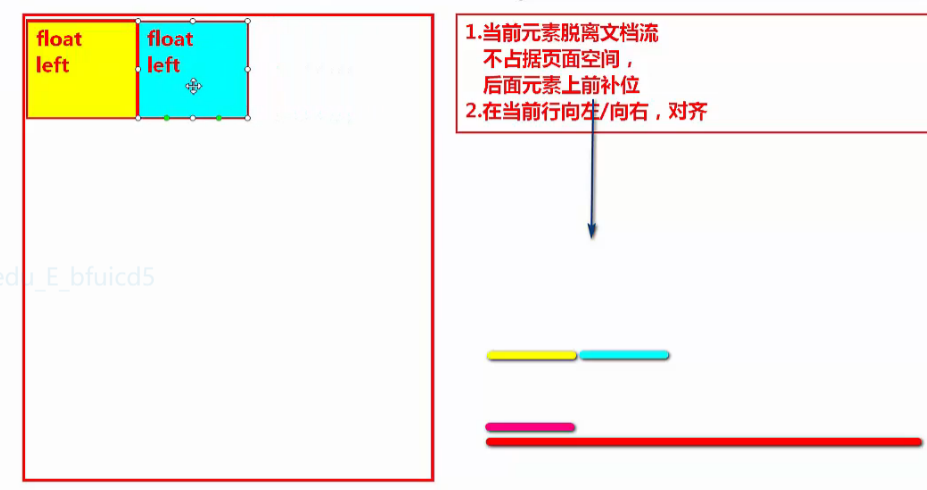
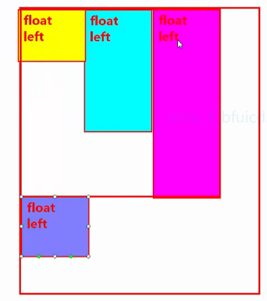
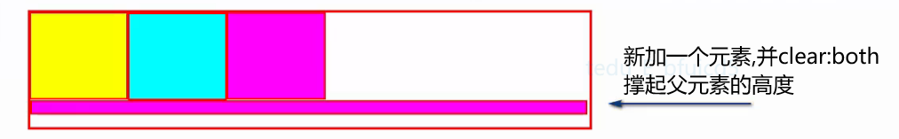

## 定位
- [1. 普通流定位](#1)
- [2. 浮动定位 float](#2)
- [3. 定位 position](#3)
--------
><h2 id='1'>1. 普通流定位</h2> 
- 默认的定位，默认文档流
1. 表格的常用属性
1. 所有元素皆为框
2. 每个都是从父元素的左上角开始渲染
3. 块级元素按照从上到下的方式逐个排列，单独成行
4. 行内元素，和行内块在一行中显示，从左往右。一行放不下自动换行

><h2 id='2'>2. 浮动定位</h2> 
- 就是让块级元素横向显示
- `float:left;`  左浮动  
  `float:right;` 右浮动  
  `float:none;` 不浮动，就是默认文档流  
- 浮动元素的特点
  ```
  1. 元素一旦浮动，脱离文档流
  2. 浮动元素会停靠在父元素的左边/右边，或者其他已浮动的后面
  3. 一行放不下所有浮动元素，会自动换行
  4. 浮动解决块级元素横向显示的问题
  ```
  
   <br>
- 浮动引发的特殊情况
  ```
  1. 元素一旦浮动，如果元素没有定义宽度，浮动之后的宽度靠内容撑开
  2. 元素一旦浮动，就会变成块级元素
  3. 浮动元素在浮动方向，会占位。被挤到下一行浮动元素，不能占据那个位置
  3. 行内元素，行内块，文本不会被浮动元素压在下面，主动避开
  ```
   <br>
- 元素脱离文档流
  ```
  1. 不占页面空间
  2. 后续元素上前补位
  3. 元素一旦脱离文档流，如果元素没有定义宽度，脱离文档流之后的宽度靠内容撑开
  4. 元素一旦脱离文档流，就会变成块级元素
  ```
- 清除浮动 
  ``` 
  清除之前浮动元素带来的影响  
  设置了清除浮动的元素，不会上前补位 
  ``` 
  `clear:left;`  清除左浮动带来的影响  
  `clear:right;`  清除右浮动带来的影响  
  `clear:both;`  清除所有浮动带来的影响
- 高度坍塌
  ```
  高度坍塌的原因:
  1.父元素不设置高度
  2.内部子元素都脱离文档流
  ```
  ```bash
  解决方案:
  1. 给父元素设置高度
    #项目中经常用，限于儿子较少，高度比较好计算的时候
  2. 父元素也浮动
    父元素如果浮动，会影响父元素的父元素，父元素的兄弟元素
  3. overflow:hidden/auto
    父元素就不能溢出显示了
  4. 使用清除浮动解决高度坍塌
    #追加一个空的div当做小儿子，给这个div设置clear:both
  ```
  

><h2 id='3'>3. 定位 position</h2> 
- 任何一个元素，定义了position,并且取值为relative/absolute/fixed中的一种时  : 
  ``` bash
  1.这个元素被称作已定位元素
  2.解锁5个属性
    # top:/right:/bottom:/left:  偏移属性
    # z-index: 堆叠顺序
  ```
1. 静态 `position:static;` 静态,默认值,文档流
2. 相对定位 `position: relative;`  
-  `相对定位不脱离文档流`
    ```bash
      相对本元素的原始位置做偏移
      如果一个元素，只定义了position:relative;没定义偏移属性:
        1. 它就会出现自己本身的位置。还不会影响其他元素
        2. 跟没写定位一样。
    ```
    ```bash
    注意:  
      # 1.当left 和 right 冲突, 以left为准
      # 2.当top 和 bottom 冲突, 以top为准
    ```
3. 绝对定位 `position: absolute;`  
-  `绝对定位脱离文档流`
    ```  
    绝对定位会相对于，离他最近的，已定位的，祖先级元素左上角做偏移
    绝对定位的元素，祖先级没有已定位元素，相对body左上角做偏移
    ```
4. 固定定位 `position:fixed;`   
- `固定定位脱离文档流`
- `永远相对于body左上角做偏移，永远固定在浏览器的可视区域内`

5. 堆叠顺序 z-index
- `z-index:无单位数字;`  
- `只对已定位元素有效`  
- 没有设置堆叠顺序, 后定位的元素, 堆叠顺序比先定位的元素高 (先后, 是按照 html的代码顺序),默认的堆叠顺序都不超过1
-  `定位是压着浮动的`
-  堆叠的最大值: 2^31次方  
- `堆叠顺序对父子关系无效，儿子永远压着爹`