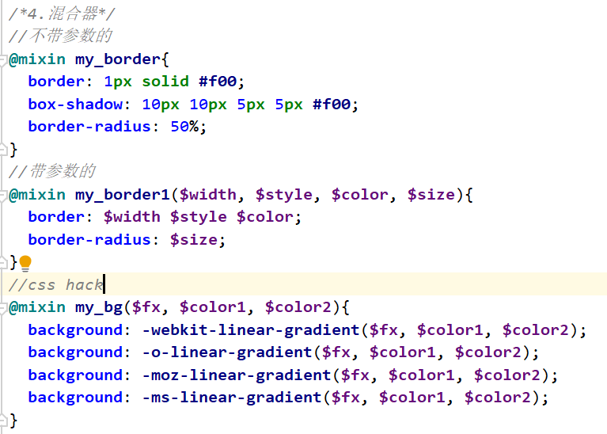

## SCSS
- scss是一款强化 css的辅助工具
- scss是一款强化和css 的语法超级像
- 在css的基础上添加了变量, 嵌套, 混合, 导入, 函数等高级功能
- [1. scss的使用](#1)
- [2. scss转换成css文件(路径问题)](#2)
- [3. 变量](#3)
- [4. 嵌套](#4)
- [5. 导入](#5)
- [6. 混合器](#6)
- [7. 继承](#7)
- [8. 运算 (加减乘除模)](#8)
- [9. 函数](#9)
--------
><h2 id='1'>1. scss的使用</h2> 
- scss在服务器端使用的
- 安装scss的步骤
  ```
  1. 保证nodejs版本在8.11以上
  2. 在线安装 cmd 输入 npm install -g node-sass
  3. 离线安装
  4. 验证: node-sass -v
  ```
><h2 id='2'>2. scss转换成css文件</h2> 
- 注意路径问题
  ```bash
  1. 单文件转换
  在项目路径下 node-sass scss文件 css文件
  # node-sass scss/scss1.scss css/css1.css
  2. 多文件转换
  命令: node-sass scss -o css
  3. 单文件监听
  开启一个监听,监听某一个scss文件,如果这个文件保存,自动转换成对应的css.
  命令: node-sass -w scss文件 css文件
  # node-sass -w scss/scss1_1.scss css/scss1_1.css
  4. 多文件监听
  命令: node-sass -w scss -o css
  ```
><h2 id='3'>3. 变量</h2> 
- 使用`$`声明变量
- 变量的名称可以包含`-`和`_`, 其他规则与css选择器规则相同,尽量见名知意
  ```
  1.变量可以保存什么数据?
    1.颜色值
    2.数字
    3.属性
    4.字符串
    5.变量中可以放其他变量
  2.变量的作用域
    在最近的一组大括号中有效
    写在全局,就全局生效
  3.!default规则
    如果此变量之前被声明了,使用之前的值
    如果之前没声明, 使用现在声明的值
  ```
><h2 id='4'>4. 嵌套</h2> 
- `嵌套`有效的减少了代码量
  ```css
  selector1{
    样式声明
    selector2 {样式声明}
  }
  ```
- 会自动生成后代选择器
- `如果嵌套伪类选择器`, 需要在 `:` 前添加占位附 `&`, 不然会有空格
  ```css
  a{
    color: #001; 
    &:hover{color: #002}
    }
  ``` 
  `群组的嵌套` :
  ```css
  div, .top,p, #content{
    a{color: #111;}
  }
  生成---->
  div a, .top a, p a, #content a {
    color: #111; 
  }
  ```
><h2 id='5'>5. 导入</h2>
- scss文件以下划线_ 作为前缀,是不会转换为css文件的---局部文件
- 而不带下划线_前缀的scss是必定会转换为css文件的---全局scss文件
- 在全局文件scss文件中, 导入局部文件scss文件, 所有的局部scss的代码都会在全局scss生成的css中存在
- 全局scss 和 局部的css都可以被导入
- 导入之后, 被导入的文件中的变量可以直接使用 !!
  ```css
  @import "scss文件名"
  注意: 不要前面的下划线_ 和 后缀.scss
  如: scss1_1 导入 _aa 和 scss1_2 
  ```
><h2 id='6'>6. 混合器</h2> 
- 把多个选择器都会使用的一部分样式封装起来,只写一遍,需要的时候就调用,实现代码重用
  ```
  1. 不带参数的混合器:
        @mixin 混合器名称{样式声明}
     在选择器中调用混合器:
        @include 混合器名称;
  2. 带参数的混合器:
        @mixin 混合器名称(形参1,形参2....){样式声明}
     在选择器中调用混合器:
        @include 混合器名称(实参1,实参2....);
  3. 混合器使用最多的场合, 是css hack(针对低版本浏览器兼容)
  ```
  
><h2 id='7'>7. 继承</h2> 
- 一个选择器可以使用另一个选择器的所有样式  
  `@extend 选择器名称`
><h2 id='8'>8. 运算 (加减乘除模)</h2> 
- scss中的运算会自动转换单位, 但是`相对单位不可以转换`, 如rem,%,会报错
  ```bash
  1. 加
    除了做加法,还有字符串拼接
    带双引号 + 不带双引号 = 带双引号的字符串
    不带双引号 + 带双引号 = 不带双引号
  2. 减
    在scss中,变量名称中可以包含-
    所以 scss有时候分不清楚写的"-"是减法,还是变量中的一部分
    需要在 "-" 前后添加空格
  3. 除
    在scss中,"/"号作用,是除法和分隔符
  4. 插值元素
    content: "zhangdaxian ate 80baozis";
  5. 颜色运算
    红色+红色, 绿色+绿色, 蓝色+蓝色
    color:rgb(1,2,3) + rgb(1,2,3); //rgb(2,4,6)
    background: #112233 + #445566; //#557799
  # 注意: rgba的运算:要求 alpha必须相同才能计算
    rgba(1,1,1,0.5) + rgba(2,3,4,0.5)
  ```
><h2 id='9'>9. 函数</h2> 
- scss中预定义了很多函数,有些函数甚至可以在css中使用
  ```css
  rgba(r,g,b,a)
  hsl(hue,saturation,lightness)
  hue:色调 0~360 分3个色段 0~120, 120~240, 240~360
  saturation:饱和度 0~100%
  lightness:亮度 0~100%
  color:hsl(240,50%,50%);
  ```
- 数学函数
  ```css
  round($val) 四舍五入
  ceil($val) 向上取整
  floor($val) 向下取整
  min($v1,$v2,$v3) 取最小值
  max($v1,$v2,$v3) 取最大值
  random() 随机数
  ```
- 字符串函数
  ```css
  unquote($string); 去掉双引号 ""
  quote($string); 添加双引号 ""
  to_upper_case($string); 转大写
  to_lower_case($string); 转小写
  ```
- 自定义函数
  ```bash
  @function add($n1, $n2){
    @return $n1+$n2+px;
  }
  # 调用: add(4,5);
  ```
