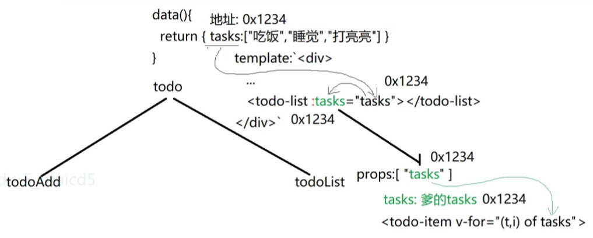
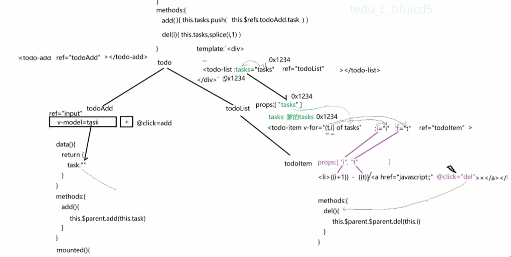
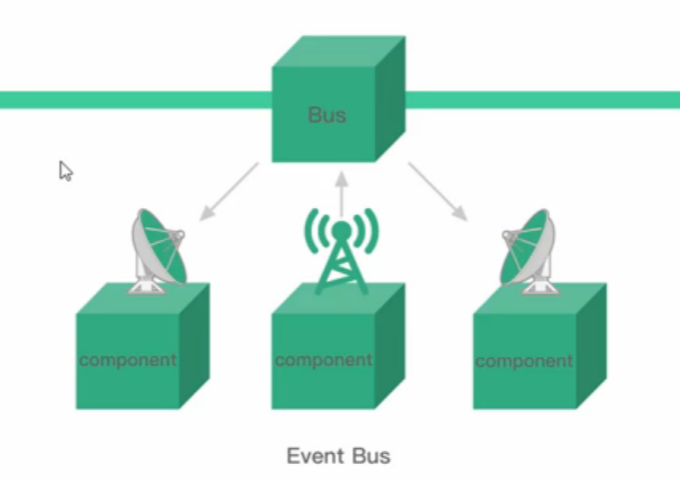
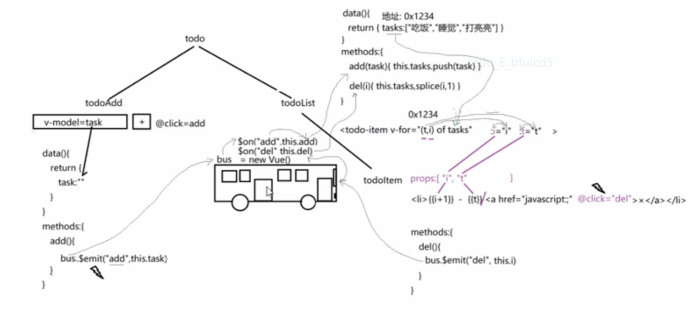

## vue 组件
* 拥有专属的HTML+CSS+JS+数据的页面上独立的可重用的功能区域
- [1. 组件创建和使用](#1)
- [2. 生命周期](#2)
- [3. 组件属性](#3)
- [4. 组件通信](#3)

--------
><h2 id='1'>1. 组件创建和使用</h2>
- `定义组件`
  ```javascript
  
    Vue.component(`组件标签名`,{
      template:`HTML内容片段`,
      data(){ 
        //因为要能反复调用
        return { 
          // 每次调用data()都为当前组件副本新创建专属data对象。保证不同组件之间，数据不会互相干扰。
          // 变量: 值
        }
      },
      methods:{ ... },
      watch:{ ... },
      computed:{ ... },
      // 八个钩子函数
      // 其余和new Vue()完全相同
    })
  ```
- `使用组件`:
    <组件标签名/>或双标记也行
- `子组件创建`
  ```html
  <!-- 创建todo-item -->
  var todoItem = {
    template: `<li>1 - 吃饭 <a href="javascript:;">×</a></li>`
  };
  var todoList = {
    template: `
      <ul>
        <!-- 使用todo-item -->
        <todo-item></todo-item>
        <todo-item></todo-item>
        <todo-item></todo-item>
      </ul>`,
    components: {
      todoItem
    }
  };
  ```
><h2 id='2'>2. 生命周期</h2>
- 所有的生命周期钩子自动绑定 `this` 上下文到实例中
  ```bash
  # beforeCreate(): 
    没有data
  # created(): 
    a. 创建new Vue()对象
    b. 创建data对象、methods对象等模型对象
    c. 但是，暂时没有虚拟DOM树
  # beforeMount(): 
    没有虚拟dom,无法执行dom操作
  # mounted(): 
    a. 扫描真实DOM树,生成虚拟DOM树,并首次将数据显示到页面上
    b. 此时，既有模型对象，又有虚拟DOM树了
  # beforeUpdate()
  # update()
    以任何形式，修改了data中的变量值，并导致页面更新时，触发更新阶段
  # beforeDestroy()
  # destroyed()
  ```
><h2 id='3'>3. 组件属性</h2>
1. `data`
    ```
    Vue实例的数据对象, Vue将会递归将data的属性转换为getter/setter
    注意:不应该对data属性使用箭头函数
    理由:箭头函数绑定了父级作用于的上下文
    ```
2. `props`  
    ```   
    props可以是数组或对象, 用于接收来自父组件的数据
    ```
3. `computed`
    ```
    1. 计算属性将被混入到Vue实例中.所有的getter和setter的this上下文自动第绑定为Vue实例
    2. 计算属性的值会被Vue 缓存起来,只执行一次
    3. 如果computed依赖的值发生变化,则执行时重新缓存
    注意:不应该对computed属性使用箭头函数
    理由:箭头函数绑定了父级作用于的上下文
    ```
4. `methods`
    ```
    methdods将被混入到Vue实例中. 可以通过Vue实例访问这些方法
    ```
5. `watch`
- 变量发生变化自动执行某些操作时,用watch
  ```
  一个对象(key: value)
  键是需要观察的表达式
  值是对应的回调函数,值也可以是方法名,或包含选项的对象
  Vue实例将会在实例化时调用$watch(),遍历watch对象的每一个属性
  example: 
  watch:{
    $route(){
      if(this.$route.name == 'Index'){
    
      }
    },
    name(){}
  },
  ```
><h2 id='4'>4. 组件通信</h2>
- 组件实例的作用域是孤立的
1. `父组件 ==> 子组件`通信 (props down)
    ```html
    父组件:
      <子组件 :自定义属性名="父组件变量"></子组件>
    ```
    ```javascript
    子组件对象:{    
      //从父组件添加的自定义属性中，取出属性值使用。
      props:[ "自定义属性名", ... , ... ],
      template:`HTML片段`,
    }
    ```
2. `子组件 ==> 父组件`通信 (event up)
- 子组件向父组件传递事件
  ```html
  父组件:
    <todo-add @add="add"></todo-add>
    methods: {
      add(task) {
        this.tasks.push(task);
      },
    }
  ```
  子组件对象:
  ```javascript
  methods: {
    add() {
      this.$emit("add", this.kws);
    },
  }
  ```
     
3. 父子通信 `$refs`, `$parent`
- 父访问子: 先定义ref, this.$refs.子名称.子数据/方法()
  ```html
  <todo-add ref="todoAdd"></todo-add>
  methods: {
    add() {
      this.tasks.push(this.$refs.todoAdd.kws);
      this.$refs.todoAdd.kws = "";
    },
  }
  ```
- 子访问父: this.$parent.数据/方法();
  ```
  methods: {
    add() {
      this.$parent.add();
    },
  },
  ```
- $refs 可以指dom元素
  ```html
  <input ref="input" type="text" v-model="kws">
  mounted() {
    <!-- this.$refs.input 就是dom元素 -->
    this.$refs.input.focus();
  }
  ```
  
4. 兄弟通信
- 有时候非父子关系的组件也需要通信,使用一个空的Vue实例作为传输中介
  ```javascript
  var bus = new Vue();
  bus.$on("add", this.add);
  bus.$emit("add", this.task);
  ```
  
  
     