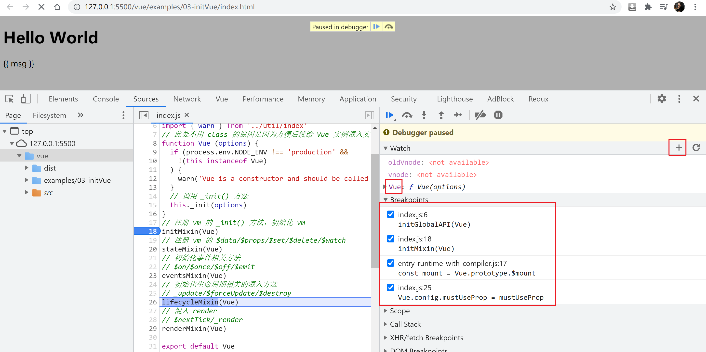
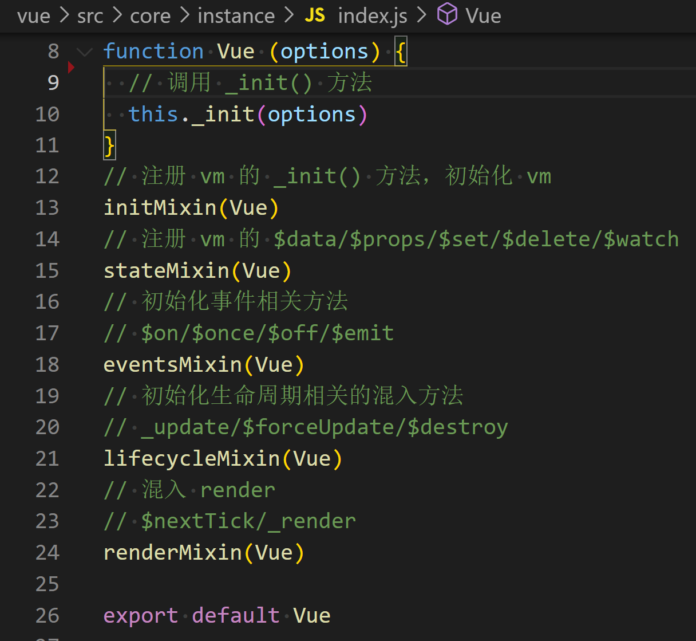
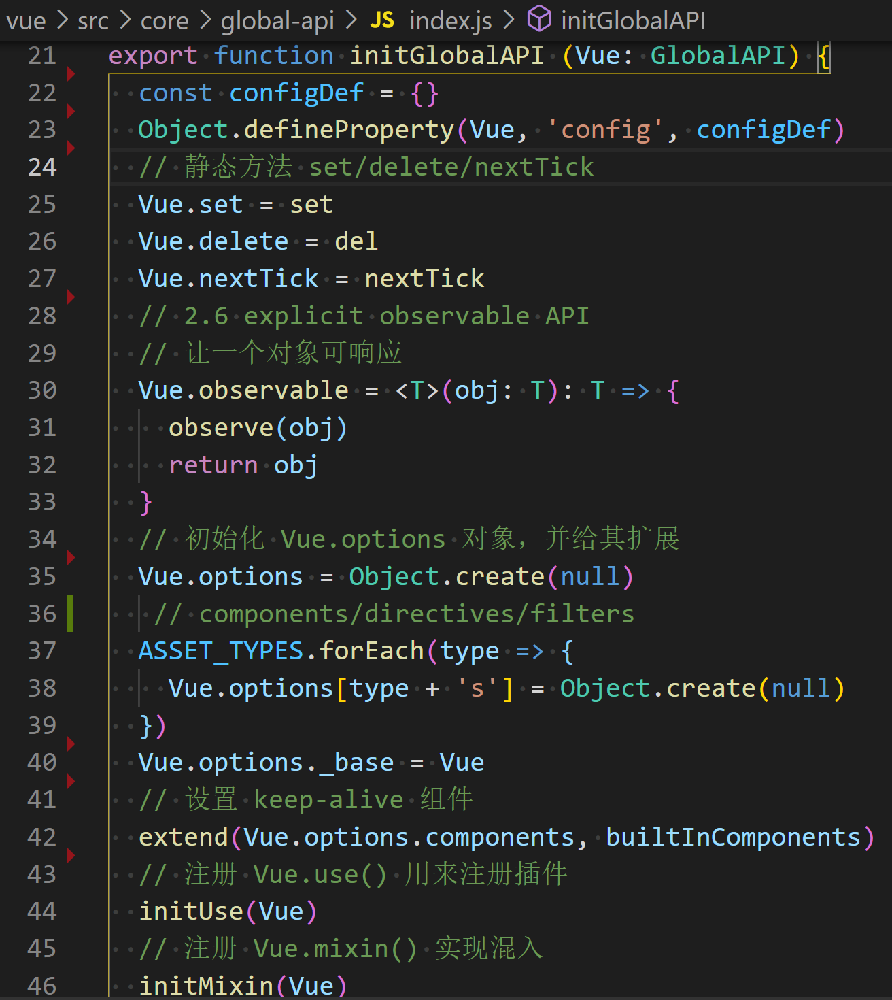
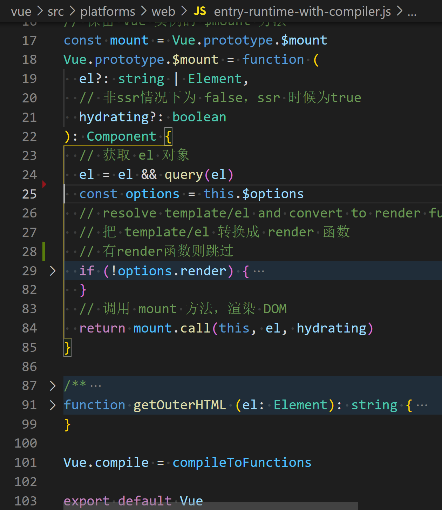

#### 调试Vue初始化过程
```js
调试页面: 
`vue/examples/03-initVue/index.html`
F11 一步一步的调试
F10 跳过方法
F8 下一个断点
`Watch`中添加 `Vue`字段进行监视
初始化顺序: 
1. src/core/instance/index.js
  定义了构造函数
  调用了this.__init(options)
  混入了实例成员
2. src/core/index.js
  设置了Vue的静态方法, 调用了initGlobalAPI(Vue)
3. src/platforms/web/runtime/index.js
  注册和平台相关的全局指令: 
    v-model, v-show
  注册和平台相关的全局组件: 
    transition, transition-group
  全局方法: 
    __patch__: 把虚拟DOM转换真实DOM
    $mount: 挂载方法
4. src/platforms/web/entry-runtime-with-compiler.js
  重写了`$mount()`方法
  注册了`Vue.compile()`方法
    把模板编译为render()函数
```






