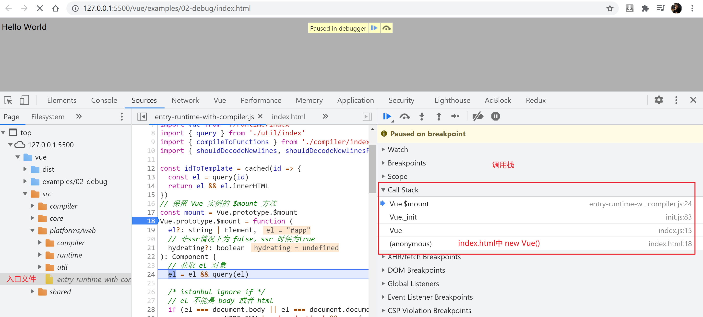

## vue2源码解析
https://github.com/vuejs/vue

#### 1. 目录结构
```js
src
├── compiler  编译器(把模板转换render函数)
├── core      vue 核心库
    ├── components    组件
    ├── global-api    静态方法
    ├── instance      vue实例
    ├── observer      响应机制
    ├── util          公共成员
    └── vdom          虚拟dom
├── platforms 平台相关代码
    ├── web           web
    └── weex          移动端
├── server    SSR 服务渲染
├── sfc       .vue文件编译为 .js对象
└── shared    公共的代码
```

#### 2. 调试设置
```js
1. npm i 
2. 设置 sourcemap (开启代码地图)
  "scripts": {
    "dev": "rollup -w -c scripts/config.js --sourcemap --environment TARGET:web-full-dev",
  }
  // scripts/config.js 为打包的入口文件
3. npm run dev
4. npm run build
  
```

#### 3. 构建不同的版本
[不同版本的构建](https://cn.vuejs.org/v2/guide/installation.html#%E6%9C%AF%E8%AF%AD)

#### 4. 入口文件
```js
根据`scripts/config.js`找出入口文件
`entry-runtime-with-compiler.js`
对其进行断点调试, 查看堆栈结果

调试页面: 
`vue/examples/03-initVue/index.html`
F11 一步一步的调试
F10 跳过方法
F8 下一个断点
`Watch`中添加 `Vue`字段进行监视
```


