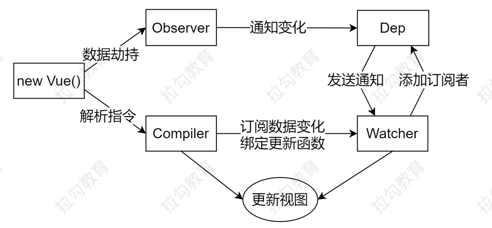

## VueRouter
- [1. 数据响应式的核心原理](#1)
- [2. 发布/订阅模式](#2)
- [3. 观察者模式](#3)
- [4. Vue 响应式原理模拟](#4)

--------

><h2 id='1'>1. 数据响应式的核心原理</h2>
```js
// Object.defineProperty 浏览器兼容 IE8 以上（不兼容 IE8）
<div id="app">
  hello
</div>
1. `Object.defineProperty` Vue 2.x
// 模拟 Vue 中的 data 选项
let data = {
  msg: 'hello'
}
// 模拟 Vue 的实例
let vm = {}
// 数据劫持：当访问或者设置 vm 中的成员的时候，做一些干预操作
Object.defineProperty(vm, 'msg', {
  // 可枚举（可遍历）
  enumerable: true,
  // 可配置（可以使用 delete 删除，可以通过 defineProperty 重新定义）
  configurable: true,
  // 当获取值的时候执行
  get () {
    console.log('get: ', data.msg)
    return data.msg
  },
  // 当设置值的时候执行
  set (newValue) {
    console.log('set: ', newValue)
    if (newValue === data.msg) {
      return
    }
    data.msg = newValue
    // 数据更改，更新 DOM 的值
    document.querySelector('#app').textContent = data.msg
  }
})
2. `Proxy` Vue 3.0
let vm = new Proxy(data, {
  // 执行代理行为的函数
  // 当访问 vm 的成员会执行
  get (target, key) {
    console.log('get, key: ', key, target[key])
    return target[key]
  },
  // 当设置 vm 的成员会执行
  set (target, key, newValue) {
    console.log('set, key: ', key, newValue)
    if (target[key] === newValue) {
      return
    }
    target[key] = newValue
    document.querySelector('#app').textContent = target[key]
  }
})

```
><h2 id='2'>2. 发布/订阅模式</h2>
```js
`发布/订阅模式`
 1. `订阅者`
 2. `发布者`
 3. `信号中心`
```
```js
// 信号中心
let vm = new Vue()
// 订阅者 
vm.$on('dataChange', () => { console.log('dataChange') })
// 订阅者
vm.$on('dataChange', () => { console.log('dataChange1') })
// 发布者
vm.$emit('dataChange')

---------代码实现----------
// 事件触发器
class EventEmitter {
  constructor () {
    // { 'click': [fn1, fn2], 'change': [fn] }
    // this.subs = {} 同面
    this.subs = Object.create(null)
  }

  // 注册事件
  $on (eventType, handler) {
    // if (!this.subs[eventType]) {
    //   this.subs[eventType] = [];
    // }
    // this.subs[eventType].push(handler)
    
    this.subs[eventType] = this.subs[eventType] || []
    this.subs[eventType].push(handler)
  }

  // 触发事件
  $emit (eventType) {
    if (this.subs[eventType]) {
      this.subs[eventType].forEach(handler => {
        handler()
      })
    }
  }
}
```
><h2 id='3'>3. 观察者模式</h2>
```js
`观察者(订阅者)` -- Watcher
  update()：当事件发生时，具体要做的事情
`目标(发布者)` -- Dep
  subs 数组：存储所有的观察者
  addSub()：添加观察者
  notify()：当事件发生，调用所有观察者的 update() 方法
`没有事件中心`
```
```js
class Dep {
  constructor () {
    // 记录所有的订阅者
    this.subs = []
  }
  // 添加订阅者
  addSub (sub) {
    if (sub && sub.update) {
      this.subs.push(sub)
    }
  }
  // 发布通知
  notify () {
    this.subs.forEach(sub => {
      sub.update()
    })
  }
}
// 订阅者-观察者
class Watcher {
  update () {
    console.log('update')
  }
}
// 测试
let dep = new Dep()
let watcher1 = new Watcher()
let watcher2 = new Watcher()
dep.addSub(watcher1)
dep.addSub(watcher2)
dep.notify()
```
><h2 id='4'>4. Vue 响应式原理模拟</h2>


```js
`Vue`
  1. 通过属性保存选项的数据, $data/$el/$options
  2. 把 data 的成员注入到 Vue 实例
  3. 负责调用 Observer 实现数据响应式处理（数据劫持）
  4. 负责调用 Compiler 编译指令/插值表达式等
`Observer`
  1. 数据劫持
    1.1 负责把 data 中的成员转换成 getter/setter
    1.2 负责把多层属性转换成 getter/setter
    1.3 如果给属性赋值为新对象，把新对象的成员设置为 getter/setter
  2. 添加 Dep 和 Watcher 的依赖关系
  3. 数据变化发送通知
`Compiler`
  1. 负责编译模板，解析指令/插值表达式
  2. 负责页面的首次渲染过程
  3. 当数据变化后重新渲染
`Dep`
  1. 收集依赖，添加订阅者(watcher)
  2. 通知所有订阅者
`Watcher`
  1. 自身实例化的时候往dep对象中添加自己
  2. 当数据变化dep通知所有的 Watcher 实例更新视图
```