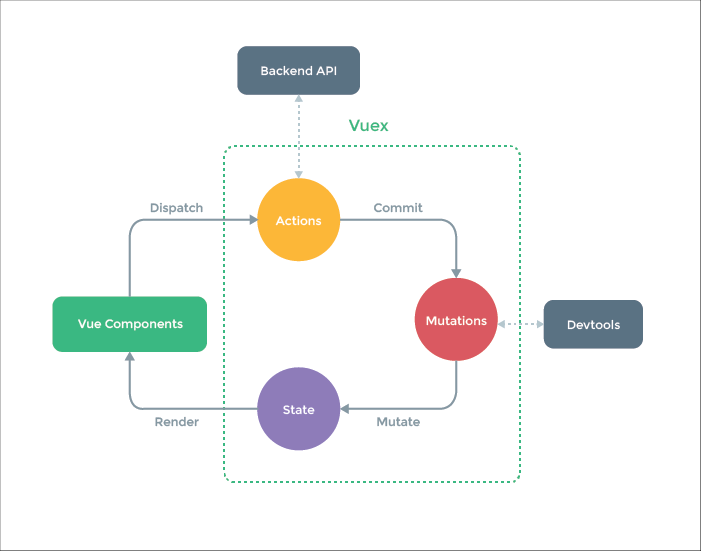

## vuex

- [1. 什么是vuex](#1)
- [2. 什是时候使用vuex](#2)
- [3. Vuex核心概念](#3)
- [4. module](#4)
- [5. 使用](#5)


--------

><h2 id='1'>1. 什么是vuex</h2>
```js
Vuex是专门为 Vue.js 设计的状态管理库
Vuex采用集中式的方式存储需要共享的状态
Vuex的作用是进行状态管理，解决复杂组件通信，数据共享
Vuex集成到devtolls中, 提供了time-travel时光旅行, 历史回滚功能
```

><h2 id='2'>2. 什是时候使用vuex</h2>
```js
1. 非必要的情况不要使用vuex
2. 中大型的单页应用程序
   多个视图依赖同一状态
   来自不同视图的行为需要变更同一状态
```

><h2 id='3'>3. module</h2>
```js
Store 仓库/容器
1. State 状态(保存在Store中)
2. Getter 计算属性
3. Mutation 状态变化必须提交Mutation执行
4. Action 异步操作
5. Module 模块(有自己的state等)
```

><h2 id='4'>4. Vuex核心概念</h2>
```js
const state = {
  products: [
    { id: 1, title: 'iPhone 11', price: 8000 },
    { id: 2, title: 'iPhone 12', price: 10000 }
  ]
}
const getters = {}
const mutations = {
  setProducts (state, payload) {
    state.products = payload
  }
}
const actions = {}
export default {
  namespaced: true, // 为模块添加命名空间, 推荐使用
  state,
  getters,
  mutations,
  actions
}
```
><h2 id='5'>5. 使用</h2>

```js
// {{ $store.state.msg}}
// {{ $store.getters.reverseMsg }}
{{ reverseMsg }}
// <button @click="$store.commit('increate', 2)">Mutation</button>
<button @click="increate(3)">Mutation</button>

import { mapState, mapGetters, mapMutations, mapActions } from 'vuex'
export default {
  computed: {
    // count: state => state.count
    // ...mapState(['count', 'msg'])
    ...mapState({ num: 'count', message: 'msg' }),  // 修改 属性名字
    ...mapGetters(['reverseMsg']),
    // {{$store.state.products.products}}  // Module不带命名空间
    // {{products}}  // Module带命名空间
    ...mapState('products', ['products']) // 第一个参数为命名空间
  },
  methods: {
    ...mapMutations(['increate']),
    ...mapActions(['increateAsync']),
    ...mapMutations('products', ['setProducts']) // 第一个参数为命名空间
  }
}
```