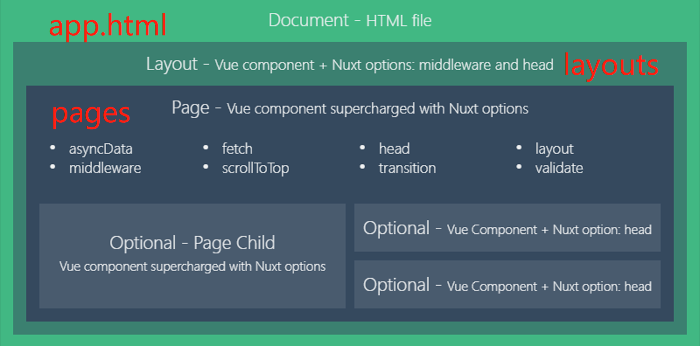

## Nuxt.js
```js
中文官网: https://www.nuxtjs.cn/guide/installation
Nuxt.js 是一个基于 Vue.js 的服务端渲染应用框架，它可以帮我们轻松的实现同构应用。
```
- [1. 创建项目](#1)
- [2. 目录](#2)
- [3. asyncData](#3)
- [4. plugin](#4)
- [5. 设置头部](#5)

--------

><h2 id='1'>1. 创建项目</h2>
```js
nuxt.js 使用方式
1. 初始化一个nuxt项目
2. 已有的 node.js项目, 把nuxt当做一个中间件
3. 已有的Vue.js项目 (需要改动一些代码)

// 创建示例项目 
// 初始化 package.json 文件 
  npm init -y 
// 安装 nuxt 
  npm innstall nuxt
// package.json
  "scripts": {
    "dev": "nuxt",  
    "build": "nuxt build",
    "start": "nuxt start"  // 启动编build后的文件
  },
```

><h2 id='2'>2. 目录</h2>
```js
app.html  // 视图模板, 可以没有(可以理解为最层)
layouts  // 视图自定义布局, 可以没有, 有的话默认default
// .vue页面, 默认不需要配置路由, 也可在nuxt.config.js中配置
pages  
middleware  // 配置中间件
plugins  // 插件 (在运行 Vue.js 应用程序之前执行 js 插件, 如第三方包)
static  // 静态资源
store  // vuex
nuxt.config.js  // 配置文件
pm2.config.json // 生产流程管理器 配置
```


><h2 id='3'>3. 异步数据 asyncData</h2>
```js
0. 服务端渲染
1. 当想要动态页面内容有利于`SEO`, 或`提升首屏渲染速度时`, 在asyncData中请求数据
2. asyncData`没有this`, 因为他是组件初始化前调用的
3. 只能在页面中使用, `不可在组件中`使用

// context 上下文对象
asyncData(context) {
  console.log(context)
}
// 解构
asyncData({query, params}) {}
```

><h2 id='4'>4. plugin</h2>
```js
// page: index.vue:
export default {
  // 在路由匹配组件渲染之前会先执行中间件处理
  middleware: 'authenticated',
  name: 'EditorIndex'
}
// puglin/authenticated.js
export default function ({ store, redirect }) {
  // If the user is not authenticated
  if (!store.state.user) {
    return redirect('/login')
  }
}
```
><h2 id='5'>5. 设置头部</h2>
```js
export default {
  name: 'ArticleIndex',
  async asyncData ({ params }) {

  },
  head () {
    return {
      title: `${this.article.title} - RealWorld`,
      meta: [
        { hid: 'description', name: 'description', content: this.article.description }
      ]
    }
  }
}
```