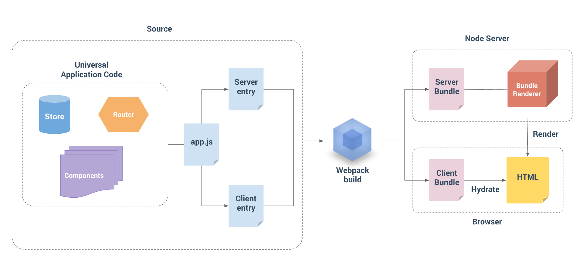

## Vue SSR.js
```js
官网: https://ssr.vuejs.org/
Vue SSR是 Vue.js 官方提供的一个服务端渲染（同构应用）解决方案
更快的首屏渲染速度
更好的 SEO
```
- [1. 安装依赖](#1)
- [2. 源码结构](#2)
- [3. app.js](#3)
- [4. entry-client.js](#4)
- [5. entry-server.js](#5)

--------

><h2 id='1'>1. 安装依赖</h2>
```js
1. 安装生产依赖
npm i vue vue-server-renderer express cross-env
// vue Vue.js 核心库
// vue-server-renderer Vue 服务端渲染工具
// express 基于 Node 的 Web 服务框架
// cross-env 通过 npm scripts 设置跨平台环境变量

2. 安装开发依赖
npm i -D webpack webpack-cli webpack-merge webpack-node-externals @babel/core @babel/plugin-transform-runtime @babel/preset-env babel-loader css-loader url- loader file-loader rimraf vue-loader vue-template-compiler friendly-errors- webpack-plugin
// webpack webpack 核心包
// webpack-cli webpack 的命令行工具
// webpack-merge webpack 配置信息合并工具
// webpack-node-externals 排除 webpack 中的 Node 模块
// rimraf 基于 Node 封装的一个跨平台 rm -rf 工具
// friendly-errors-webpack-plugin 友好的 webpack 错误提示
// @babel/core
// @babel/plugin-transform-runtime
// @babel/preset-env
// babel-loader
// Babel 相关工具
// vue-loader
// vue-template-compiler 处理 .vue 资源
// file-loader 处理字体资源
// css-loader 处理 CSS 资源
// url-loader 处理图片资源
```

><h2 id='2'>2. 源码结构</h2>
```js
src 
├── components 
│ ├── Foo.vue 
│ ├── Bar.vue 
│ └── Baz.vue 
├── App.vue 
├── app.js # 通用 entry(universal entry) 
├── entry-client.js # 仅运行于浏览器 
└── entry-server.js # 仅运行于服务器
server.js Web 服务启动脚本
```


><h2 id='3'>3. app.js</h2>
```js
export 导出一个 createApp 函数 

// 注册插件
Vue.use(VueMeta)
// 全局混入 metaInfo
Vue.mixin({
  metaInfo: {
    titleTemplate: '%s - 拉勾教育'
  }
})
// 导出一个工厂函数，用于创建新的
// 应用程序、router 和 store 实例
export function createApp () {
  const router = createRouter()
  const store = createStore()
  const app = new Vue({
    router, // 把路由挂载到 Vue 根实例中
    store, // 把容器挂载到 Vue 根实例中
    // 根实例简单的渲染应用程序组件。
    render: h => h(App)
  })
  return { app, router, store }
}
```

><h2 id='4'>4. entry-client.js</h2>
```js
客户端 entry 只需创建应用程序，并且将其挂载到 DOM 中
import { createApp } from './app' 
// 客户端特定引导逻辑…… 
const { app } = createApp() 
// 这里假定 App.vue 模板中根元素具有 `id="app"` 
app.$mount('#app')
```
><h2 id='5'>5. entry-server.js</h2>
```js
服务器 entry 使用 default export 导出函数，并在每次渲染中重复调用此函数
import { createApp } from './app' 
export default context => { 
  const { app } = createApp() return app 
}
```