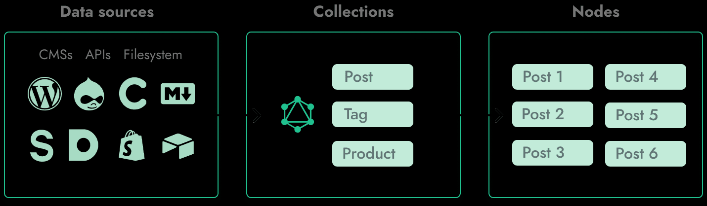
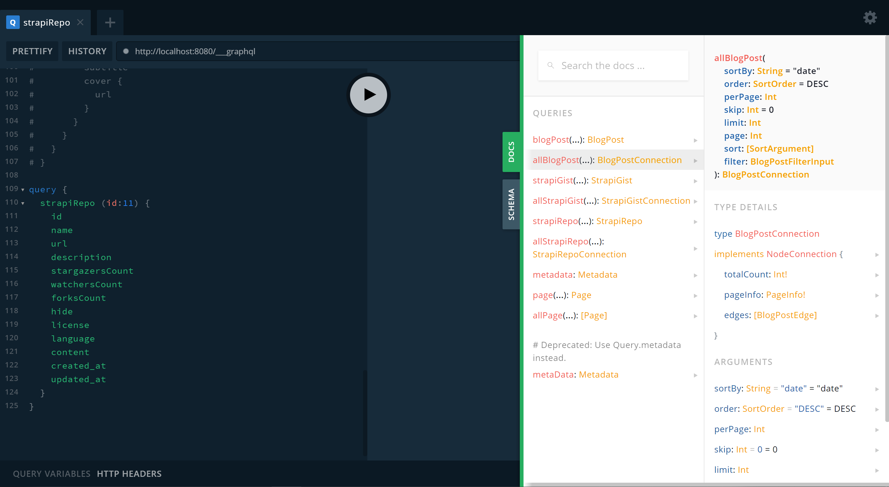

## gridsome
```js
官网：https://gridsome.org/
一个免费, 开源, 基于vue.js技术栈的静态网站生成器
需要Node.js（v8.3 +），并建议使用 Yarn
```
- [1. 静态生成器](#1)
- [2. 创建 gridesome](#2)
- [3. 目录结构](#3)
- [4. 页面meta](#4)
- [5. Pages](#5)
- [6. Collections](#6)
- [7. Templates](#7)
- [8. Layouts](#8)
- [9. main.js](#9)
- [10. gridsome.config.js](#10)
- [11. GraphQL](#11)
- [12. vercel部署gridsome](#11)

--------

><h2 id='1'>1. 静态生成器</h2>
```js
1. 什么是静态生成器
// 使用一系列配置, 模板及数据,生成html文件及相关资源的工具
2. 常见的静态网站生成器
jekyll (Ruby)
Hexo (Node)
Hugo (Golang)
Gatsby (Node/React)
Gridsome (Node/vue)
另外 next.js, nuxt.js也能生产静态网站, 但更多认为他们是SSR(服务端渲染)框架
3. 静态应用场景:
不适合有大量路由页面的应用
不适合有大量动态内容的应用
```

><h2 id='2'>2. 创建 gridesome</h2>
```js
1. `安装 Gridsome CLI`
// 使用 yarn
yarn global add @gridsome/cli
// 查看是否安装成功
gridsome --version

2. `创建 gridesome项目`
gridsome create my-gridsome-site
// 进入项目中
cd my-gridsome-site
// 启动开发模式
gridsome develop

3. `gridsome 项目安装依赖注意事项`:
  1. 配置 node-gyp 编译环境(需要C++编译):
  https://github.com/nodejs/node-gyp
  // npm install -g node-gyp
  2. 依赖libvips,配置环境变量:
  https://github.com/lovell/sharp-libvips
  https://sharp.pixelplumbing.com/install#chinese-mirror
  // npm config set sharp_binary_host "https://npm.taobao.org/mirrors/sharp"
  // npm config set sharp_libvips_binary_host "https://npm.taobao.org/mirrors/sharp-libvips"

```

><h2 id='3'>3. 目录结构</h2>
```js
├── `src`
│   ├── `components` # 公共组件
│   ├── `layouts` # 布局组件
│   ├── `pages` # 页面路由组件
│   ├── `templates` # 模板文件
│   ├── `favicon.png` # 网站图标
│   └── `main.js` # 应用入口
├── `static` # 静态资源存储目录，该目录中的资源不做构建处理
├── `gridsome.config.js` # 应用配置文件
├── `gridsome.server.js` # 针对服务端的配置文件
└── `package.json`
```

><h2 id='4'>4. 页面meta</h2>
```js
export default {
  metaInfo: {
    title: 'Hello, world!',
    meta: [
      { name: 'author', content: 'John Doe' }
    ]
  }
}
</script>
```
><h2 id='5'>5. Pages</h2>
```js
通过在 src/pages 文件夹中添加Vue组件来创建页面。他们使用基于文件的路由系统
```


><h2 id='6'>6. Collections</h2>
```js
集合存储在临时的本地GraphQL数据层中，可以在任何地方查询，过滤，分页或有关系
```

><h2 id='7'>7. Templates</h2>
```js
模板负责显示集合的节点（单个页面）。
模板通常位于`src/templates`中。
```

><h2 id='8'>8. Layouts</h2>
```js
布局是在页面和模板内部用于包装内容的Vue组件。布局通常包含页眉和页脚。
<template>
  <div>
    <nav></nav>
    <slot/> // 出口
    <footer>
    </footer>
  </div>
</template>
// 使用
<template>
  <Layout>
    <h1>About us</h1>
  </Layout>
</template>
```
><h2 id='9'>9. main.js</h2>
```js
import DefaultLayout from '~/layouts/Default.vue'
import Store from './store/index'
import util from './utils/util'
import ElementUI from 'element-ui'
import 'element-ui/lib/theme-chalk/index.css'
export default function (Vue, { appOptions, router, head, isClient }) {
  Vue.use(ElementUI)
  appOptions.store = Store  // add vuex
  router.beforeEach((to, from, next) => {
    next()
  })
  Vue.mixin({
    data(){
      return {
        GRIDSOME_API_URL: 'http://106.75.154.132:1337'
      }
    }
  })
  Vue.prototype.$util = util
  Vue.component('Layout', DefaultLayout)
}
```

><h2 id='10'>10. gridsome.config.js</h2>
```js
// https://www.gridsome.cn/plugins/
module.exports = {
  siteName: '博客',
  plugins: [
    {
      use: '@gridsome/source-strapi',
      options: {
        apiURL: 'http://106.75.154.132:1337',
        queryLimit: 1000, // Defaults to 100
        contentTypes: ['gist','repo'],  // StrapiGist, StrapiRepo
      }
    }
  ],
  templates: {
    StrapiRepo: [
      {
        path: '/project/details/:id',
        component: './src/templates/project/Details.vue'
      }
    ]
  }
}
```

><h2 id='11'>11. GraphQL</h2>
```js
// http://localhost:8080/___explore
使用:  this.$page.gists.edges[0].node.id
<page-query>
query ($page: Int) {
  // gists 别名
  //  (perPage: 1, page: $page) @paginate 分页
  gists: allStrapiGist (perPage: 1, page: $page) @paginate{
    pageInfo {
      totalPages
      currentPage
    }
    edges {
      node {
        id
        title
      }
    }
  }
}
</page-query>

```


><h2 id='12'>12. vercel部署gridsome</h2>
```js
https://vercel.com/
登录后, 选择git项目 一键安装并下载依赖运行
```