## ReactNative
- [1. reactNative 编译环境搭建](#1)
- [2. reactNative ip模式](#2)
- [3. 真机调试](#3)
- [4. 两种启动方式](#4)
- [5. apk发布](#5)

><h2 id='1'>1. reactNative 编译环境搭建</h2>
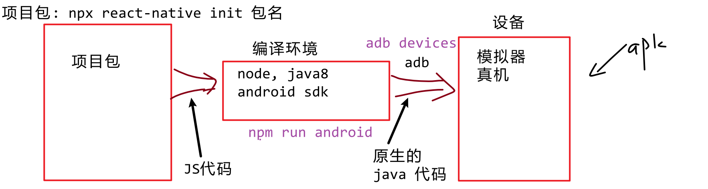
- rn官网: https://reactnative.cn/docs/environment-setup

```jsx
一: `必须安装的依赖有`
1. `node`: 要求 `>=12.10`版本以上;  
    查看版本: `node -v`
2. `JDK`: 版本必须是 1.8版本官方也直接称 8版本
    推荐JDK8 8u202
    查看版本: `java -version`
    配置环境变量
3. `Android Studio`
  官网: `http://www.android-studio.org/`

二: `创建新项目` 
  卸载: npm uninstall -g react-native-cli
  创建: npx react-native init 项目名字
  或
    npm i -g react-native
    react-native init  项目名字
三: `启动项目`
   查找设备: `adb devices`
   启动项目: `npm run android`
   adb查找正常 图7
   adb 图8 更换模拟器adb.exe
   图9 使用本地的.zip, 远程下载慢
```

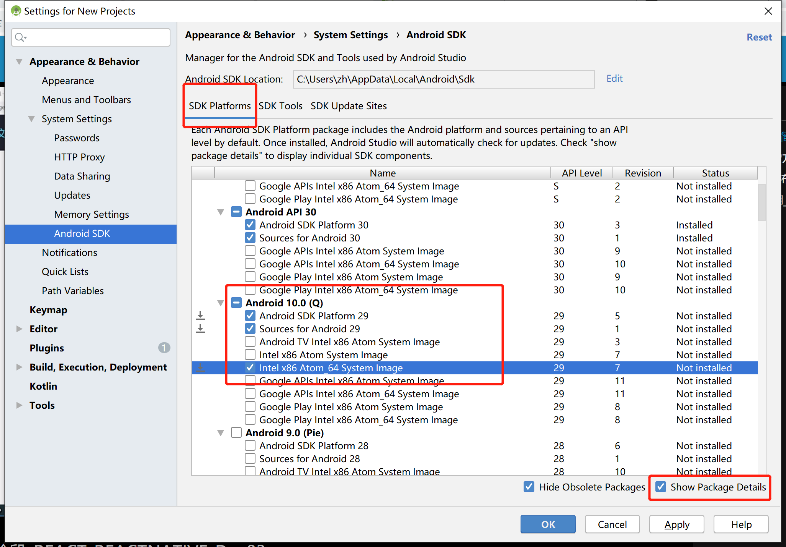
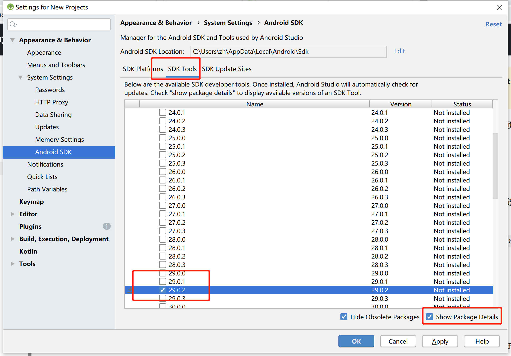
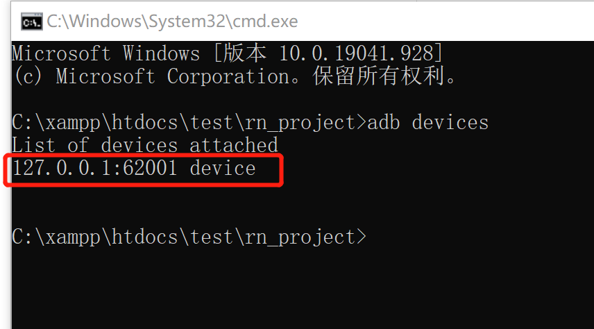
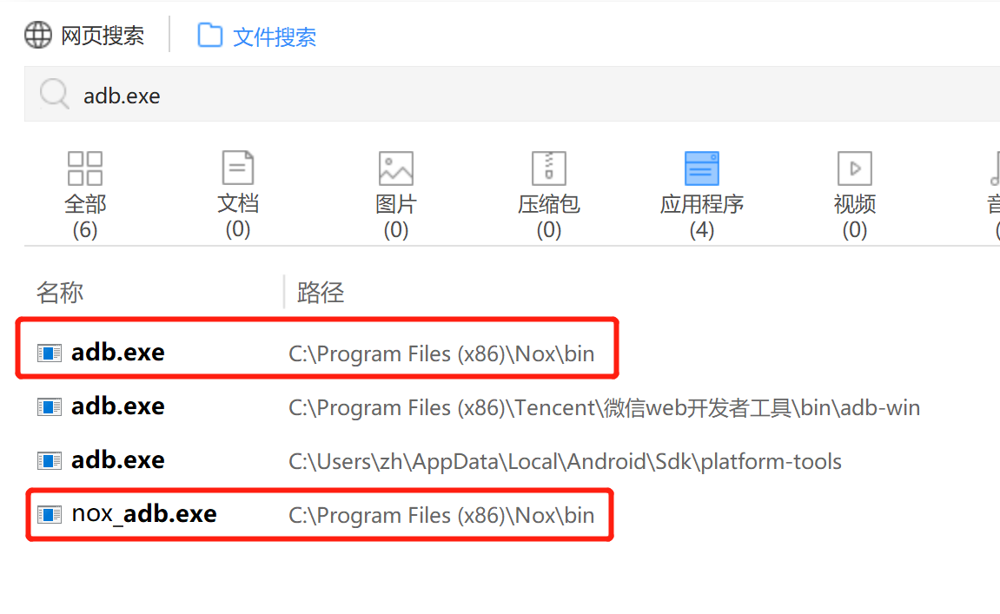
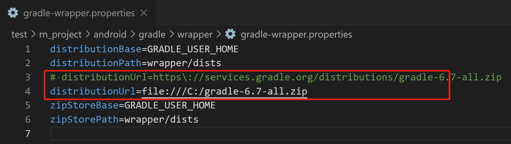

><h2 id='2'>2. reactNative ip模式</h2>
```js
把其他人编译成功的 apk 直接拿来使用即可!
apk与项目包 必须`同名` + `同版本`

步骤:
1. 把`xxx.apk`到模拟器上, 安装
2. ipconfig 查找自己`ipv4`地址
3. 启动项目服务器`npm run start`
4. 之后如下图
```
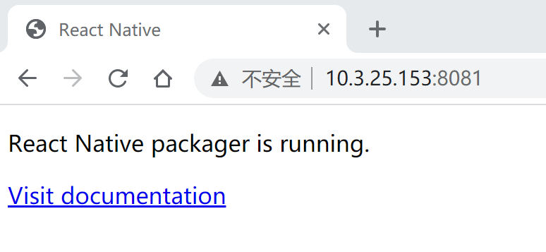
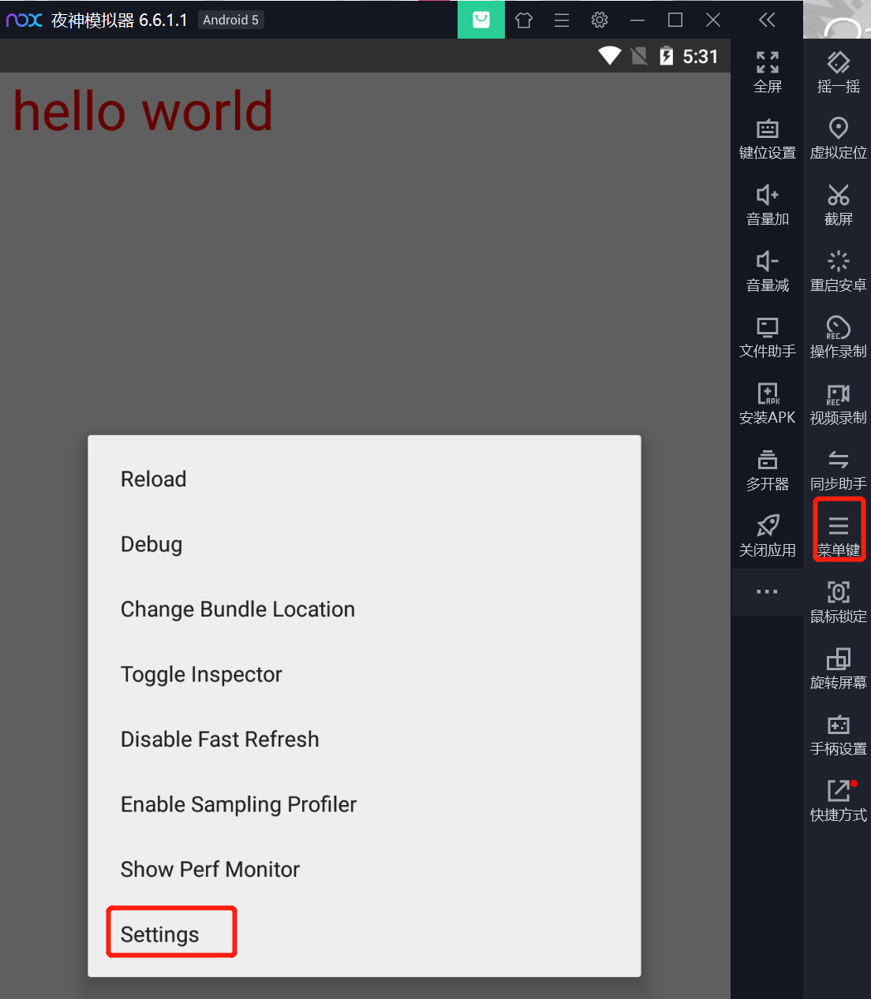
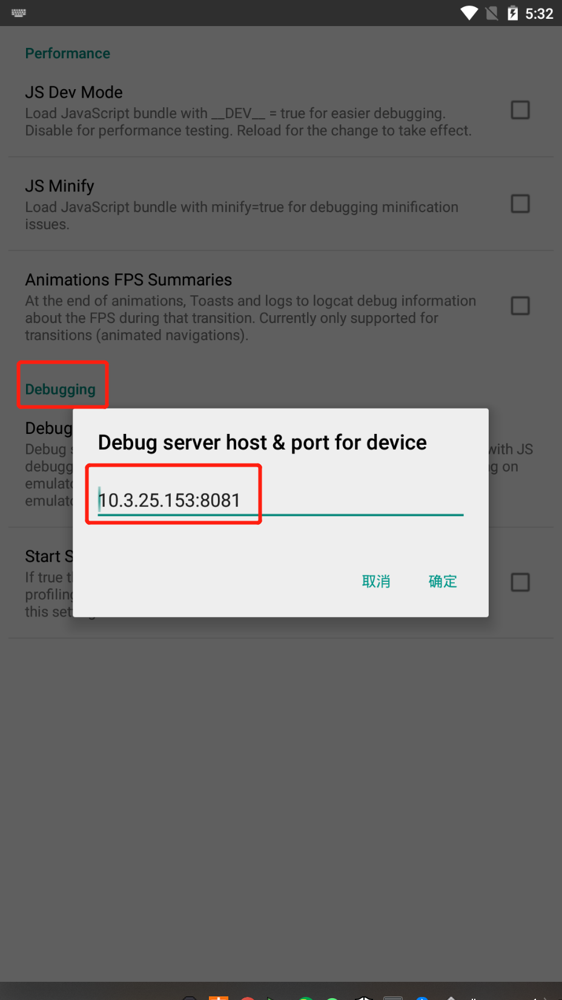

><h2 id='3'>3. 真机调试</h2>
```jsx
1. 开启 手机的 `开发者模式`
2. 打开 `USB调试模式`
3. 关闭电脑上开启的 `夜神模拟器`
4. 用数据线连接 计算机和手机: 选择`数据传输`有关的选项
  * 此处应该有弹窗: 询问是否 允许 xxx 进行调试.  要选择 `总是允许`
  * 如果没有弹窗: 则在计算机上执行两行命令:   作用是重启adb服务
    `adb kill-server`
    `adb start-server`
5. 执行后 重新插拔手机
6. 查看连接设备列表: `adb devices`   应该能看到 `xxxxxxxxx device`
7. 到 `rnApp` 下执行: `npm run android` 命令,  就可以运行项目到手机上

```

><h2 id='4'>4. 两种启动方式</h2>
```js
1. 常规方式
   * `adb devices` 打开服务,  开启 **模拟器**, 再次 `adb devices`
   * 编译项目: `npm run android`
2. ip方式
   * 把一个已有的 apk 安装到模拟器.
   * 查看当前计算机的ip: `ipconfig`
   * 启动项目的服务: `npm run start`
   * 连接: 打开模拟器上的 rnApp,  菜单->设置->端口号中:  `ip:8081`
```
><h2 id='5'>5. apk发布</h2>
https://reactnative.cn/docs/next/signed-apk-android
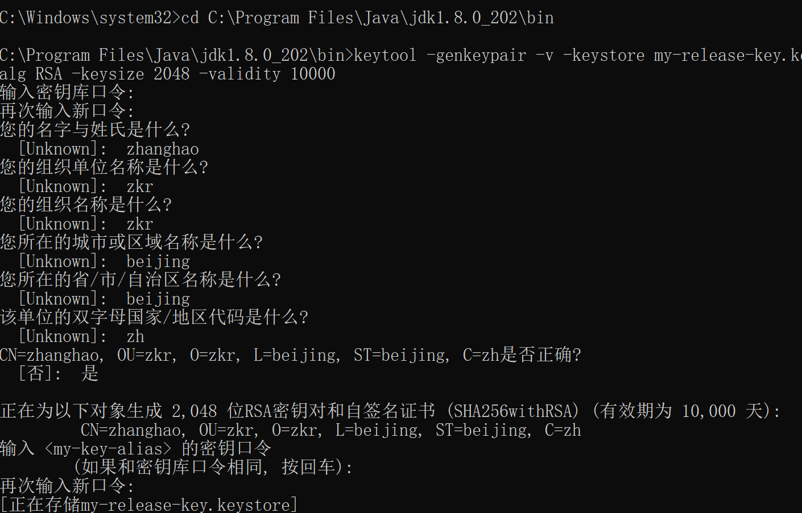
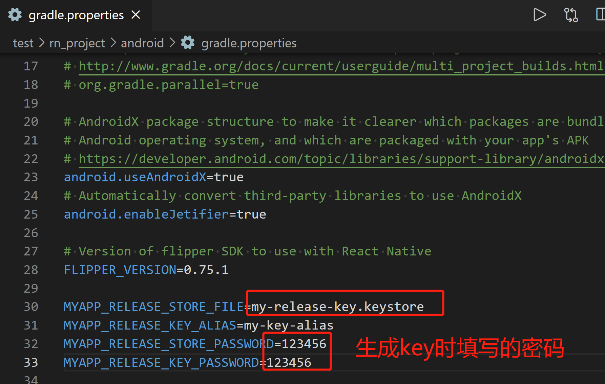
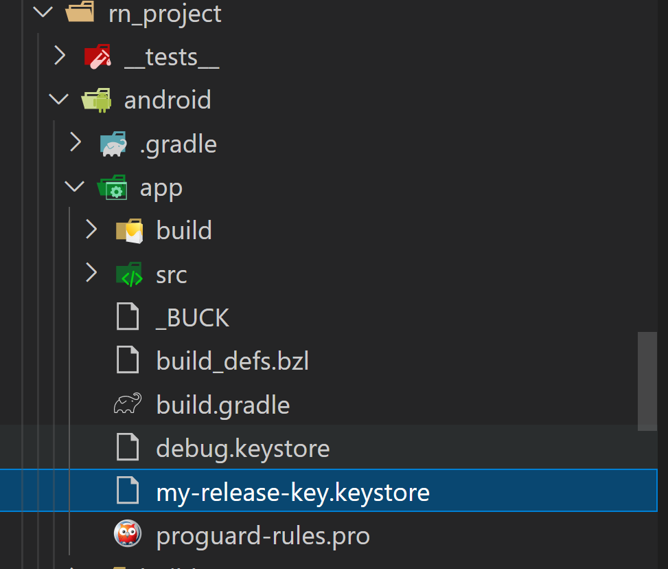
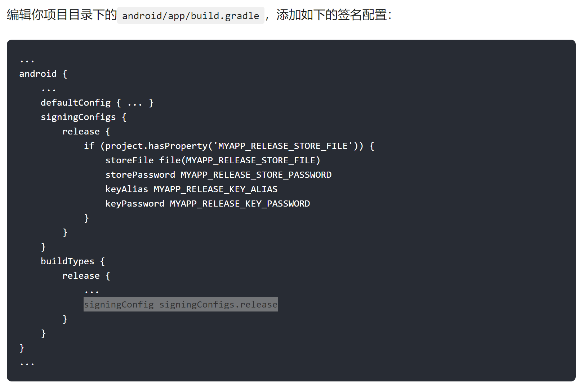
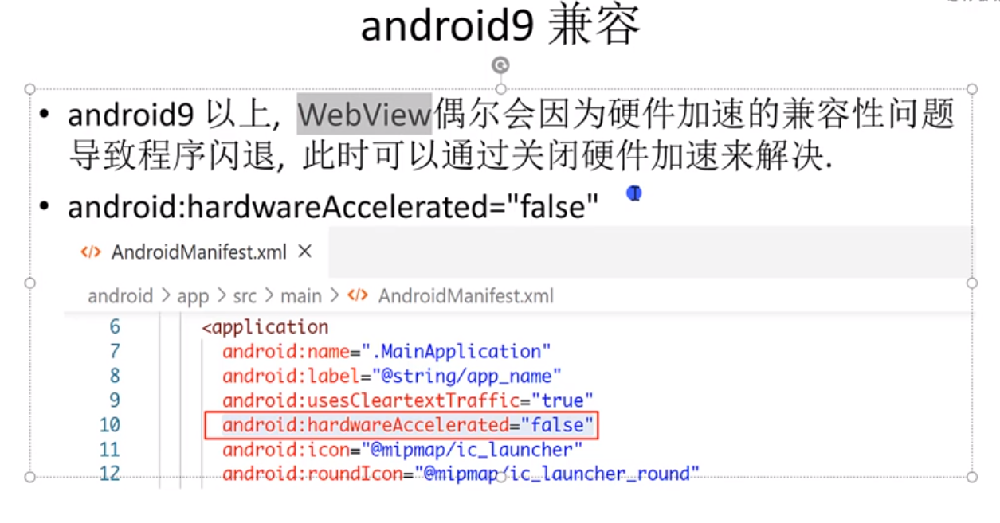
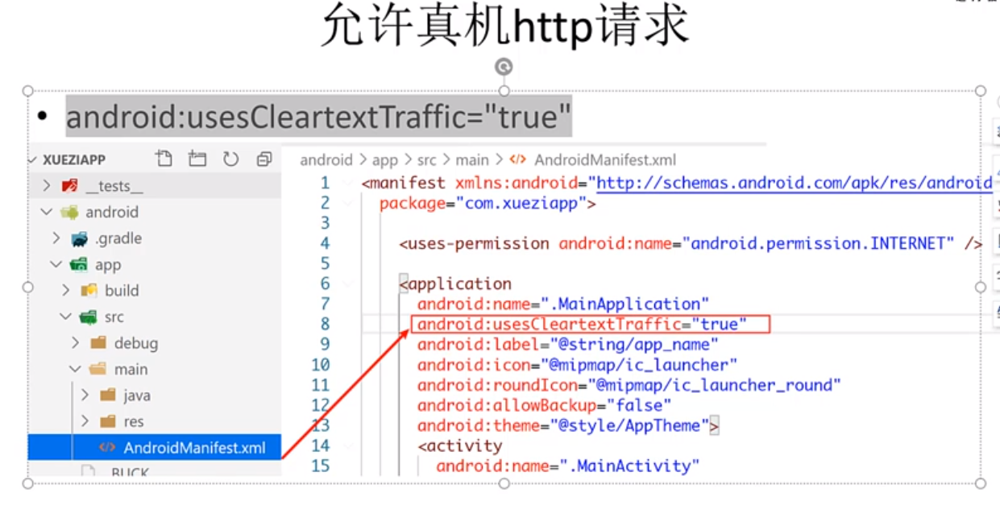
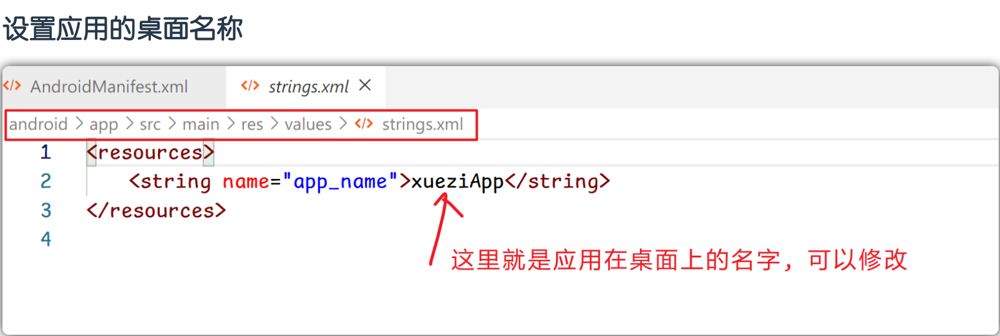
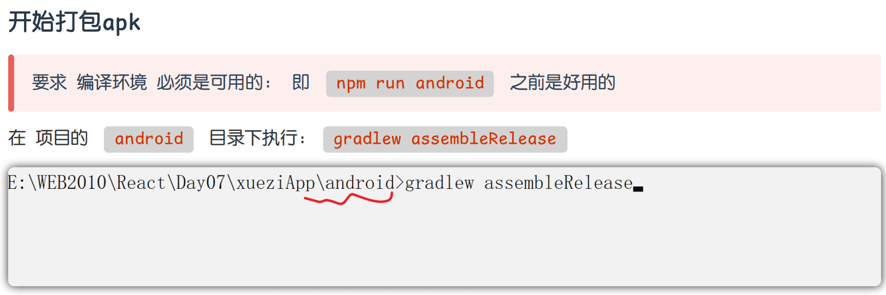

