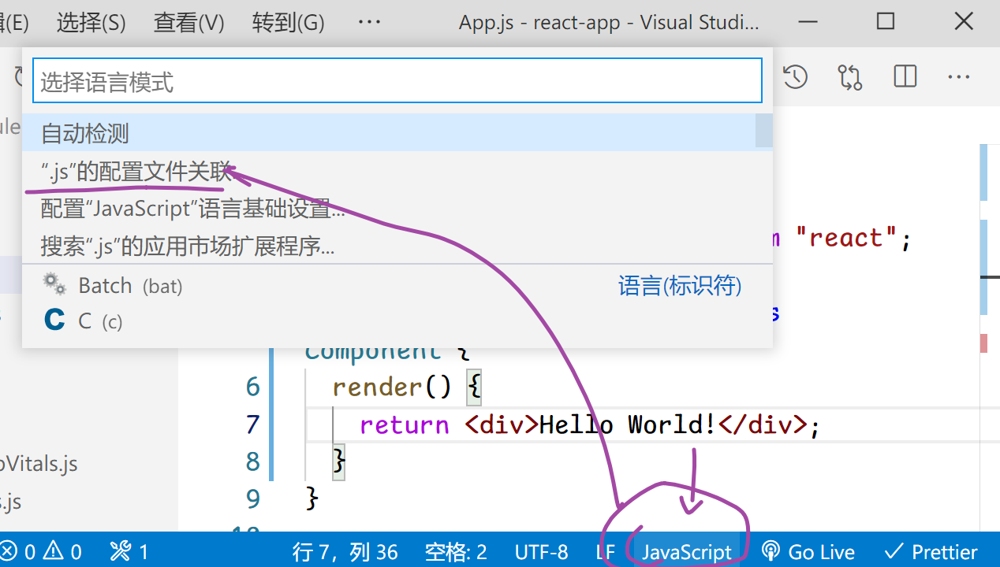
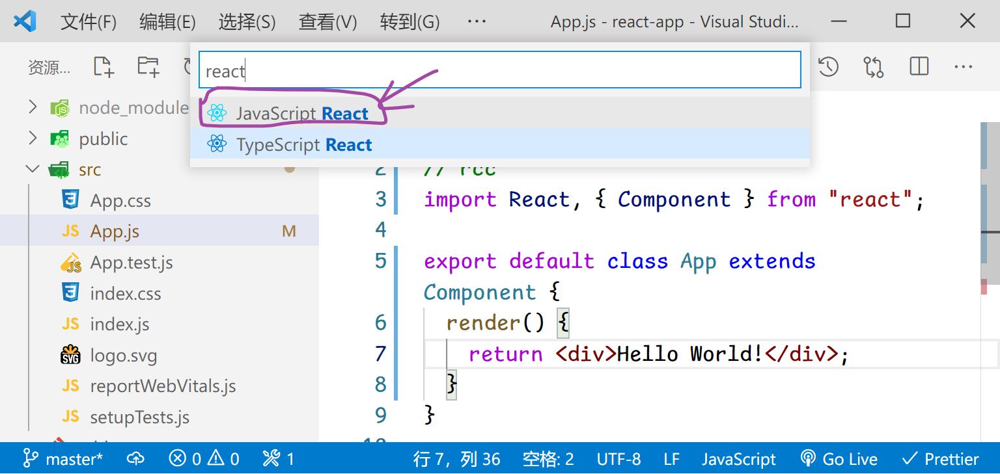

## React
- [1. JSX](#1)
- [2. 组件](#2)
- [3. 组件参数](#3)
- [4. 事件](#4)
- [5. 事件传参](#52)
- [6. 状态值](6)
- [7. 样式](#7)
- [8. 条件渲染](#8)
- [9. 列表渲染](#9)
- [10. 生命周期](#10)
- [11. 双向数据绑定](#11)
- [12. react-cli](#12)
--------

><h2 id='1'>1. JSX</h2>
```js
注意:
1. 脚本的引入顺序, 必须先 React 后 ReactDOM
2. 脚本必须带 : `type="text/babel"` 才能被 babel解析
```
```jsx
<div id="root"></div>
<script type="text/babel">
  //Facebook 研发了新的语法JSX
  //JSX: JavaScript XML  代表在JS中书写HTML
  const b = (
    <b id="b1" className="danger">
      Hello World!
    </b>
  );
  ReactDOM.render(b, root);
</script>

```
><h2 id='2'>2. 组件</h2>
```jsx
<div id="root"></div>
<script type="text/babel">
  React提供了两种组件的制作方式: 函数 和 类方式
    1.函数方式： 适合最基础的组件, 功能简单.
    2.函数做组件, 要求 函数名必须 大驼峰写法!
  function Hello() {
    //本质是: 
    // React.createElement('h1', {}, 'Hello World!')
    // babel工具会自动编译
    return <h1>Hello World!</h1>;
  }
  let h = Hello();
  // 语法糖:  Hello() 写法看着不像组件
  h = <Hello />; //本质是 Hello()

  // 复用性:  组件需要唯一的父
  // 在 JSX 中, 使用 {} 代表 JS代码
  <div>
    <Hello />
    <Hello />
    Hello()
    {Hello()}
    {Hello()}
  </div>
  ReactDOM.render(h, root);
</script>

```

><h2 id='3'>3. 组件参数</h2>
```jsx
<div id="root"></div>
1. function
<script type="text/babel">
  function HelloName(props) {
    return <h1>Hello, {props.name}</h1>;
  }
  <div>
    <HelloName name="亮亮" />
    <HelloName name="铭铭" />
    <HelloName name="小新" />
    {HelloName({ name: "东东" })}
    {HelloName({ name: "东东" })}
  </div>
</script>

2. class
// 类组件的传参
class HelloName extends React.Component {
  // 父类的构造方法:
  // constructor(props) {
  //   this.props = props;
  // }
  render() {
    // this.props: 父类的构造方法中 声明的
    return <h1>Hello, {this.props.name}</h1>;
  }
}
let h = new HelloName({ name: "东东" }).render();
//语法糖 方法必须是 render(){}
h = <HelloName name="然然" />;
h = (
  <div>
    <HelloName name="然然" />
    <HelloName name="铭铭" />
    <HelloName name="文华" />
  </div>
);

```

><h2 id='4'>4. 事件</h2>
```jsx
// rcc
// 事件中的this指向
import React, { Component } from "react";
export default class App extends Component {
  name = "然然";
  show() {
    // 函数.bind(参数):  参数会替换 函数中的this
    console.log(this);
    console.log(this.name);
  }
  // 箭头函数: this永远是声明时 所在的对象
  show1 = () => {
    console.log(this);
    console.log(this.name);
  };
  // 类组件初始化: const a = new App().render();
  // render() 是 new App() 调用的,  所以 render中的this 就是 new App()
  render() {
    return (
      <div>
        {/* 把 非箭头函数, 放在 箭头函数中调用, 也可以保持this指向 */}
        <button onClick={() => this.show()}>箭头函数 + 普通函数</button>
        {/* 全写格式: 点击时执行的箭头函数, 箭头函数再执行其中的 show() */}
        <button
          onClick={() => {
            this.show();
          }}
        >
          箭头函数 + 普通函数
        </button>

        <br />
        <button onClick={this.show1}>箭头函数</button>

        {/* 点击事件是延时执行的, 延迟到用户点击时 */}
        {/* 提前为 this.show 即 当前对象App 中的 show 方法 绑定 this, this代表当前对象 
        点击是执行的 show 方法中的this 就是当前对象
        */}
        {/* 参考  src 中的 Demo.js 中的代码 */}
        <button onClick={this.show.bind(this)}>点击</button>
      </div>
    );
  }
}

```

><h2 id='5'>5. 事件传参</h2>
```jsx
export default class App extends Component {
  state = { name: "请选择英雄:" };
  changeName(name) {
    // setState() 和 state 搭配使用, 用于 更新数据+更新界面
    this.setState({ name });
  }
  render() {
    return (
      <div>
        <h4>{this.state.name}</h4>
        <button onClick={this.changeName.bind(this, "貂蝉")}>貂蝉</button>
        {/* 
        this.changeName.bind(this, "貂蝉")
        页面显示时, 会生成一个 changeName() 函数的副本,  此副本中 已经绑定了固定的 this 和 参数,  就等着 点击时触发
        */}
        {/* 临时制作一个箭头函数, 其中包含了changeName的调用.   
        点击时->执行箭头函数->执行内部的 changeName */}
        <button onClick={() => this.changeName("鲁班")}>鲁班</button>
        <button onClick={() => this.changeName("蔡文姬")}>蔡文姬</button>
      </div>
    );
  }
}
```

><h2 id='6'>6. 状态值</h2>
```jsx
// setState 的 异步性
import React, { Component } from "react";
export default class App extends Component {
  state = { num: 1 };
  updateNum = () => {
    // this.setState({ num: this.state.num+1});
    // state中的值, 不允许擅自修改,  必须通过 setState 修改
    // setState(): 需要刷新界面, 属于耗时操作.  系统会分派到 子线程中执行
    const obj = { num: this.state.num+1 }; //{num:1}
    // 参数2: 界面更新成功后的回调函数
    this.setState(obj, () => {
      console.log("页面更新完毕: num变为", this.state.num);
    }); // setState() 异步执行
    console.log(this.state.num);
  };
  render() {
    return (
      <div>
        <button onClick={this.updateNum}>{this.state.num}</button>
      </div>
    );
  }
}
```

><h2 id='7'>7. 样式</h2>
```jsx
/**
 * 外部css样式文件的引入:
 *
 * html引入: <link href="" type="..."
 * css引入: @import 'xxx.css';
 * js引入: import './xxx.css';  必须带有路径标识
 */

// import 关键词用于引入外部模块,  在用于引入文件时, 必须添加 路径标识. 否则会当成是模块进行引入.
// 路径标识:  ./ / ../
import "./App.css";

export default class App extends Component {
  state = { size: 18 };

  render() {
    return (
      <div>
        <button onClick={() => this.setState({ size: this.state.size + 1 })}>
          变大
        </button>
        {/* 动态样式: style={ 对象类型 } */}
        {/* JSX代码: 不是html, 是DOM的一种语法糖格式, 长得像 html 而已;  在DOM中 设置class 的属性名 就叫 className */}
        <div className="btn-success" style={{ fontSize: this.state.size }}>
          Hello World
        </div>
      </div>
    );
  }
}
```

><h2 id='8'>8. 样式</h2>
```jsx
// react: 代码本身就是在js中书写, 不需要新语法
showRes() {
  const score = this.state.score;
  if (score < 60) return <p>回去等消息吧...</p>;
  if (score >= 60 && score < 80) return <p>让HR找你聊一聊</p>;
  if (score >= 80) return <p>让老板和你聊一聊</p>;
}

render(){
  return <div>{this.showRes()}</div>
}
```

><h2 id='9'>9. 列表渲染</h2>
```jsx
export default class App extends Component {
  skills = ["axios", "echarts", "mintUI", "DOM", "jQuery"];
  // foreach
  showTags() {
    const tags = [];

    this.skills.forEach((item, index) => {
      tags.push(
        <span key={index} className="tag">
          {item}
        </span>
      );
    });
    return tags;
  }
  // map 推荐
  showBtns = () =>
    this.skills.map((item, index) => <button key={index}>{item}</button>);

  render() {
    return (
      <div>
        <div>{this.showTags()}</div>
        <div>{this.showBtns()}</div>
      </div>
    );
  }
}
```

><h2 id='10'>10. 生命周期</h2>
```jsx
export default class App extends Component {
  state = { num: 1 };
  componentDidMount() {
    console.log("componentDidMount: 挂载, 组件显示");
  }
  componentDidUpdate(props, state) {
    console.log("componentDidUpdate: 更新");
    console.log("外来属性传值, 旧值props:", props);
    console.log("旧state:", state);
    console.log("外来属性传值, 新props:", this.props);
    console.log("新state:", this.state);
  }

  componentWillUnmount() {
    console.log("componentWillUnmount: 卸载, 组件销毁");
  }
  // 特殊:
  // 返回值 可以限制 页面是否要刷新
  shouldComponentUpdate(props, state) {
    // props, state 都是将要变化成的数据
    // 可以根据将要变化成的数据 来决定是否要同步更新界面.
    // true 更新; false 不更新

    // 需求: state.num 是5的时候, 页面不刷新
    if (state.num == 5) return false;
    return true;
  }
  render() {
    return <div></div>
  }
}
```

><h2 id='11'>11. 双向数据绑定</h2>
```jsx
export default class App extends Component {
  name = "dongdong";
  // 把值放在 state中, 使用setState() 可以同时完成 数据变化 + 界面变化
  state = { email: "12123@qq.com" };
  render() {
    return (
      <div>
        <input
          type="text"
          value={this.state.email}
          onChange={(event) => this.setState({ email: event.target.value })}
        />
        <p>{this.state.email}</p>
        <br />
        {/* 
        双向绑定:
        方向1: 数据 传递到 界面
        方向2: 用户操作界面, 同步修改数据
        */}
        <input type="text" value={this.name} onChange={this._changeName} />
        <p>{this.name}</p>
      </div>
    );
  }

  // 习惯把 事件触发的方法, 添加 _ 前缀
  // 箭头函数, 可以避免this绑定问题
  _changeName = (event) => {
    console.log(event);
    const value = event.target.value; // 输入框中的新值

    this.name = value; // 输入框的值 更新到 name 变量中
    this.setState({}); //刷新界面
  };
}

```

><h2 id='12'>12. react 脚手架</h2>
```js
官方不推荐安装全局本地脚手架,  `推荐临时方式`; 这样可以保障是最新的
npx: 临时下载脚手架使用
`npx create-react-app 包名`
启动命令: `npm start`
http://localhost:3000/

流程:
1. 入口文件`index.html`,含有一个 `<div id="root"></div>` 标签
2. webpack自动化操作: 自动打包 `index.js` 文件引入到 `index.html` 中
3. `index.js` : 渲染了 App.js 文件到 `id='root'` 的标签中
```


```js
//rcc 快捷创建
```




