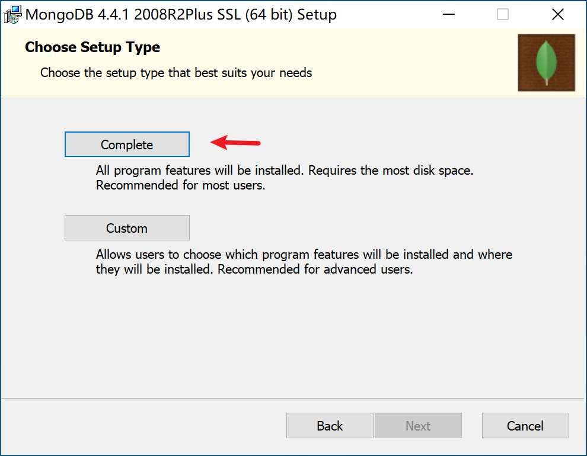
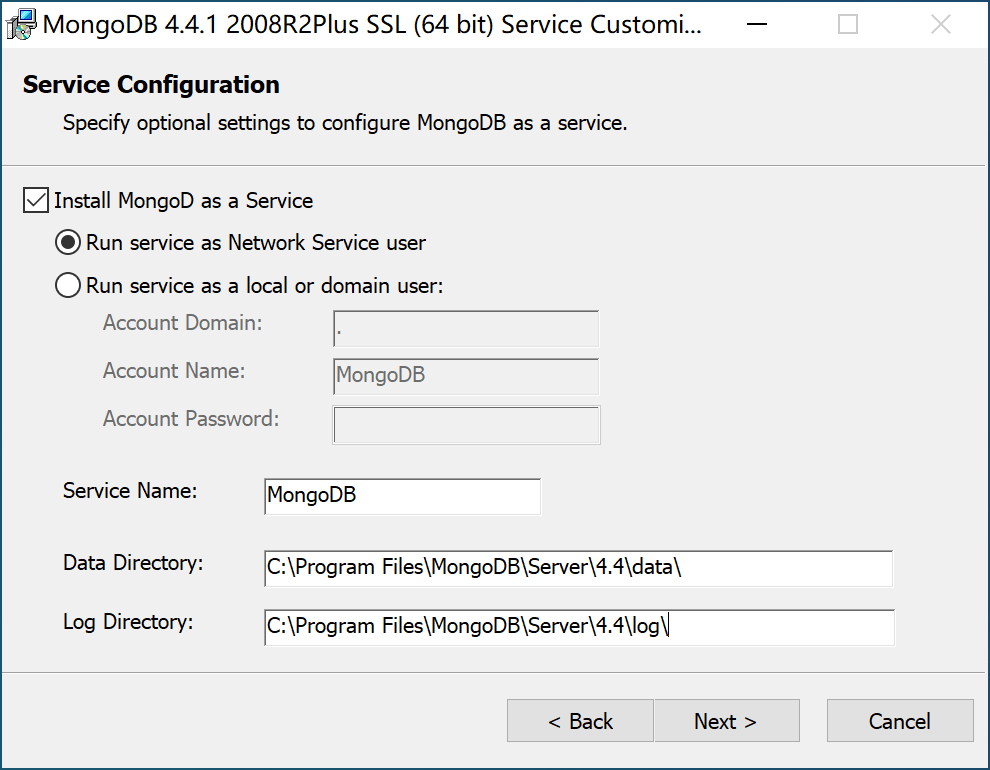
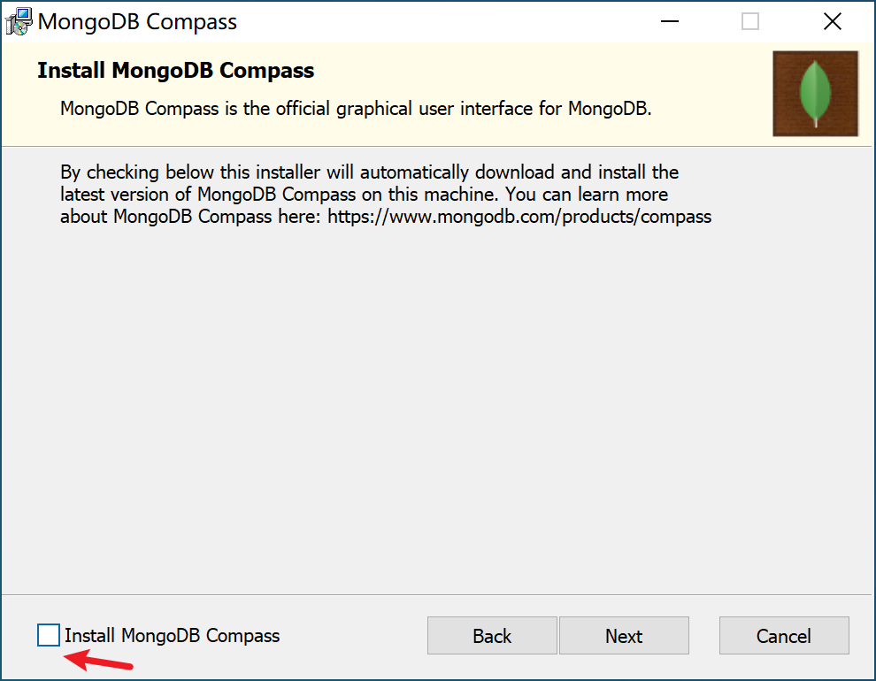
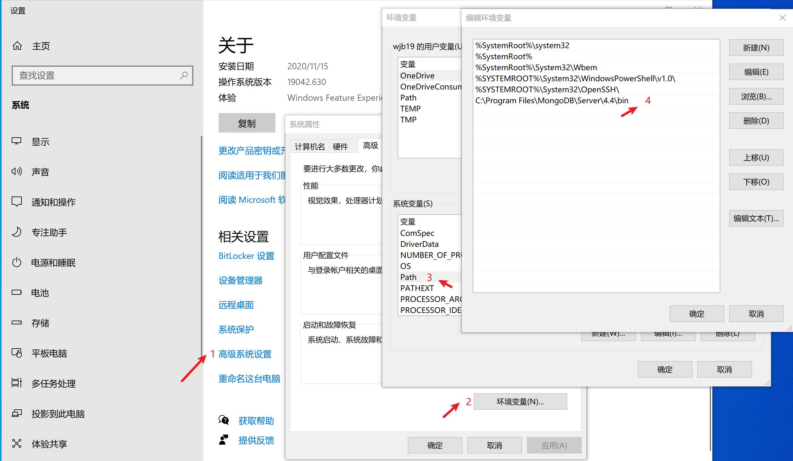
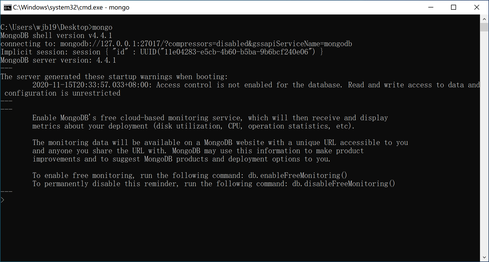
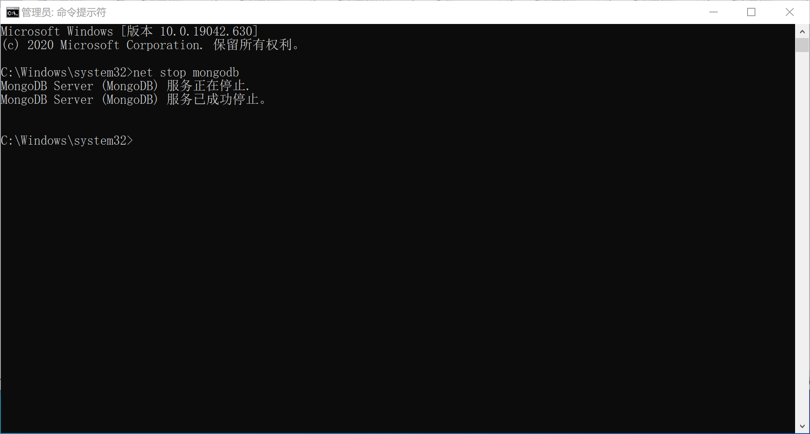
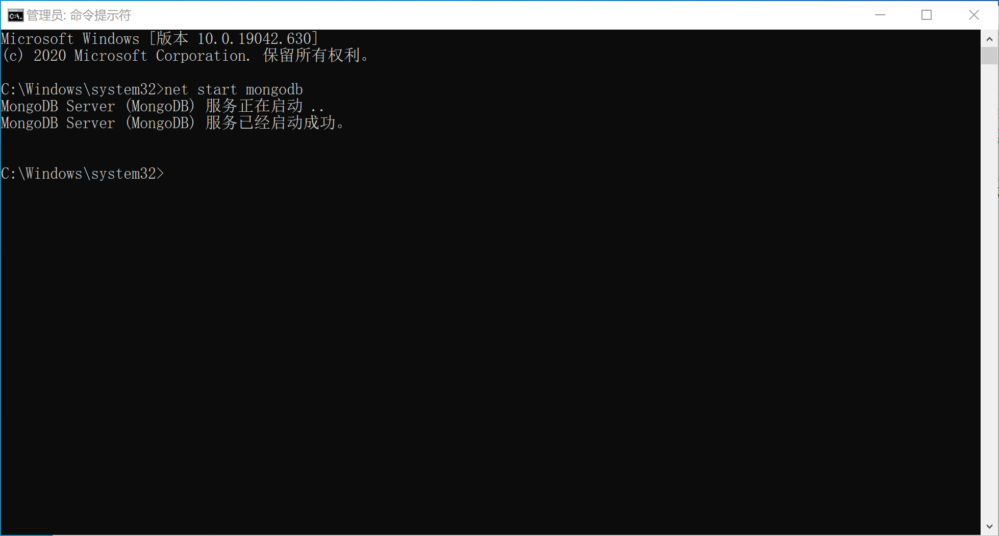
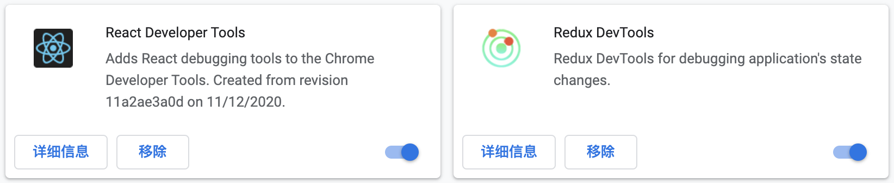

## 项目: 拉勾电商

#### 1.启动项目
```js
`npm start`
  此时: process.env.NODE_ENV === "development"
`npm run build` 生产模式
    ↓
`serve -s build`
  此时: process.env.NODE_ENV === "production"
```
#### 2.支付
- 支付不支持本地调试, 需要切换到生产模式 (最好是无痕模式)
##### 支付流程
1. 点击提交向服务器发送请求
2. 服务器返回支付地址, 客户端跳转支付地址
3. 用户支付 , 重定向到设置好的客户端地址, 告诉用户支付成功或失败
4. 同时向服务器发送请求,通知订单状态是否成功
```js
生产环境: 
-------------
支付宝测试账号: graveq3405@sandbox.com
密码: 111111

登录账号: duanyu@163.com
密码: 123456
```


#### 3. 服务端技术栈
1. 脚本：Node.js
2. 数据库：Mongodb
3. 数据库可视化：Robo 3T

#### 4.客户端技术栈
1. redux: 状态管理
2. redux-saga: 异步状态更新中间件
3. connected-react-router:  将路由状态同步到store中
4. antd: ReactUI组件库
5. react-router-dom: 路由
6. .env 脚手架中内置了dotenv, 环境变量的名字必须以 REACT_APP_ 开头
7. redux-devtools-extension 调试工具
8. useEffect() 钩子函数
9. TypeScript
10. moment(order.createdAt).format("YYYY-MM-DD")

#### 5.项目路由目录
```js
首页: Home
商城: Shop
购物车: Cart
登录: Signin 
注册: Signup 
dashboard: (登录后才有, 与登录注册互斥)
  用户: PrivateRoute(Dashboard)  受保护的(相当于路由守卫)
  管理员: AdminRoute(AdminDashboard) 受保护的(相当于路由守卫)
    添加分类: AdminRoute(AddCategory) 
    添加产品: AdminRoute(AddProduct) 
    订单列表: AdminRoute(Orders)
```

#### 6. 搭建开发环境 (服务端)
##### 5.1 安装 mongodb 数据库 (Mac)
1. 安装mac系统中的软件包管理器 [homebrew](https://brew.sh/index_zh-cn)
   ```bash
   /bin/bash -c "$(curl -fsSL https://raw.githubusercontent.com/Homebrew/install/master/install.sh)"
   ```
2. 添加 mongodb 仓库源
   ```bash
   brew tap mongodb/brew
   ```
3. 安装 mongodb
   安装前确保系统已经安装 xcode 命令行编译开发工具
   ```bash
   brew install mongodb-community
   ```
   ```bash
   xcode-select --install 
   ```
4. 启动 mongodb

   ```bash
   brew services run mongodb-community
   ```
5. 停止 mongodb
   ```bash
   brew services stop mongodb-community
   ```
6. 文件位置
   1. 数据库配置文件：/usr/local/etc/mongod.conf
   2. 数据库文件默认存放位置：/usr/local/var/mongodb
   3. 日志存放位置：/usr/local/var/log/mongodb/mongo.log

##### 5.2 安装 mongodb 数据库 (Windows)








```js
`引入数据库`
--db: 数据库  (ecommerce)
--collection: 集合 (categories/orders/products/users)
--file: 文件位置
mongoimport --db ecommerce --collection categories --file C:\Users\zh\Downloads\db\categories.json

如果mongoimport报错, 说明没有mongoimport命令文件
https://www.mongodb.com/try/download/database-tools
将下好的文件放入bin下
位置: C:\Program Files\MongoDB\Server\4.4\bin 
```

##### 5.3 数据库可视化 Robo3T
[下载地址](https://robomongo.org/download)

#### 7. 搭建开发环境 (客户端)
##### 7.1 创建项目并安装依赖

1. 使用 create-react-app 脚手架创建 react 项目
   ```js
   npx create-react-app ecommerce-front --template typescript 
   ```
2. 安装项目依赖
   `npm install antd axios moment redux react-redux react-router-dom redux-saga connected-react-router redux-devtools-extension @types/react-redux @types/react-router-dom`
3. antd CSS 使用 CDN
   https://cdn.bootcdn.net/ajax/libs/antd/4.8.3/antd.min.css

##### 7.2 安装 chrome 扩展



React Developer Tools：检查React组件层次结构，在页面上显示React组件。


Redux DevTools：监测 Store 中状态的变化


```js
import { composeWithDevTools } from "redux-devtools-extension"

export const store = createStore(
  rootReducer,
  composeWithDevTools(applyMiddleware(...middlewares))
)
```