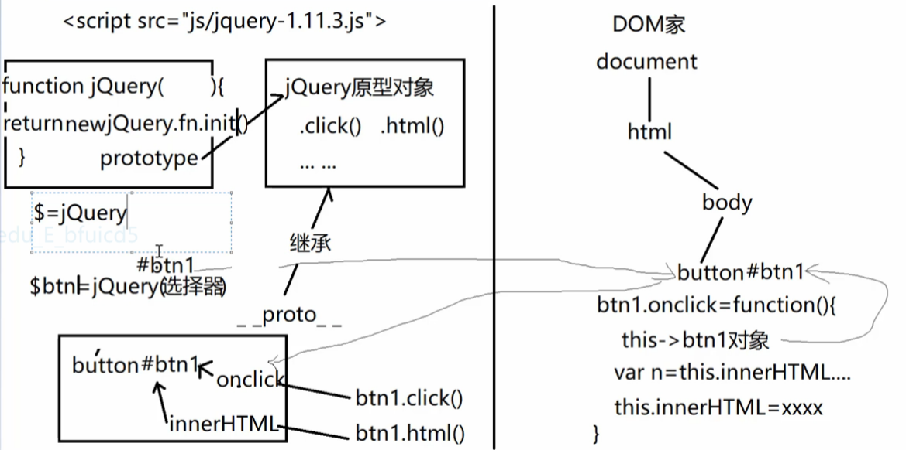
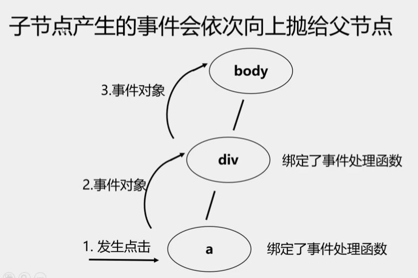

## jquery
- 官网: https://jquery.com/
- 核心理念: write less do more
- 2.x后不再兼容ie8
> 总结: `$()`共有4种: 
1. `$("选择器")` 查找DOM元素，并包装进jQuery对象中
2. `$(DOM元素对象)` 直接将DOM元素包装进jQuery对象中
3. $(`HTML片段`) 创建新元素
4. `$(function(){ ... })` 早于`window.onload`, 在DOM内容加载后就自动提前执行！

- [1. 原理](#1)
- [2. 查找元素](#2)
- [3. 修改元素](#3)
- [4. 添加/删除/替换/克隆元素](#4)
- [5. 事件绑定/事件委托代理](#5)
- [6. 类数组对象操作](#6)
- [7. 动画](#7)
- [8. 添加自定义函数](#8)
- [9. 自定义插件](#9)
- [10. 表单序列化 serialize](#10)
- [11. $ajax](#11)

--------
><h2 id='1'>1. 原理</h2>
- 通过jQuery包装DOM后产生的对象
- `$` = `jQuery` = `new jQuery`
    ```javascript
    var btn = $("#btn") == new jQuery('#btn') == jQuery('#btn')
    ```
-  jq子对象其实是一个`类数组对象`，可保存找到的多个DOM元素对象
    ```bash
    1. #dom-->jquery:
        var btn1 = document.getElementById('#btn1');
        var $btn1 = $(btn1)
    2. #jquery-->dom: jquery为类数组对象,下标则为dom
        $btn1[0]
        $btn1.get(0)
    ```
    
- 对jq子对象调用简化版函数，会被自动翻译为对应的原生DOM的方法和属性。
  ```bash
  jQuery中的this、e、e.target等,和DOM中的完全一样！
  jquery事件自带遍历
  .click 指向了dom中onclick事件, 所以事件中的this指向dom本身
    比如一组btns
    btns.click(
      # this 就指向每个btn的dom元素.
      若想继续使用 jquery 则将dom变为jquery对象
      # _this = $(this)
    ) 
    .click 指向了dom中onclick事件, 所以事件中的this指向dom本身
  ```
- 多数函数都会返回正在操作的.前的主语jq对象——`链式操作`
  ```bash
  $(this).clone(true).appendTo("ul");
  ```

><h2 id='2'>2. 查找元素</h2>
1. `jQuery支持用所以CSS3选择器查找`
2. jQuery新增选择器: (`css中不能用`)
    ```css
    a. 基本过滤: (下标从0开始)
      :first :last :eq(i) :lt(i) :gt(i) :even  :odd
    b. 内容过滤: 
      :contains(文本) :has(选择器) :parent :empty
    c. 可见性过滤: 
      :visible  :hidden(只能选择display:none和input type="hidden")
    d. 表单元素过滤: 
      :input  :text  :password  :radio  :checkbox
    ```
3. 用节点间关系查找: 
    ```css
    a. 父子关系：
      $元素.parent()
      $元素.children("选择器") 
      $元素.find("选择器")
    b. 兄弟关系：
      $元素.prev()  
      $元素.prevAll("选择器")
      $元素.next()  
      $元素.nextAll("选择器")
      $元素.siblings("选择器")
    ```

><h2 id='3'>3. 修改元素</h2>
- 修改中的所有函数，都是一个函数两用(取值和赋值)
1. 修改元素内容:
    ```css
    a. 原始HTML内容: 
      $元素.html("新HTML内容") 代替.innerHTML
    b. 纯文本内容:    
      $元素.text("纯文本内容") 代替.textContent
    c. 表单元素的值:  
      $元素.val("新值") 代替.value
    ```
2. 修改元素属性:
    ```bash 
    a. 字符串类型的HTML标准属性: 
      #1. $元素.attr("属性名","新属性值")
          代替dom 元素.getAttribute()和setAttribute()
    b. bool类型的HTML标准属性:
      # $元素.prop("属性名", bool值) 
          代替dom 元素.属性名=bool值
          $others.prop("disabled",false);
    c. 自定义扩展属性:只有一种: 
      # $元素.attr("属性名","新属性值")
          代替dom 元素.getAttribute()和setAttribute()
    反过来总结: 
      # $元素.attr()可修改一切字符串类型的属性(字符串类型HTML标准属性+自定义扩展属性)
      # $元素.prop()可修改一切可用.访问的属性(所有HTML标准属性)
    ```
3. 修改元素样式: 
    ```bash
    a. 获取或修改单个"css"属性:
      # $元素.css("css属性名", "属性值")
        $("#d1").css("width", 400)
        获取属性值时被翻译为getComputedStyle(元素)
        修改属性值时被翻译为.style.css属性=属性值
    b. 使用"class"修改样式: 
      # $元素.addClass("class名")
      # $元素.removeClass("class名")
      # $元素.hasClass("class名")
      # $元素.toggleClass("class名")
    ```
    ```bash
    #修改相关的函数都可同时修改多个属性值: 
    $元素.attr或prop或css({
      属性名:"属性值",
      ... : ...
    })
    ```
><h2 id='4'>4. 添加/删除/替换/克隆元素</h2>
1. 添加新元素: 
    ```bash
    a. 使用HTML片段批量创建新元素: 
      # $(`HTML片段`)
    b. 将新元素添加到DOM树:
      1. 末尾追加: 
        # $父元素.append($新元素)
        # $新元素.appendTo($父元素)
      2. 开头插入: 
        # $父元素.prepend($新元素) 
        # $新元素.prependTo($父元素)
      3. 插入到一个现有元素之前: 
        # $现有元素.before($新元素)
        # $新元素.insertBefore($现有元素)
      4. 插入到一个现有元素之后: 
        # $现有元素.after($新元素)
        # $新元素.insertAfter($现有元素)
      5. 替换现有元素: 
        # $现有元素.replaceWith($新元素)
        # $新元素.replaceAll($现有元素)
    ```
    ```bash
    $("#add").click(function () {
         var $div = $(`
         <div class="block">
            <span class="close">×</span>
         </div>
         `);
         $div.css("background-color",'red');
         $(".container").prepend($div);
      });
    ```
2. 删除元素: `$元素.remove()`
3. 克隆元素: `$元素.clone()`
4. 判断一个元素是否具有什么特征: `$元素.is("选择器")`
    ```bash
    if ($div.is(":visible")) {
      $div.hide(2000);
    } else {
      $div.show(2000);
    }
    ```

><h2 id='5'>5. 事件绑定/代理</h2>
1. `页面加载后执行$(function(){ })`
    ```bash
    代码执行的时机选择:
    1. window.onload事件:
      网页所有元素(包括元素关联文件(img,cssdeng))完全加载完后执行.
    2. $(document).ready(fn):
      # dom加载后(html,js) 就可以调用.
      # $(document).ready(fn) 早于 window.onload事件.   
      $(document).ready(fn) 关联文件可能未加载完毕,如css,img的属性有可能获取不到 
      # $(document).ready(function(){}) 简写:
        $().ready(function(){}) 再简写
      # $(function(){}) 最终 
    ```
    ```bash 
    了解
    基于一个页面执行多个脚本:
    1. window.onload:
      <body onload = "bodystart();">
        window.onload = start1;   start1函数会取代bodystart
        window.onload = start2;  start2函数会取代start1
      如果不想替换可以用如下方法
        # $(window).load(start1)
        $(window).load(start2)
    2. $().ready(fn)每次都会向队列添加一个新的函数,页面加载完后,所有函数都会执行,
        所有jquery函数(包括$()ready())底层都是 .addEventListener("",function())   
    3 与其他库共存:
      * 引入多个js库时,'$'冲突
      1. jQuery.noConflict(); 放弃$控制权 给其他库
      2. 使用 jQuery(function($){}); 重新获取$控制权
      3. 推荐 (function($){})(jQuery); 推荐使用匿名函数,形参$,重新获取$控制权
    ```
2. 标准写法:`on/bind off/unbind`     
  `$元素.bind("事件名", 事件处理函数)`  
  `$元素.unbind("事件名", 原事件处理函数)` 移除绑定
    ```javascript
    $("div").bind('click', function(){
      do something
    });
    ```
3. `简写`:   
  `$元素.事件名(事件处理函数)`
    ```javascript
    $("div").click(function(){
      do something
    })
    ```
    ```css
    常用事件列表
    遇到这个列表之外的稀有事件，就必须用.on/bind()
      blur 失去焦点 
      change 下拉列表选中项改变 
      click 单击 
      dblclick 双击 
      focus 获得焦点  
      keydown 键盘按键按下 
      keyup 键盘按键抬起
      mousedown 鼠标按键按下 
      mouseenter 鼠标进入(jq)
      mouseleave 鼠标移出(jq)
      mousemove  鼠标移动
      mouseout 鼠标移出(dom)
      mouseover 鼠标进入(dom)
      mouseup 鼠标按键抬起
      resize  窗口大小改变
      scroll  网页滚动
    ```
4. `事件委托`: 
- 子节点产生的事件会依次向上抛给父节点body>div>a 点击a 事件会依次向上抛
    ```css
    1.on 
      $父元素.on("事件名","选择器",function(){ 
      ...this指向e.target...
      })
    2.delegate
      $父元素.delegate(选择器, 事件类型, 处理函数)
    ```
    ```javascript
      $(".container").delegate(".close", "click", function () {
         $(this).parent().remove();
      });
    ```
    
5. 事件对象 event  
    ```css
    $(obj).click(function(event){
      event.preventDefault(); 阻止默认行为
      event.stopPropagation(); 阻止冒泡
      srcElement/target: 事件源对象
      eventPhase: 事件所处的传播阶段
      clientX(浏览器文档显示区域左上)
      offsetX(相对于事件元素左上角偏移量)
      pageX(相对于网页(body左上角))
      screenX(相对于显示器左上角距离)
      keyCode/charCode 键盘事件按下的键
      button 鼠标的哪个按键被按下
    })
    ```
6. 模拟触发: 
    ```css
    a. 标准: $元素.trigger("事件名")
    b. 如果属于常用事件列表，可简写为: 
       $元素.事件名()
    example:
      模拟$obj的click事件
        $obj.trigger("click");
      简写: $obj.click();
    ```
><h2 id='6'>6. 类数组对象操作</h2>
* 类数组对象不能使用 数组的函数
* 属性: length
* 方法:
  ```css
  1.eq(index) 取出index下标的 dom
  2.get() 返回一个dom数组
  3. 遍历查找结果中每个DOM元素对象: 
    $查找结果.each(function(i, domElem){
      /*i(可省略):下标, this表示当前dom*/
    })
  4. 查找一个DOM元素在整个查找结果中的下标位置
    var i=$查找结果.index(要找的DOM元素)
  ```

><h2 id='7'>7. 动画</h2>
1. `$obj.show(执行事件, 回调函数)`  
  执行事件: slow, normal, fast 或者 毫秒数  
  不加参数时,相当于 display:block和none
    ```css
    1. 显示和隐藏 show() /hide()
    2. 滑动式 slideDown() /slideUp()
    3. 淡入淡出 fadeIn() / fadeOut()
    ```
2. 自定义动画 `animate()`  
  用法: animate(css的对象, 执行时间, 回调函数) 
    ```bash
    css对象: {}秒数动画执行之后元素的样式
    执行时间: 毫秒数
    #只支持单个数值的css属性, rgb(a,b,c)这样的不可以
    $(this).animate({left:"500px"}, 4000, function(){
      回调
    })
    ``` 
3. 并发效果  
  多个动画同时进行
    ```bash
    # 效果是斜着的
    $(this).animate({left:500,top:500},4000);  
    ```
4. 处理一组元素(排队)
  当为同一组元素时, 排队效果
    ```bash
    #先右500 后下500
    $(this).animate({left:500},4000); 
    $(this).animate({top:500},4000);  
    ```
5. 停止动画: 
    ```css
    a. 只停止当前一个动画
      $元素.stop()
    b. 停止队列中所有动画
      $元素.stop(true)
    ```
6. 选择器匹配正在播放动画的元素: `:animated`
7. css 动画
    ```css
    #d1 {transition: all 2s linear;}
    $("#d1").css("width", 400); 
    ```
><h2 id='8'>8. 添加自定义函数</h2>
1. 方式一:
    ```javascript
    jQuery.fun1 = function(){}
    jQuery.fun2 = function(){}
    ```
2. 方式二:  使用$.extend()函数
    ```javascript
    jQuery.extend({
        fun1:function(){},
        fun3:function(){}
    });   
    调用: $.fun1()
    ```
3. 方式三:  封装到到全局的对象中
    ```javascript
    jQuery.myobj = {
        fun1:function(){},
        fun2:function(){}
      }
    调用:$.myobj.fun1()
    ```
4. 方式四:  添加到prototype原型中 
    ```bash
    # jQuery.prototype.fun1 = function(){}
    jQuery中 "prototype 别名为 fn"
    简写:
    # $.fn.fun1 = function(){}
    ```
><h2 id='9'>9. 自定义插件</h2>
```html
<div id="my-accordion">
      <div>《西游记》</div>
      <div>西游记: 故事片段 </div>
      <div>《三国演义》</div>
      <div>三国故事: 故事片段 </div>
</div>
<script>
  调用 : $("#my-accordion").myAccordion();
  $.fn.myAccordion = function () {
    //this 指向$("#my-accordion")
    // 链式操作
    this.addClass("accordion") 
    // this.children(":nth-child(2n+1)").addClass("title");
    // this.children(":nth-child(2n)").addClass("content fade");
    // this.children(":nth-child(2n)").first().addClass("in");
        // 返回this
        .children(":nth-child(2n+1)")
        // 返回this.children
        .addClass("title")
        .next()
        .addClass("content fade")
        .first()
        .addClass("in");
    $(".title").click(function () {
        var $next = $(this).next();
        var $others = $(this).siblings(".content");
        if ($next.hasClass("in")) {
          $next.removeClass("in");
        } else {
          $others.removeClass("in");
          $next.addClass("in");
        }
    })
  }
</script>
```
><h2 id='10'>10. 表单序列化 serialize</h2>
* 可以通过`serialize()` 将表单元素序列化成字符串
* 可以通过`serializeArray()` 将表单元素序列化成JSON字符串
* 格式: var data = `$("#form").serialize()`;
><h2 id='11'>11. $ajax</h2>
- 详情见 05_http_ajax jq_ajax


