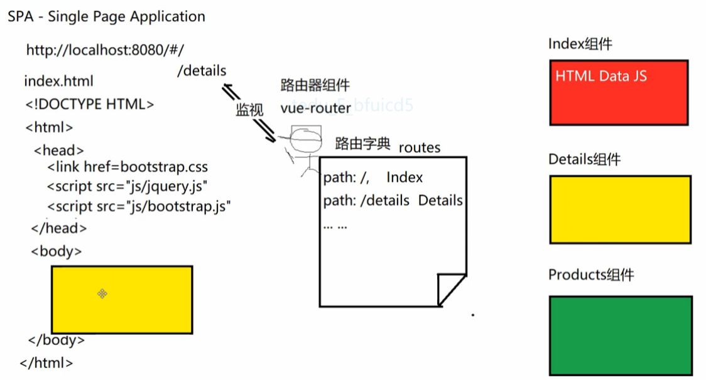

## vue 指令

- [1. 单页面应用 spa](#1)
- [2. 路由实现](#2)
- [3. 路由跳转](#3)
- [4. 路由跳转传参](#4)
- [5. 路由守卫](#5)
- [6. 过渡动效](#6)
- [7. 全路径](#7)
- [8. 路由懒加载](#8)
--------
><h2 id='1'>1. 单页面应用 spa</h2>
- SPA: Single Page Application


><h2 id='2'>2. 路由实现</h2>
- html
  ```html
  <div id="app">
    <p>
      <!-- 使用 router-link 组件来导航. -->
      <!-- 通过传入 `to` 属性指定链接. -->
      <!-- <router-link> 默认会被渲染成一个 `<a>` 标签 -->
      <router-link to="/foo">Go to Foo</router-link>
      <router-link to="/bar">Go to Bar</router-link>
    </p>
    <!-- 路由出口 -->
    <!-- 路由匹配到的组件将渲染在这里 -->
    <router-view></router-view>
  </div>
  ```
  ```javascript
  // 0. 如果使用模块化机制编程，导入Vue和VueRouter，要调用 Vue.use(VueRouter)

  // 1. 定义 (路由) 组件。
  // 可以从其他文件 import 进来
  const Foo = { template: '<div>foo</div>' }
  const Bar = { template: '<div>bar</div>' }

  // 2. 定义路由
  // 每个路由应该映射一个组件。 其中"component" 可以是
  // 通过 Vue.extend() 创建的组件构造器，
  // 或者，只是一个组件配置对象。
  // 我们晚点再讨论嵌套路由。
  const routes = [
    { path: '/foo', component: Foo },
    { path: '/bar', component: Bar }
  ]

  // 3. 创建 router 实例，然后传 `routes` 配置
  // 你还可以传别的配置参数, 不过先这么简单着吧。
  const router = new VueRouter({
    routes // (缩写) 相当于 routes: routes
  })

  // 4. 创建和挂载根实例。
  // 记得要通过 router 配置参数注入路由，
  // 从而让整个应用都有路由功能
  const app = new Vue({
    router
  }).$mount('#app')
  ```
><h2 id='3'>3. 路由跳转</h2>
1. 超链接a
    ```html
    <a href = "#/details">Details</a>
    ```
2. router-link
    ```html
    <router-link to="/details">Details</router-link>
    ```
3. js
    ```javascript
    this.$router.push("/details");
    ```
><h2 id='4'>4. 路由跳转传参</h2>
1. 方式一: `props:true`
    ```javascript
    配置路由:
      1. props: true
      2. /:id 
    routes: [
      { path: '/user/:id', component: User, props: true },
    ]
    路由跳转:
      <router-link to="/user/14"></router-link>
    接收路由参数:
      方式一: props: ['id']
      方式二: $route.params.id
    ```
2. 方式二: `js`
    ```javascript
    路由跳转: 
    this.$router.push("/detai/"+id);
    this.$router.push({
        path:'/',
        query:{
            user_id: this.userId,
            channel:channel?channel:'' 
        }
      })
    接收路由参数:
    this.channel = this.$route.query.channel;
    ```

><h2 id='5'>5. 路由守卫</h2>
- 使用`beforeEach`注册一个全局前置守卫:
  ```javascript
  const router = new VueRouter({ ... })
  router.beforeEach((to, from, next) => {
    if (to.meta.title) {
      document.title = to.meta.title
    }
    next()
  })
  // to: route即将要进入的目标 路由对象
  // from: route当前导航正要离开的路由
  // next(): 进行管道中的下一个钩子
  // next(false): 中断当前的导航
  // next('/') 或者 next({ path: '/' }): 跳转到一个不同的地址
  ```
><h2 id='6'>6. 过渡动效</h2>
- 
  ```html
  <transition name="slide">
    <router-view></router-view>
  </transition>
  ```

><h2 id='7'>7. 全路径</h2>
- 
  ```javascript
  router中配置:
  router.push({ path: "/login", query: {path:to.fullPath} })
  调用:
  if(this.$route.query.path){
    this.$router.push(this.$route.query.path)
  }else{
    this.$router.push("/");
  }
  if(this.$route.query.path){ 
    this.$router.push(this.$route.query.path) 
  }else{ 
    this.$router.push("/"); 
  }
  ```
><h2 id='8'>8. 路由懒加载</h2>
- 不用懒加载 会把路由内所有组件打包加载 `chunk.js`
- `使用懒加载会分别异步打包对应模块的js`
- 如何查看是否懒加载
  ```
  1. 可以npm run build 打包查看
  2. 可以F12 查看 head中 link的js中是否, ref='prefetch'(预加载,异步加载的), 主线程是preload(app.js,chunk.js)
  ```
1. 异步延迟下载
    ```javascript
    const Foo = () => import(/* webpackChunkName: "group-foo" */ './Foo.vue')
    ```
2. 彻底懒加载 (需要时再加载)
    ```javascript
    vue.config.js
    module.exports = {
      chainWebpack: config => {
        config.plugins.delete("prefetch");
      }
    }
    ```
  