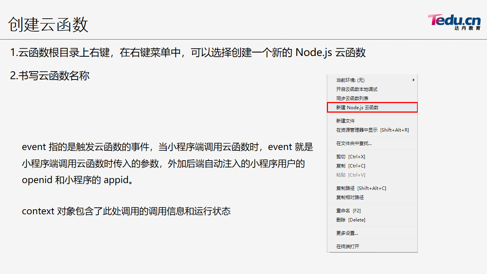
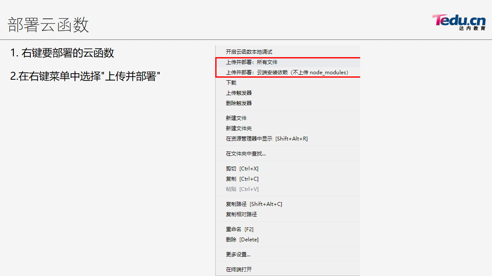

## 小程序云开发
- [1. 云存储](#1)
- [2. 云数据库](#2)
- [3. 云函数](#3)
```
开发者可以使用腾讯提供的云服务来开发微信小程序、小游戏，而无需搭建服务器。
```
```js
在小程序端初始化云环境 app.js
wx.cloud.init({
  // 如不填则使用默认环境（第一个创建的环境）
  env: '云服务器环境ID' // 控制台设置中获取
})
```
><h3 id='1'>1. 云存储</h3> 
```js
小程序可以通过以下2种方式管理云存储
1. 云开发控制台
2. 网络API
   wx.chooseImage({}) 选取照片
   wx.previewImage({}) 预览
   wx.cloud.uploadFile() 上传云存储
```

><h3 id='2'>2. 云数据库</h3> 
```js
既可以在小程序前端操作，也可以在云函数中操作的 JSON 类型的非关系型数据库。（基于MongoDB ）
1. 获取数据库对象。
const db = wx.cloud.database();
2. 通过 db 对象访问数据库中的某个集合
const coll = db.collection('student');
3. Collection 对象
coll.add({data:{name: "tom"}})
    .then(res){}
    .catch(err){}
coll.remove()
coll.update({data:{salary:66}})
// collection.get() 用于查询符合查询条件的集合数据
// collection.where() 用于添加查询条件
// collection.skip(n) 控制跳过前n行数据 （用于分页）
// collection.limit(n) 从当前记录位置向后读取n行数据（用于分页）
// collection.doc(123) 从当前集合中查询 _id=123 的一条记录
// collection.field() 指定返回结果中记录需返回的字段
// collection.orderBy(id, 'desc') 指定排序规则，按照id字段降序排序
// collection.count() 查询结果集的数量
```
><h3 id='3'>3. 云函数</h3> 
```js
1.创建云函数
2.部署云函数
  右键->movielist1905->打开终端(下面命令顺序)
    npm install -S request         #安装依赖库
    npm install -S request-promise  #ajax库
3.调用云函数
  cloud.callFunction({
    name:'云函数名字',
    data:{传递的参数},
    success:res=>{},
    fail:res=>{},
    complete:res=>{},
  })
```

